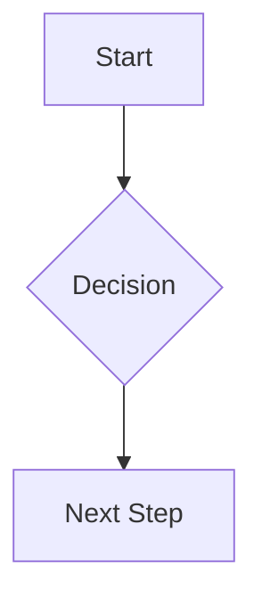

# Mermaid Diagrams

Use Mermaid for diagrams that clarify structure or flow. Keep diagrams compact
enough to remain readable in raw Markdown and in rendered form.

## Mandatory Rules

- MUST use fenced code blocks with the `mermaid` info string.
- MUST keep labels short and readable.
- MUST avoid oversized diagrams when a smaller diagram plus prose is clearer.
- MUST pair diagrams in documentation with a short explanatory summary.

## Example Pattern

````markdown

````

## Do

- Use Mermaid when the visual adds clarity beyond prose alone.
- Keep node names and edge labels concise.
- Split one large diagram into several smaller ones when needed.

## Do Not

- Add a diagram when a short list would explain the same thing better.
- Pack multiple unrelated concerns into one diagram.
- Leave diagrams without surrounding context.
