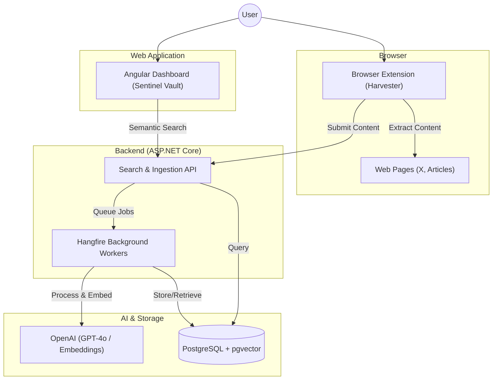

# Sentinel Knowledge Engine

Sentinel is an advanced knowledge curation platform that bypasses traditional API limitations using a browser-resident agent. It enables users to capture high-signal content (Tweets, Web Articles, Selections) directly from their browsing session, processes it using state-of-the-art LLMs, and stores it in a searchable, vector-indexed vault.

## System Architecture



## Project Overview

The project consists of three main components working in concert:
1. **Chrome Extension**: Acts as the data harvester, injecting capture tools directly into web platforms.
2. **.NET 10 Backend**: Manages ingestion, AI-driven processing, and semantic storage.
3. **Angular Dashboard**: A premium web portal for managing your "Personal Knowledge Vault" with semantic search and tag clouds.

### Core Features

- **Seamless Capture**: Inject "Save to Sentinel" buttons directly into web platforms (X.com, etc.).
- **AI-Powered Insights**: Automated de-noising, summary extraction, and actionable insight generation using OpenAI Models.
- **Semantic Search**: Meaning-based retrieval using vector embeddings stored in PostgreSQL.
- **Premium Vault**: A modern web dashboard with glassmorphism UI and real-time reactive filtering.
- **Reliable Processing**: Persistent background job management with Hangfire.

## Tech Stack

### Backend
- **Framework**: .NET 10.0 (ASP.NET Core)
- **Database**: PostgreSQL with `pgvector` extension
- **Background Jobs**: Hangfire (PostgreSQL storage)
- **Observability**: Serilog (Seq Sink), OpenTelemetry (Metrics), Health Checks

### AI Layer
- **Processing**: OpenAI `gpt-4o` / `gpt-4o-mini`
- **Embeddings**: OpenAI `text-embedding-3-small` (1536-dimensional vectors)

### Frontend
- **Angular Dashboard**: v21 (Modern Zoneless mode), Signals, SCSS, Playwright E2E.
- **Browser Extension**: Manifest V3, TypeScript, Chrome Storage & Scripting APIs.

## Quick Start

### Prerequisites
- .NET 10 SDK
- Node.js & npm
- Docker Desktop
- OpenAI API Key

### 1. Start Infrastructure
Launch the database, Seq (logging), and other services using Docker:
```bash
docker-compose up -d
```

### 2. Run the Backend
Set your OpenAI API Key and connection strings:
```bash
cd backend
dotnet run --project src/SentinelKnowledgebase.Api
```

### 3. Run the Dashboard
```bash
cd frontend
npm install
npm run start
```

### 4. Explore
- **Web Dashboard**: `http://localhost:4200`
- **OpenAPI Document**: `https://localhost:5001/openapi/v1.json`
- **Scalar API Reference**: `https://localhost:5001/scalar/v1`
- **Hangfire Dashboard**: `https://localhost:5001/hangfire` (Job monitoring)
- **Health Checks**: `https://localhost:5001/health`
- **Seq (Logs)**: `http://localhost:5341` (Local logging UI)
