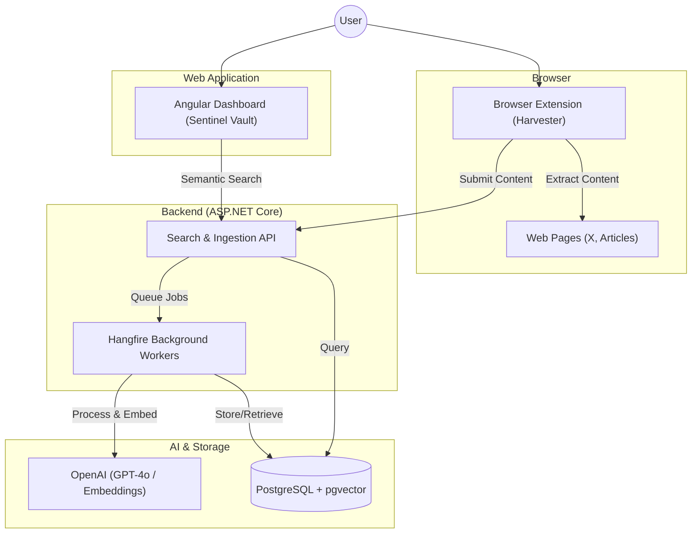

# Sentinel Knowledge Engine

Sentinel is an advanced knowledge curation platform that bypasses traditional API limitations using a browser-resident agent. It enables users to capture high-signal content (Tweets, Web Articles, Selections) directly from their browsing session, processes it using state-of-the-art LLMs, and stores it in a searchable, vector-indexed vault.

## System Architecture



## Project Overview

The project consists of three main components working in concert:

1. **Chrome Extension**: Acts as the data harvester, injecting capture tools directly into web platforms.
2. **.NET 10 Backend**: Manages ingestion, AI-driven processing, and semantic storage.
3. **Angular Dashboard**: A premium web portal for managing your "Personal Knowledge Vault" with semantic search and tag clouds.

### Core Features

- **Seamless Capture**: Inject "Save to Sentinel" buttons directly into web platforms (X.com, etc.).
- **AI-Powered Insights**: Automated de-noising, summary extraction, and actionable insight generation using OpenAI Models.
- **Semantic Search**: Meaning-based retrieval using vector embeddings stored in PostgreSQL.
- **Premium Vault**: A modern web dashboard with glassmorphism UI and real-time reactive filtering.
- **Reliable Processing**: Persistent background job management with Hangfire.

## Tech Stack

### Backend

- **Framework**: .NET 10.0 (ASP.NET Core)
- **Database**: PostgreSQL with `pgvector` extension
- **Background Jobs**: Hangfire (PostgreSQL storage)
- **Observability**: Serilog (Seq Sink), OpenTelemetry (Metrics), Health Checks

### AI Layer

- **Processing**: OpenAI `gpt-4o` / `gpt-4o-mini`
- **Embeddings**: OpenAI `text-embedding-3-small` (1536-dimensional vectors)

### Frontend

- **Angular Dashboard**: v21 (Modern Zoneless mode), Signals, SCSS, Playwright E2E.
- **Browser Extension**: Manifest V3, TypeScript, Chrome Storage & Scripting APIs.

## Documentation

- [System entity model](docs/ENTITY-MODEL.md): canonical overview of the
  implemented entities, lifecycle states, and main data flows.

## Quick Start

### Prerequisites

- .NET 10 SDK
- Node.js & npm
- Docker Desktop
- OpenAI API Key

### Recommended: One-Command Dev Startup

From the repository root:

```powershell
.\build.ps1 -Target Setup
.\build.ps1 -Target Check
.\build.ps1 -Target Dev
```

This starts:

- Backend infrastructure only (`docker compose up -d` from `backend/`, starts `postgres`)
- Applies backend EF Core migrations against the local development database
- Backend API (`dotnet watch run --project src/SentinelKnowledgebase.Api`)
- Backend Worker (`dotnet watch run --project src/SentinelKnowledgebase.Worker`)
- Angular frontend (`npm run start` in `frontend/`)
- Browser extension watch build (`npm run watch` in `browser-extension/`)

Optional: launch Chromium with the extension loaded:

```powershell
.\build.ps1 -Target Dev -LaunchExtensionBrowser
```

Useful selective startup examples:

```powershell
.\build.ps1 -Target Dev -SkipExtensionWatch
.\build.ps1 -Target Dev -SkipWorker
.\build.ps1 -Target Dev -SkipInfra
.\build.ps1 -Target DevWithProxy
```

`Setup` installs .NET dependencies, frontend and extension npm dependencies,
creates `backend/.env` from `backend/.env.example` when needed, prompts for
missing required secrets such as `OPENAI_API_KEY`, and installs Playwright
Chromium for both frontend and extension projects.

`Check` verifies `dotnet`, `node`, `npm`, and Docker availability, reports
likely port conflicts, and prints the expected local URLs for the dev stack.

`Dev` ensures `backend/.env` exists for backend startup, waits for PostgreSQL,
and runs `dotnet ef database update` before launching the API and worker.
`DevWithProxy` additionally ensures `deploy/.env.proxy` exists and starts the
shared proxy stack for parity with production or for other local containerized
services.

### Build Script Targets

From the repository root:

```powershell
.\build.ps1 -Target Setup
.\build.ps1 -Target Check
.\build.ps1 -Target Build
.\build.ps1 -Target Backend
.\build.ps1 -Target WebFrontend
.\build.ps1 -Target Extension
.\build.ps1 -Target InfraUp
.\build.ps1 -Target InfraDown
.\build.ps1 -Target DevWithProxy
.\build.ps1 -Target Clean
.\build.ps1 -Target ExtensionBrowser
```

### Manual Startup (Alternative)

If you prefer to run services manually:

1. Start infrastructure

    ```bash
    cd backend
    docker compose up -d
    ```

    If `backend/.env` does not exist yet, copy `backend/.env.example` to
    `backend/.env` and fill in `OPENAI_API_KEY` before starting the stack.

    Optional shared proxy:

    ```bash
    cp deploy/.env.proxy.example deploy/.env.proxy
    docker compose -f deploy/docker-compose.proxy.yml --env-file deploy/.env.proxy up -d
    ```

2. Run backend API

    ```bash
    cd backend
    dotnet watch run --project src/SentinelKnowledgebase.Api
    ```

3. Run backend worker

    ```bash
    cd backend
    dotnet watch run --project src/SentinelKnowledgebase.Worker
    ```

4. Run Angular dashboard

    ```bash
    cd frontend
    npm install
    npm run start
    ```

5. Build extension in watch mode

    ```bash
    cd browser-extension
    npm install
    npm run watch
    ```

Extension default API URL is `http://localhost:5000` (configurable in extension options).

### Full Docker Backend (API + Worker + Postgres)

```bash
cd backend
docker compose --profile app up -d
```

### Production Deployment (Docker + Caddy)

This repository now includes production deployment assets for CI/CD and multi-app hosts:

- `deploy/docker-compose.prod.yml` (Postgres + API + Worker + Web app only)
- `deploy/docker-compose.proxy.yml` (shared autodiscovery Caddy edge, run once per host)
- `deploy/docker-compose.vertex-proxy.yml` (optional Vertex AI OpenAI-compatible proxy)
- `deploy/scripts/deploy.sh` (server-side rollout script)
- `frontend/Dockerfile` + `frontend/Caddyfile` (Angular static hosting)
- `.github/workflows/deploy.yml` and `bitbucket-pipelines.yml` (image build/push + SSH deploy)
- `.github/workflows/release-please.yml` + release-please config files (versioning + changelog)

For multiple apps on the same server, use one shared autodiscovery Caddy instance:

- `deploy/docker-compose.proxy.yml`
- `deploy/.env.proxy.example`

Bootstrap shared Caddy once:

```bash
cd <repo>
cp deploy/.env.proxy.example deploy/.env.proxy
docker compose -f deploy/docker-compose.proxy.yml --env-file deploy/.env.proxy up -d
```

Optional: bootstrap the Vertex AI proxy:

```bash
cd <repo>
docker network create sentinel-ai || true
cp deploy/.env.vertex-proxy.example deploy/.env.vertex-proxy
docker compose -f deploy/docker-compose.vertex-proxy.yml --env-file deploy/.env.vertex-proxy up -d
```

This starts `ghcr.io/prantlf/ovai` as a local OpenAI-compatible proxy backed by
Vertex AI. By default it only binds to `127.0.0.1:22434`.

### Release Process (GitHub)

Releases are formalized with Release Please and Conventional Commits:

1. Merge feature/fix PRs into `main` or `master` using Conventional Commit subjects.
2. Release Please updates or opens a release PR with:
   - version bump
   - `CHANGELOG.md` updates generated from commit history
3. Merge the release PR when ready.
4. Release Please creates a Git tag like `v1.2.3`.
5. `deploy.yml` triggers on `v*` tags, builds images tagged with the release tag, uploads deployment artifacts to the server, and deploys.

Manual deployment remains available through `workflow_dispatch` in `deploy.yml`.

Server bootstrap (one-time):

1. Clone repo on your server (example: `/opt/sentinel`).
2. Copy `deploy/.env.proxy.example` to `deploy/.env.proxy` and start the shared Caddy stack:

   ```bash
   cd /opt/sentinel
   cp deploy/.env.proxy.example deploy/.env.proxy
   docker compose -f deploy/docker-compose.proxy.yml --env-file deploy/.env.proxy up -d
   ```

3. Copy `deploy/.env.production.example` to `deploy/.env.production`.
4. Fill in secrets (`OPENAI_API_KEY`, DB password, registry credentials) and set `SENTINEL_DOMAIN`.
5. Run:

   ```bash
   cd /opt/sentinel
   IMAGE_TAG=latest ./deploy/scripts/deploy.sh
   ```

Each CI deployment then updates `IMAGE_TAG` to commit SHA and re-runs the same script.

### Local Remote Deploy (Linux/WSL)

If you want to run the same deployment flow manually from your own machine:

1. Copy `deploy/.env.remote.example` to `deploy/.env.remote` and fill SSH values.
2. Verify SSH + remote prerequisites:

   ```bash
   ./deploy/scripts/remote-deploy.sh --config deploy/.env.remote --verify-only
   ```

3. Run deployment with a tag (for example a commit SHA):

   ```bash
   ./deploy/scripts/remote-deploy.sh --config deploy/.env.remote --image-tag <commit-sha>
   ```

Optional: preview remote commands without executing deploy:

```bash
./deploy/scripts/remote-deploy.sh --config deploy/.env.remote --image-tag <commit-sha> --dry-run
```

This mirrors the CI deployment behavior:
- SSH to server
- `git fetch`, `git checkout`, `git pull`
- execute `deploy/scripts/deploy.sh` remotely with `IMAGE_TAG`

### Explore

- **Web Dashboard**: `http://localhost:4200`
- **OpenAPI Document**: `https://localhost:5001/openapi/v1.json`
- **Scalar API Reference**: `https://localhost:5001/scalar/v1`
- **Hangfire Dashboard**: `https://localhost:5001/hangfire` (Job monitoring)
- **Health Checks**: `https://localhost:5001/health`
- **Seq (Logs)**: `http://localhost:5341` (Local logging UI)
