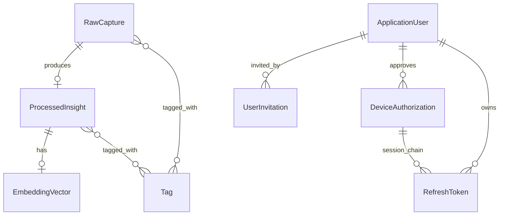
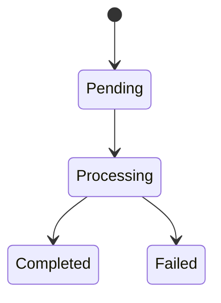
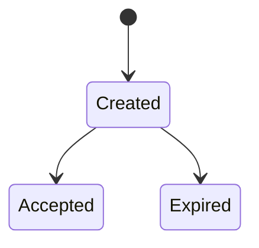
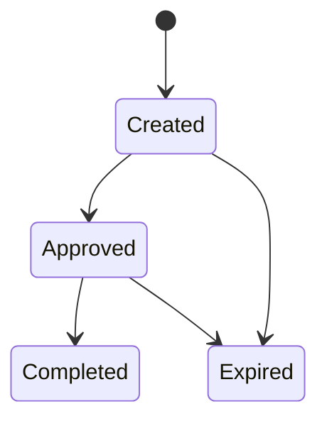
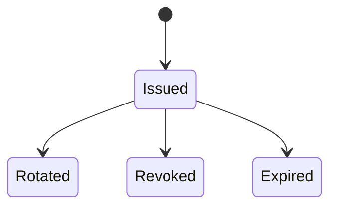
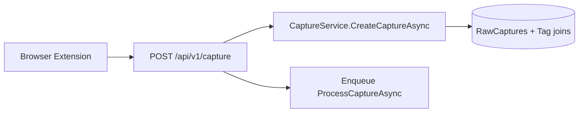
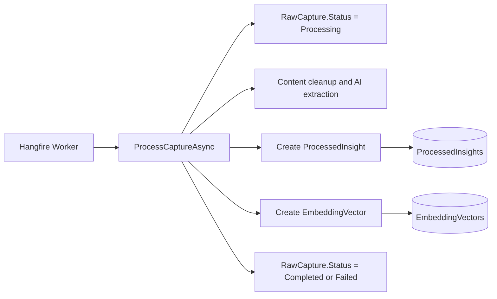
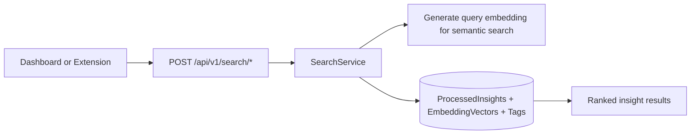
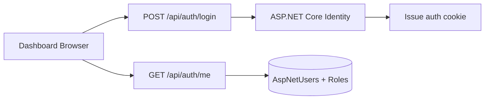
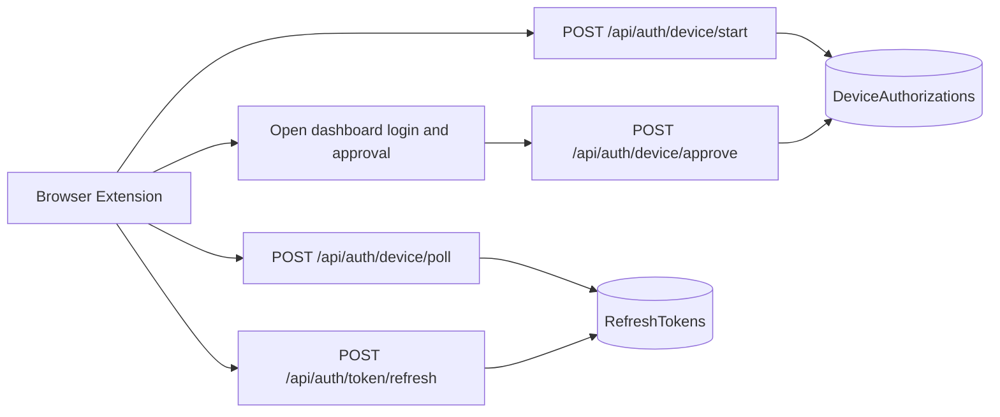

# Sentinel System Entity Model

## Purpose and Audience

This document is the canonical high-level model for the implemented Sentinel
system. It is written for engineers onboarding to the codebase who need a
single place to understand:

- which persisted entities exist today
- how those entities relate to each other
- which lifecycle states are meaningful
- how data moves across the extension, API, worker, and database

This document covers implemented behavior only. Backlog concepts such as
folders and export are intentionally excluded.

## Entity Clusters

Sentinel currently has two main persisted entity clusters:

1. Knowledge ingestion and retrieval
2. Authentication and session management

## Entity Catalog

| Entity | Cluster | Source of truth | Purpose | Key fields | Relationships |
|---|---|---|---|---|---|
| `RawCapture` | Knowledge | `ApplicationDbContext.RawCaptures` | Stores the original captured payload before and during processing. | `Id`, `SourceUrl`, `ContentType`, `RawContent`, `Metadata`, `Status`, `CreatedAt`, `ProcessedAt` | Many-to-many with `Tag`; one-to-one with `ProcessedInsight` |
| `ProcessedInsight` | Knowledge | `ApplicationDbContext.ProcessedInsights` | Stores normalized, AI-generated output derived from one raw capture. | `Id`, `RawCaptureId`, `Title`, `Summary`, `KeyInsights`, `ActionItems`, `SourceTitle`, `Author`, `ProcessedAt` | Belongs to one `RawCapture`; many-to-many with `Tag`; one-to-one with `EmbeddingVector` |
| `EmbeddingVector` | Knowledge | `ApplicationDbContext.EmbeddingVectors` | Stores the semantic embedding used for vector search. | `Id`, `ProcessedInsightId`, `Vector`, `CreatedAt` | Belongs to one `ProcessedInsight` |
| `Tag` | Knowledge | `ApplicationDbContext.Tags` | Shared categorization label attached to captures and insights. | `Id`, `Name`, `CreatedAt` | Many-to-many with `RawCapture`; many-to-many with `ProcessedInsight` |
| `ApplicationUser` | Auth | ASP.NET Core Identity `AspNetUsers` | Identity user for dashboard sign-in, role membership, and device approval. | `Id`, `UserName`, `Email`, `DisplayName` | Referenced by `UserInvitation`, `DeviceAuthorization`, and `RefreshToken` |
| `UserInvitation` | Auth | `ApplicationDbContext.UserInvitations` | Tracks invite-only account creation. | `Id`, `Email`, `DisplayName`, `Role`, `TokenHash`, `InvitedByUserId`, `CreatedAt`, `ExpiresAt`, `AcceptedAt` | Invited by one `ApplicationUser` |
| `DeviceAuthorization` | Auth | `ApplicationDbContext.DeviceAuthorizations` | Tracks browser-assisted device login for the extension. | `Id`, `DeviceCode`, `UserCode`, `DeviceName`, `ApprovedByUserId`, `CreatedAt`, `ExpiresAt`, `ApprovedAt`, `CompletedAt`, `Denied` | Optionally approved by one `ApplicationUser`; optionally referenced by many `RefreshToken` rows over time |
| `RefreshToken` | Auth | `ApplicationDbContext.RefreshTokens` | Stores opaque refresh tokens for extension sessions and rotation. | `Id`, `UserId`, `DeviceAuthorizationId`, `TokenHash`, `TokenName`, `Scope`, `CreatedAt`, `ExpiresAt`, `RevokedAt` | Belongs to one `ApplicationUser`; optionally linked to one `DeviceAuthorization` |

## Relationship Model

Relationship summary:

- Every `ProcessedInsight` is derived from exactly one `RawCapture`.
- A `RawCapture` may exist without a `ProcessedInsight` while processing is
  pending or failed.
- Every `EmbeddingVector` belongs to exactly one `ProcessedInsight`.
- Tags are shared labels reused across raw captures and processed insights.
- `ApplicationUser` is the root identity record for invites, approvals, and
  extension refresh tokens.
- A device authorization can lead to multiple refresh-token rows because token
  rotation revokes the old token and persists a new one.

## Lifecycle States

### Capture Processing Lifecycle

`RawCapture.Status` is the explicit persisted state machine.

State summary:

| State | Meaning | Backing fields |
|---|---|---|
| `Pending` | Capture was accepted and persisted, but worker processing has not started. | `Status = Pending`, `ProcessedAt = null` |
| `Processing` | Worker has started content cleanup, extraction, and embedding generation. | `Status = Processing` |
| `Completed` | Processed insight and embedding were persisted successfully. | `Status = Completed`, `ProcessedAt != null` |
| `Failed` | Processing failed after capture persistence. | `Status = Failed` |

Implementation traceability:

- Capture status enum: `backend/src/SentinelKnowledgebase.Domain/Enums/Enums.cs`
- Capture creation and processing: `backend/src/SentinelKnowledgebase.Application/Services/CaptureService.cs`
- Capture enqueue boundary: `backend/src/SentinelKnowledgebase.Api/Controllers/CaptureController.cs`
- Queue-processing architecture: `docs/adrs/02-queue-processing/queue-processing.md`

### Invitation Lifecycle

`UserInvitation` does not use a dedicated enum. Its lifecycle is derived from
timestamps and expiry.

State summary:

| Derived state | Meaning | Backing fields |
|---|---|---|
| `Created` | Invitation exists and is still redeemable. | `AcceptedAt = null` and `ExpiresAt > now` |
| `Accepted` | Invitation was redeemed to create an account. | `AcceptedAt != null` |
| `Expired` | Invitation aged out before acceptance. | `AcceptedAt = null` and `ExpiresAt <= now` |

Implementation traceability:

- Invitation entity: `backend/src/SentinelKnowledgebase.Infrastructure/Authentication/UserInvitation.cs`
- Invitation issue and acceptance: `backend/src/SentinelKnowledgebase.Api/Controllers/AuthController.cs`
- Auth feature scope: `docs/features/10-user-authentication/feature-spec.md`

### Device Authorization Lifecycle

`DeviceAuthorization` also uses derived state rather than a single enum.

State summary:

| Derived state | Meaning | Backing fields |
|---|---|---|
| `Created` | Device code was issued and is waiting for browser approval. | `ApprovedAt = null`, `CompletedAt = null`, `Denied = false`, `ExpiresAt > now` |
| `Approved` | Signed-in user approved the device, but token exchange has not completed. | `ApprovedAt != null`, `CompletedAt = null`, `Denied = false`, `ExpiresAt > now` |
| `Completed` | Device poll succeeded and refresh token issuance was persisted. | `CompletedAt != null` |
| `Expired` | Authorization is no longer redeemable. | `ExpiresAt <= now` and `CompletedAt = null` |

Implementation traceability:

- Device authorization entity: `backend/src/SentinelKnowledgebase.Infrastructure/Authentication/DeviceAuthorization.cs`
- Device start, approve, and poll endpoints: `backend/src/SentinelKnowledgebase.Api/Controllers/AuthController.cs`
- Auth feature scope: `docs/features/10-user-authentication/feature-spec.md`

Current implementation note:

- The entity includes a `Denied` flag in persistence, but the current public
  auth flow does not expose a denial endpoint that sets it to `true`.

### Refresh Token Lifecycle

Refresh tokens use persisted rows plus revocation and expiry timestamps.

State summary:

| Derived state | Meaning | Backing fields |
|---|---|---|
| `Issued` | Current active refresh token for a device/session chain. | `RevokedAt = null` and `ExpiresAt > now` |
| `Rotated` | Token was used successfully for refresh and replaced by a new row. | Previous row has `RevokedAt != null`; new row created with same `DeviceAuthorizationId` |
| `Revoked` | Token was explicitly invalidated by logout/reset/revoke flow. | `RevokedAt != null` |
| `Expired` | Token aged out and can no longer be redeemed. | `ExpiresAt <= now` |

Implementation traceability:

- Refresh token entity: `backend/src/SentinelKnowledgebase.Infrastructure/Authentication/RefreshToken.cs`
- Token issue, rotation, and revocation: `backend/src/SentinelKnowledgebase.Api/Controllers/AuthController.cs`
- Token creation helper: `backend/src/SentinelKnowledgebase.Infrastructure/Authentication/TokenService.cs`

## End-to-End Data Flows

### Browser Extension Capture Ingestion

Flow summary:

- The extension sends a normalized capture payload to the API.
- The API persists `RawCapture` plus any tag associations immediately.
- The API returns `202 Accepted` after enqueueing background processing.
- No `ProcessedInsight` or `EmbeddingVector` exists yet at this point.

Traceability:

- Capture endpoint: `backend/src/SentinelKnowledgebase.Api/Controllers/CaptureController.cs`
- Capture write path: `backend/src/SentinelKnowledgebase.Application/Services/CaptureService.cs`

### Background Processing and Persistence

Flow summary:

- The worker loads the raw capture and marks it `Processing`.
- Content cleanup, insight extraction, and embedding generation occur inside the
  application service.
- Success creates `ProcessedInsight`, `EmbeddingVector`, and final
  `RawCapture.ProcessedAt`.
- Failure leaves the raw record in place and marks the capture `Failed`.

Traceability:

- Worker host: `backend/src/SentinelKnowledgebase.Worker/Program.cs`
- Processing service: `backend/src/SentinelKnowledgebase.Application/Services/CaptureService.cs`
- Queue decision: `docs/adrs/02-queue-processing/queue-processing.md`

### Semantic and Tag Search Retrieval

Flow summary:

- Both search endpoints operate on processed knowledge, not raw captures alone.
- Semantic search generates a query embedding and compares it against stored
  vectors.
- Tag search filters `ProcessedInsight` records by associated tags.
- Retrieval depends on the ingestion pipeline having completed successfully.

Traceability:

- Search endpoints: `backend/src/SentinelKnowledgebase.Api/Controllers/SearchController.cs`
- Search service: `backend/src/SentinelKnowledgebase.Application/Services/SearchService.cs`
- Search repository queries: `backend/src/SentinelKnowledgebase.Infrastructure/Repositories/ProcessedInsightRepository.cs`

### Dashboard Cookie Authentication

Flow summary:

- Dashboard login is cookie-based rather than bearer-token based.
- Identity owns password verification, user records, and role membership.
- Authenticated dashboard requests rely on the server-backed cookie session.
- Admin-only flows such as invitations and password reset resolve from the same
  user identity root.

Traceability:

- Auth controller: `backend/src/SentinelKnowledgebase.Api/Controllers/AuthController.cs`
- Identity user: `backend/src/SentinelKnowledgebase.Infrastructure/Authentication/ApplicationUser.cs`
- Auth feature scope: `docs/features/10-user-authentication/feature-spec.md`

### Extension Device Login and Token Refresh

Flow summary:

- The extension starts device authorization and receives `DeviceCode`,
  `UserCode`, and a verification URL.
- A signed-in dashboard user approves that device session.
- Poll completion creates a refresh-token row bound to the approving user and
  device authorization.
- Later refresh calls revoke the previous token row and persist a replacement.

Traceability:

- Device and token endpoints: `backend/src/SentinelKnowledgebase.Api/Controllers/AuthController.cs`
- Auth entities: `backend/src/SentinelKnowledgebase.Infrastructure/Authentication/`
- Auth feature scope: `docs/features/10-user-authentication/feature-spec.md`

## Notes and Boundaries

- This document describes persisted application entities, not every DTO or
  every Hangfire internal record.
- Hangfire job/state tables exist operationally, but they are infrastructure
  storage rather than Sentinel domain entities.
- `ApplicationUser` roles are currently limited to `admin` and `member`.
- Where older ADR content and current code differ, this document follows the
  implemented code paths and accepted feature specs.
