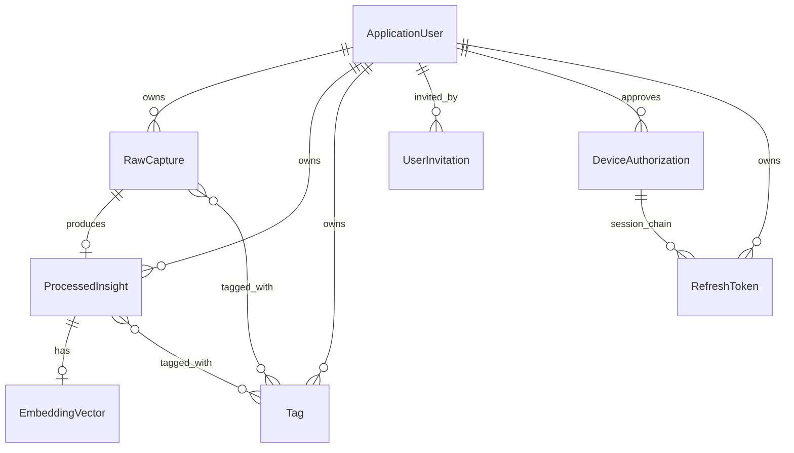
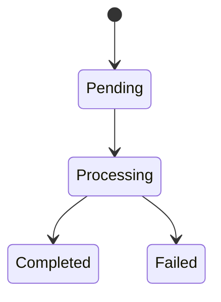
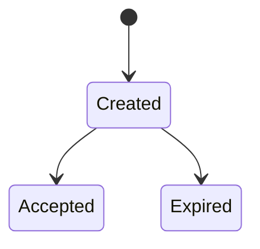
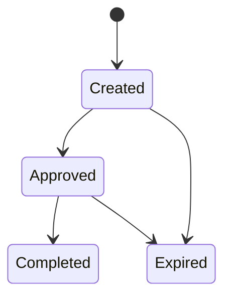
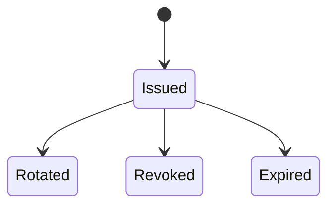
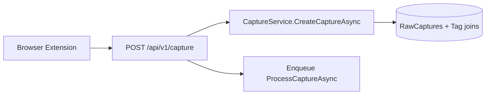
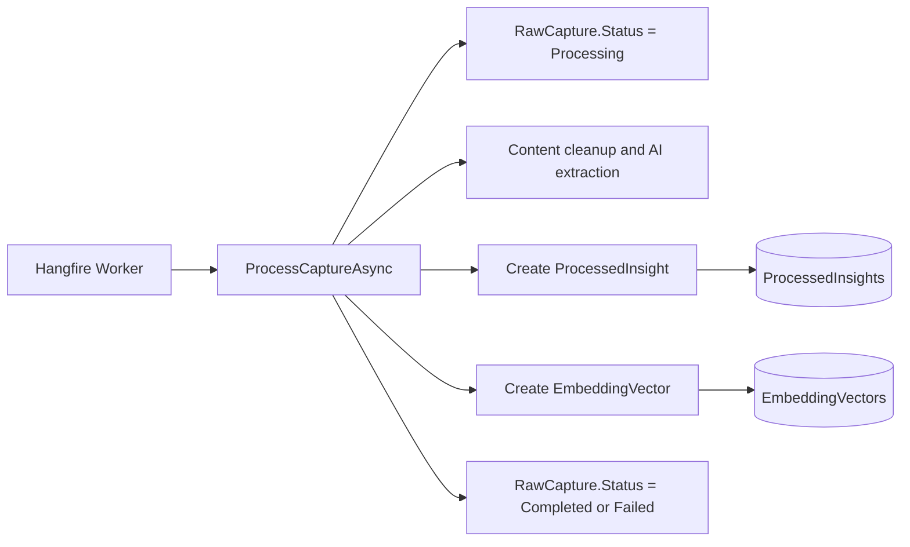
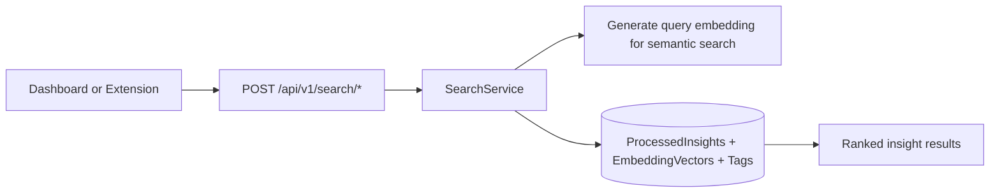
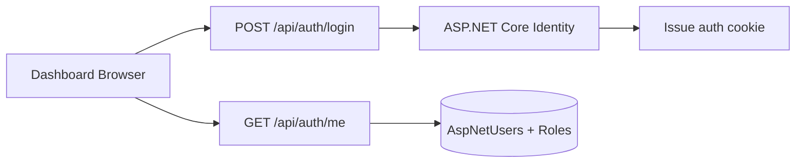
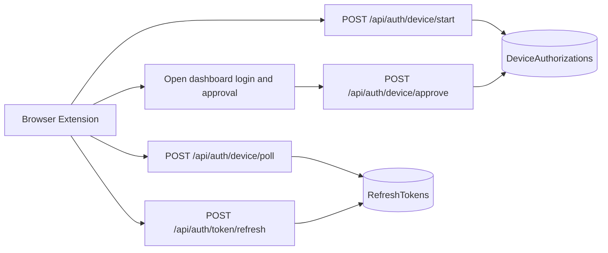

# Sentinel System Entity Model

## Purpose and Audience

This document is the canonical high-level model for the implemented Sentinel
system. It is written for engineers onboarding to the codebase who need a
single place to understand:

- which persisted entities exist today
- how those entities relate to each other
- which lifecycle states are meaningful
- how data moves across the extension, API, worker, and database

This document covers implemented behavior only. Backlog concepts such as
folders and export are intentionally excluded.

## Entity Clusters

Sentinel currently has two main persisted entity clusters:

1. Knowledge ingestion and retrieval
2. Authentication and session management

## Entity Catalog

### Knowledge Entities

| Entity             | Source of Truth                          | Purpose                          | Relationships                                                          |
| :----------------- | :--------------------------------------- | :------------------------------- | :--------------------------------------------------------------------- |
| `RawCapture`       | `ApplicationDbContext.RawCaptures`       | Original captured payload.       | `ApplicationUser` N:1; `Tag` M:N; `ProcessedInsight` 1:1               |
| `ProcessedInsight` | `ApplicationDbContext.ProcessedInsights` | AI-generated normalized insight. | `ApplicationUser` N:1; `RawCapture` 1:1; `Tag` M:N; `EmbeddingVector` 1:1 |
| `EmbeddingVector`  | `ApplicationDbContext.EmbeddingVectors`  | Vector-search embedding record.  | `ProcessedInsight` 1:1                                                 |
| `Tag`              | `ApplicationDbContext.Tags`              | Per-user categorization label.   | `ApplicationUser` N:1; `RawCapture` M:N; `ProcessedInsight` M:N        |

Key fields:

- `RawCapture`: `Id`, `OwnerUserId`, `SourceUrl`, `ContentType`, `RawContent`,
  `Metadata`, `Status`, `CreatedAt`, `ProcessedAt`
- `ProcessedInsight`: `Id`, `OwnerUserId`, `RawCaptureId`, `Title`, `Summary`,
  `KeyInsights`, `ActionItems`, `SourceTitle`, `Author`, `ProcessedAt`
- `EmbeddingVector`: `Id`, `ProcessedInsightId`, `Vector`, `CreatedAt`
- `Tag`: `Id`, `OwnerUserId`, `Name`, `CreatedAt`

### Authentication and Session Entities

| Entity                | Source of Truth                             | Purpose                            | Relationships                                           |
|:----------------------|:--------------------------------------------|:-----------------------------------|:--------------------------------------------------------|
| `ApplicationUser`     | ASP.NET Core Identity `AspNetUsers`         | Identity root for users and roles. | Referenced by invitation, device auth, refresh token    |
| `UserInvitation`      | `ApplicationDbContext.UserInvitations`      | Invite-only account record.        | `ApplicationUser` N:1                                   |
| `DeviceAuthorization` | `ApplicationDbContext.DeviceAuthorizations` | Extension device-login session.    | `ApplicationUser` opt N:1; `RefreshToken` 1:N over time |
| `RefreshToken`        | `ApplicationDbContext.RefreshTokens`        | Opaque refresh token record.       | `ApplicationUser` N:1; `DeviceAuthorization` opt N:1    |

Key fields:

- `ApplicationUser`: `Id`, `UserName`, `Email`, `DisplayName`
- `UserInvitation`: `Id`, `Email`, `DisplayName`, `Role`, `TokenHash`,
  `InvitedByUserId`, `CreatedAt`, `ExpiresAt`, `AcceptedAt`
- `DeviceAuthorization`: `Id`, `DeviceCode`, `UserCode`, `DeviceName`,
  `ApprovedByUserId`, `CreatedAt`, `ExpiresAt`, `ApprovedAt`, `CompletedAt`,
  `Denied`
- `RefreshToken`: `Id`, `UserId`, `DeviceAuthorizationId`, `TokenHash`,
  `TokenName`, `Scope`, `CreatedAt`, `ExpiresAt`, `RevokedAt`

## Relationship Model

Relationship summary:

- Every `ProcessedInsight` is derived from exactly one `RawCapture`.
- Every `RawCapture`, `ProcessedInsight`, and `Tag` belongs to exactly one
  `ApplicationUser` through `OwnerUserId`.
- A `RawCapture` may exist without a `ProcessedInsight` while processing is
  pending or failed.
- Every `EmbeddingVector` belongs to exactly one `ProcessedInsight`.
- Tags are scoped per user and reused only within that owner's knowledge graph.
- `ApplicationUser` is the root identity record for invites, approvals, and
  extension refresh tokens, and it also owns persisted knowledge entities.
- A device authorization can lead to multiple refresh-token rows because token
  rotation revokes the old token and persists a new one.

## Lifecycle States

### Capture Processing Lifecycle

`RawCapture.Status` is the explicit persisted state machine.

State summary:

| State        | Meaning                              | Backing fields                              |
|:-------------|:-------------------------------------|:--------------------------------------------|
| `Pending`    | Accepted; work not started.          | `Status = Pending`, `ProcessedAt = null`    |
| `Processing` | Worker is processing content.        | `Status = Processing`                       |
| `Completed`  | Insight and embedding persisted.     | `Status = Completed`, `ProcessedAt != null` |
| `Failed`     | Processing failed after persistence. | `Status = Failed`                           |

Implementation traceability:

- Capture status enum: `backend/src/SentinelKnowledgebase.Domain/Enums/Enums.cs`
- Capture creation and processing: `backend/src/SentinelKnowledgebase.Application/Services/CaptureService.cs`
- Capture enqueue boundary: `backend/src/SentinelKnowledgebase.Api/Controllers/CaptureController.cs`
- Queue-processing architecture: `docs/adrs/02-queue-processing/queue-processing.md`

### Invitation Lifecycle

`UserInvitation` does not use a dedicated enum. Its lifecycle is derived from
timestamps and expiry.

State summary:

| Derived state | Meaning                     | Backing fields                          |
|:--------------|:----------------------------|:----------------------------------------|
| `Created`     | Invitation is valid.        | `AcceptedAt = null`, `ExpiresAt > now`  |
| `Accepted`    | Invitation created account. | `AcceptedAt != null`                    |
| `Expired`     | Invitation aged out unused. | `AcceptedAt = null`, `ExpiresAt <= now` |

Implementation traceability:

- Invitation entity: `backend/src/SentinelKnowledgebase.Infrastructure/Authentication/UserInvitation.cs`
- Invitation issue and acceptance: `backend/src/SentinelKnowledgebase.Api/Controllers/AuthController.cs`
- Auth feature scope: `docs/features/10-user-authentication/feature-spec.md`

### Device Authorization Lifecycle

`DeviceAuthorization` also uses derived state rather than a single enum.

State summary:

| Derived state | Meaning                           | Backing fields                                                |
|:--------------|:----------------------------------|:--------------------------------------------------------------|
| `Created`     | Code issued; awaiting approval.   | `ApprovedAt = null`, `CompletedAt = null`, `ExpiresAt > now`  |
| `Approved`    | Approved; exchange incomplete.    | `ApprovedAt != null`, `CompletedAt = null`, `ExpiresAt > now` |
| `Completed`   | Poll succeeded; token issued.     | `CompletedAt != null`                                         |
| `Expired`     | Authorization is no longer valid. | `ExpiresAt <= now`, `CompletedAt = null`                      |

Implementation traceability:

- Device authorization entity: `backend/src/SentinelKnowledgebase.Infrastructure/Authentication/DeviceAuthorization.cs`
- Device start, approve, and poll endpoints: `backend/src/SentinelKnowledgebase.Api/Controllers/AuthController.cs`
- Auth feature scope: `docs/features/10-user-authentication/feature-spec.md`

Current implementation note:

- The entity includes a `Denied` flag in persistence, but the current public
  auth flow does not expose a denial endpoint that sets it to `true`.

### Refresh Token Lifecycle

Refresh tokens use persisted rows plus revocation and expiry timestamps.

State summary:

| Derived state | Meaning                      | Backing fields                        |
|:--------------|:-----------------------------|:--------------------------------------|
| `Issued`      | Active token for a session.  | `RevokedAt = null`, `ExpiresAt > now` |
| `Rotated`     | Replaced by a new token row. | Previous row has `RevokedAt != null`  |
| `Revoked`     | Explicitly invalidated.      | `RevokedAt != null`                   |
| `Expired`     | Aged out and not redeemable. | `ExpiresAt <= now`                    |

Implementation traceability:

- Refresh token entity: `backend/src/SentinelKnowledgebase.Infrastructure/Authentication/RefreshToken.cs`
- Token issue, rotation, and revocation: `backend/src/SentinelKnowledgebase.Api/Controllers/AuthController.cs`
- Token creation helper: `backend/src/SentinelKnowledgebase.Infrastructure/Authentication/TokenService.cs`

## End-to-End Data Flows

### Browser Extension Capture Ingestion

Flow summary:

- The extension sends a normalized capture payload to the API.
- The API derives `OwnerUserId` from the authenticated principal, then persists
  `RawCapture` plus any tag associations immediately.
- The API returns `202 Accepted` after enqueueing background processing.
- No `ProcessedInsight` or `EmbeddingVector` exists yet at this point.

Traceability:

- Capture endpoint: `backend/src/SentinelKnowledgebase.Api/Controllers/CaptureController.cs`
- Capture write path: `backend/src/SentinelKnowledgebase.Application/Services/CaptureService.cs`

### Background Processing and Persistence

Flow summary:

- The worker loads the raw capture and marks it `Processing`.
- Content cleanup, insight extraction, and embedding generation occur inside the
  application service.
- Success creates an owner-matching `ProcessedInsight`, an
  owner-transitive `EmbeddingVector`, and final `RawCapture.ProcessedAt`.
- Failure leaves the raw record in place and marks the capture `Failed`.

Traceability:

- Worker host: `backend/src/SentinelKnowledgebase.Worker/Program.cs`
- Processing service: `backend/src/SentinelKnowledgebase.Application/Services/CaptureService.cs`
- Queue decision: `docs/adrs/02-queue-processing/queue-processing.md`

### Semantic and Tag Search Retrieval

Flow summary:

- Both search endpoints operate on processed knowledge, not raw captures alone.
- Semantic search generates a query embedding and compares it against stored
  vectors.
- Tag search filters owner-scoped `ProcessedInsight` records by associated
  tags.
- Retrieval depends on the ingestion pipeline having completed successfully.

Traceability:

- Search endpoints: `backend/src/SentinelKnowledgebase.Api/Controllers/SearchController.cs`
- Search service: `backend/src/SentinelKnowledgebase.Application/Services/SearchService.cs`
- Search repository queries: `backend/src/SentinelKnowledgebase.Infrastructure/Repositories/ProcessedInsightRepository.cs`

### Dashboard Cookie Authentication

Flow summary:

- Dashboard login is cookie-based rather than bearer-token based.
- Identity owns password verification, user records, and role membership.
- Authenticated dashboard requests rely on the server-backed cookie session.
- Admin-only flows such as invitations and password reset resolve from the same
  user identity root.
- Knowledge reads from the dashboard remain scoped to the signed-in owner's
  data even for admin users.

Traceability:

- Auth controller: `backend/src/SentinelKnowledgebase.Api/Controllers/AuthController.cs`
- Identity user: `backend/src/SentinelKnowledgebase.Infrastructure/Authentication/ApplicationUser.cs`
- Auth feature scope: `docs/features/10-user-authentication/feature-spec.md`

### Extension Device Login and Token Refresh

Flow summary:

- The extension starts device authorization and receives `DeviceCode`,
  `UserCode`, and a verification URL.
- A signed-in dashboard user approves that device session.
- Poll completion creates a refresh-token row bound to the approving user and
  device authorization.
- Later refresh calls revoke the previous token row and persist a replacement.

Traceability:

- Device and token endpoints: `backend/src/SentinelKnowledgebase.Api/Controllers/AuthController.cs`
- Auth entities: `backend/src/SentinelKnowledgebase.Infrastructure/Authentication/`
- Auth feature scope: `docs/features/10-user-authentication/feature-spec.md`

## Notes and Boundaries

- This document describes persisted application entities, not every DTO or
  every Hangfire internal record.
- Hangfire job/state tables exist operationally, but they are infrastructure
  storage rather than Sentinel domain entities.
- `ApplicationUser` roles are currently limited to `admin` and `member`.
- Where older ADR content and current code differ, this document follows the
  implemented code paths and accepted feature specs.
