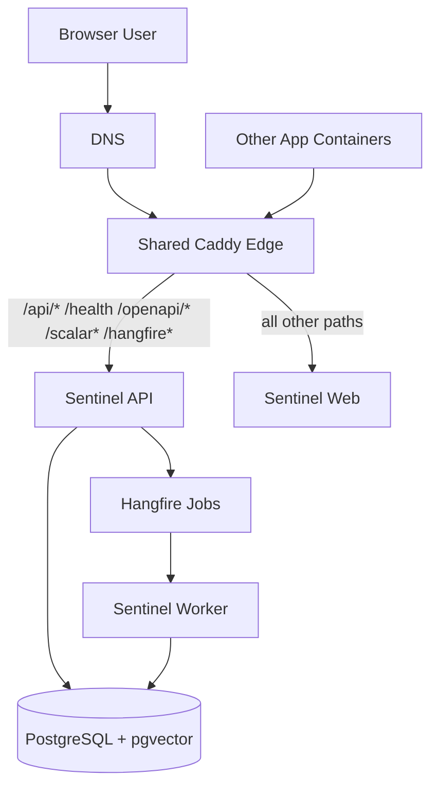

# ADR 03: Deployment Edge Routing

## Status
Accepted

## Context
The Sentinel production deployment now runs as a small set of containers:

- `sentinel-web`
- `sentinel-api`
- `sentinel-worker`
- PostgreSQL

The platform also needs to coexist with other applications on the same host.
That creates two deployment requirements:

1. There must be a single public edge on ports `80` and `443`.
2. Application stacks should be attachable to that edge without each app
   maintaining its own hand-written reverse proxy configuration.

We considered two practical options for the shared edge:

- **Nginx**
- **Caddy**

## Decision
We will use **one shared Caddy instance** as the public edge for production
deployments, using **Docker label autodiscovery** and a shared Docker network
(`shared-proxy`).

Sentinel application containers attach to the shared proxy network, and the web
container publishes Caddy routing labels for the Sentinel domain.

## Deployment Model
The deployment model is:

In operational terms:

- Caddy is started once per host.
- Each application stack joins the `shared-proxy` network.
- Public routing is derived from container labels instead of per-app proxy
  files.
- Sentinel keeps API, worker, and database responsibilities separate.

## Comparison: Caddy vs. Nginx

| Topic | Caddy | Nginx |
|-------|-------|-------|
| **Initial setup** | Simpler for this use case | More manual |
| **TLS automation** | Built in | Usually additional setup |
| **Docker autodiscovery** | Strong fit with label-based proxying | Typically requires template/generator tooling |
| **Operational overhead** | Lower | Higher |
| **Flexibility for advanced custom proxy rules** | Good | Excellent |
| **Fit for Sentinel shared-host deployment** | Preferred | Viable, but heavier |

## Reasoning
The primary driver is **operational simplicity**.

1. **Single edge per host**: Caddy cleanly supports one public proxy for many
   apps on the same server.
2. **Lower maintenance cost**: Docker label autodiscovery avoids maintaining
   separate proxy config files for each application.
3. **Built-in HTTPS**: Automatic certificate management reduces setup and
   renewal overhead.
4. **Good enough routing model**: Sentinel only needs one host with a small
   set of API path forwards and a default web fallback.
5. **Better fit than Nginx for this repo**: Nginx remains a valid option, but
   for the current deployment pattern it adds configuration complexity without a
   corresponding benefit.

## Consequences

- A shared Caddy container becomes host-level infrastructure and must be
  started before app stacks rely on it.
- Application stacks must join the shared proxy network.
- Public ingress behavior now depends on Docker labels, so misconfigured labels
  can break routing.
- This approach requires Docker socket access in the shared Caddy container,
  which increases operational sensitivity and should be treated as privileged
  infrastructure.
- The default local `Dev` workflow remains proxy-free for simplicity, while
  proxy-enabled scenarios use the explicit `DevWithProxy` path.

## Alternatives Considered

### Nginx with static config

This would work, but would require more manual configuration per app and more
TLS plumbing. It is better suited when highly customized proxy behavior is a
primary need.

### Nginx with generated config

This is viable, but introduces extra moving parts such as template generators
and certificate companions. For Sentinel, that is more machinery than needed.

### File-based Caddy config per app

This is simpler than Nginx, but still creates per-app proxy files to maintain.
The label-based approach scales better for a shared host with multiple
containerized applications.
