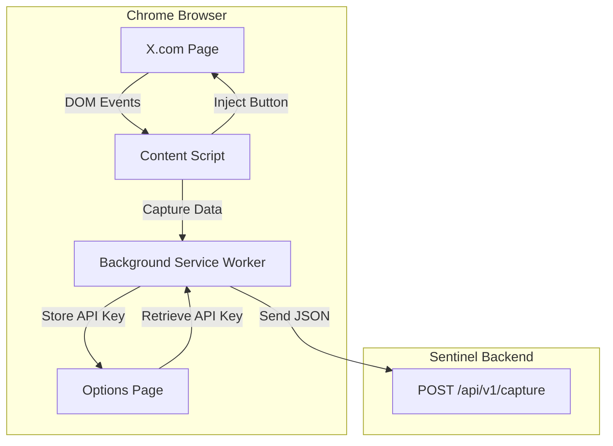

# Phase 1: The Collector (Browser Extension) - Implementation Plan

## Overview
This document outlines the detailed implementation plan for the Sentinel browser extension (Phase 1). The extension will capture high-signal social media content from X (Twitter) and send it to the Sentinel backend for processing.

## Architecture



## Implementation Steps

### Task 1.1: Manifest Setup
**Goal:** Initialize the Chrome extension with proper permissions and configuration.

**Files to Create:**
- `extension/manifest.json` - Extension manifest (Manifest V3)
- `extension/package.json` - NPM configuration (optional, for TypeScript build)

**Key Requirements:**
- Manifest V3 format
- Permissions: `storage`, `scripting`, `activeTab`
- Host permissions: `https://x.com/*`, `https://twitter.com/*`
- Content script matches: `https://x.com/*`, `https://twitter.com/*`
- Background service worker for API calls
- Options page for settings

**Deliverables:**
- Valid manifest.json that loads in Chrome
- Extension can be loaded in developer mode

---

### Task 1.2: DOM Injection
**Goal:** Create a content script that detects tweets and injects a "Save to Sentinel" button.

**Files to Create:**
- `extension/content.js` - Main content script
- `extension/styles.css` - Styles for injected button

**Key Requirements:**
- Use `MutationObserver` to detect dynamically loaded tweets
- Target the reply button group `[data-testid="reply"]` for button injection
- Button should match X's UI aesthetic
- Handle infinite scroll (new tweets loading)
- Avoid duplicate button injection on same tweet

**Technical Approach:**
1. Observe DOM mutations on the timeline container
2. Detect new tweet articles (`article` elements)
3. Find the action bar with reply/retweet/like buttons
4. Inject custom button with click handler
5. Store reference to injected buttons to prevent duplicates

**Deliverables:**
- Content script successfully injects button on all visible tweets
- Button appears in the action bar alongside native X buttons
- No duplicate buttons on scroll/refresh

---

### Task 1.3: Data Scraper
**Goal:** Extract tweet data from the DOM when the save button is clicked.

**Files to Modify:**
- `extension/content.js` - Add scraping logic

**Data to Extract:**
- **Tweet ID**: From URL or data attributes
- **Text**: Tweet content text
- **Author**: Username and display name
- **Timestamp**: Tweet publication time
- **URL**: Direct link to the tweet
- **Media**: URLs of attached images/videos (optional)

**Key Requirements:**
- Robust DOM selectors that handle X's dynamic structure
- Handle edge cases: deleted tweets, promoted content, threads
- Sanitize extracted text (remove tracking params from URLs)
- Validate data before sending

**Technical Approach:**
1. On button click, traverse up to the tweet article element
2. Query specific selectors for each data field
3. Extract and clean the data
4. Send message to background worker with payload

**Deliverables:**
- Accurate extraction of all required fields
- JSON payload structure defined
- Error handling for missing/invalid data

---

### Task 1.4: Shadow API (Optional)
**Goal:** Intercept X's GraphQL API requests for richer metadata.

**Files to Create:**
- `extension/background.js` - Service worker with request interception

**Key Requirements:**
- Use `chrome.webRequest` API to intercept `/__graphql/` requests
- Parse JSON responses for tweet data
- Match intercepted data to DOM tweet IDs
- Cache recent API responses for correlation

**Technical Approach:**
1. Listen to webRequest events for X's GraphQL endpoints
2. Parse response body for tweet objects
3. Store in temporary cache keyed by tweet ID
4. Content script queries background for enriched data

**Note:** This is marked as optional. Can be implemented in a later iteration.

**Deliverables:**
- Background worker intercepts and caches API responses
- Content script can retrieve enriched data

---

### Task 1.5: Auth Bridge
**Goal:** Create an options page for users to configure their Sentinel API key.

**Files to Create:**
- `extension/options.html` - Options page UI
- `extension/options.js` - Options page logic
- `extension/background.js` - API key storage/retrieval (if not created in 1.4)

**Key Requirements:**
- Simple form for API key input
- Secure storage using `chrome.storage.local`
- Validation of API key format
- Status messages (saved/error)

**Technical Approach:**
1. Create HTML form with API key input
2. Save to chrome.storage on form submit
3. Load saved value on page open
4. Background worker reads key when making API calls

**Deliverables:**
- Functional options page accessible from extension menu
- API key persists across browser sessions
- Background worker can retrieve key for API authentication

---

## Project Structure

```
extension/
├── manifest.json          # Extension manifest (V3)
├── content.js             # Content script for DOM injection & scraping
├── content.css            # Styles for injected elements
├── background.js          # Service worker for API calls & storage
├── options.html           # Settings page markup
├── options.js             # Settings page logic
├── icons/                 # Extension icons
│   ├── icon16.png
│   ├── icon48.png
│   └── icon128.png
└── lib/                   # Optional: utility libraries
    └── api-client.js
```

## API Integration

### Endpoint
```
POST /api/v1/capture
Authorization: Bearer {API_KEY}
Content-Type: application/json
```

### Payload Structure
```json
{
  "source": "twitter",
  "tweet_id": "1234567890",
  "author": {
    "username": "@handle",
    "display_name": "Display Name"
  },
  "content": {
    "text": "Tweet text content...",
    "timestamp": "2026-01-31T12:00:00Z",
    "url": "https://x.com/handle/status/1234567890"
  },
  "captured_at": "2026-01-31T12:30:00Z"
}
```

## Success Criteria

- [ ] Extension loads without errors in Chrome
- [ ] "Save to Sentinel" button appears on all tweets
- [ ] Clicking button extracts accurate tweet data
- [ ] Data is sent to backend API successfully
- [ ] API key is stored securely and used for authentication
- [ ] No console errors during normal operation

## Next Steps

Once Phase 1 is complete, the extension will be ready for integration with:
- **Phase 2**: Backend API to receive and process captured data
- **Phase 3**: Database storage with vector embeddings
- **Phase 4**: Dashboard UI for browsing captured insights
