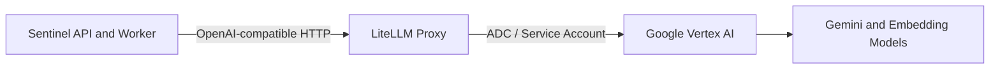

# LiteLLM Vertex Proxy Guide

## Purpose

Use LiteLLM when you want a more full-featured OpenAI-compatible gateway in
front of Vertex AI than the minimal `ovai` proxy.

This guide uses:

- [deploy/docker-compose.litellm.yml](../../../deploy/docker-compose.litellm.yml)
- [deploy/.env.litellm.example](../../../deploy/.env.litellm.example)
- [deploy/litellm.vertex.yaml](../../../deploy/litellm.vertex.yaml)
- [LiteLLM](https://docs.litellm.ai/)

LiteLLM gives you:

- OpenAI-compatible chat and embedding endpoints
- Better debug logs through normal container logs
- A clearer model alias layer
- A cleaner path to retries, fallbacks, and gateway features later

## Architecture



## Prerequisites

- A Google Cloud project with billing enabled
- Vertex AI API enabled on the target project
- A service account JSON key stored on the Sentinel server
- The shared Docker network `sentinel-ai`

## Start LiteLLM

On the Sentinel server:

```bash
cd /home/sentinel/sentinel
docker network create sentinel-ai || true
cp deploy/.env.litellm.example deploy/.env.litellm
```

Edit `deploy/.env.litellm` and set at minimum:

```env
LITELLM_VERTEX_PROJECT=your-gcp-project-id
LITELLM_VERTEX_LOCATION=us-central1
LITELLM_GOOGLE_ACCOUNT_FILE=/home/sentinel/sentinel/deploy/google-account.json
```

Then start the proxy:

```bash
docker compose -f deploy/docker-compose.litellm.yml --env-file deploy/.env.litellm up -d
```

Check the container:

```bash
docker ps --filter name=sentinel-litellm
docker logs sentinel-litellm
```

## Test The Proxy

List models:

```bash
curl http://127.0.0.1:4000/v1/models
```

Test chat:

```bash
curl -X POST http://127.0.0.1:4000/v1/chat/completions \
  -H "Authorization: Bearer anything" \
  -H "Content-Type: application/json" \
  -d '{
    "model":"gemini-2.5-flash",
    "messages":[{"role":"user","content":"Reply with OK"}],
    "temperature":0
  }'
```

Test embeddings:

```bash
curl -X POST http://127.0.0.1:4000/v1/embeddings \
  -H "Authorization: Bearer anything" \
  -H "Content-Type: application/json" \
  -d '{
    "model":"gemini-embedding-001",
    "input":"test"
  }'
```

## Configure Sentinel To Use LiteLLM

Sentinel already supports custom OpenAI-compatible URLs through
[deploy/docker-compose.prod.yml](../../../deploy/docker-compose.prod.yml).

Set these values in `deploy/.env.production`:

```env
OPENAI_API_KEY=litellm-placeholder
OPENAI_MODEL=gemini-2.5-flash
OPENAI_CHAT_COMPLETIONS_URL=http://litellm:4000/v1/chat/completions
```

If you also want embeddings through LiteLLM:

```env
OPENAI_EMBEDDING_MODEL=gemini-embedding-001
OPENAI_EMBEDDING_DIMENSIONS=1536
OPENAI_EMBEDDINGS_URL=http://litellm:4000/v1/embeddings
```

The `OPENAI_API_KEY` value is still required by Sentinel's current
implementation even if LiteLLM is running without a master key.

## Important Embeddings Warning

Sentinel currently stores embeddings in PostgreSQL with a fixed `vector(1536)`
schema. The current Vertex embedding model in this LiteLLM config is
`gemini-embedding-001`.

Do not enable Vertex-backed embeddings in production until you verify that:

- the returned vector length matches Sentinel's current schema, or
- you set `OPENAI_EMBEDDING_DIMENSIONS=1536`, or
- you migrate the database and application to a different vector size

Relevant code paths:

- [backend/src/SentinelKnowledgebase.Domain/Entities/EmbeddingVector.cs](../../../backend/src/SentinelKnowledgebase.Domain/Entities/EmbeddingVector.cs)
- [backend/src/SentinelKnowledgebase.Infrastructure/Data/ApplicationDbContext.cs](../../../backend/src/SentinelKnowledgebase.Infrastructure/Data/ApplicationDbContext.cs)
- [backend/src/SentinelKnowledgebase.Api/appsettings.json](../../../backend/src/SentinelKnowledgebase.Api/appsettings.json)

## Debugging

LiteLLM logs through normal container output, which is usually enough to debug
auth and provider failures:

```bash
docker logs -f --tail 200 sentinel-litellm
docker logs -f --tail 200 sentinel-api
docker logs -f --tail 200 sentinel-worker
```

## Suggested Rollout Order

1. Confirm the correct Google Cloud project and service account.
2. Start LiteLLM and validate `/v1/models` and `/v1/chat/completions`.
3. Point only chat completions at LiteLLM first.
4. Keep OpenAI embeddings until you resolve the vector-size question.
5. Add Vertex embeddings only after an explicit compatibility check.
