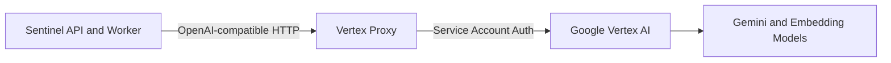

# Vertex Proxy Guide

## Purpose

Use the Vertex proxy when you want Sentinel to keep speaking an OpenAI-style API
while the actual model execution runs through Google Vertex AI.

This guide uses:

- [deploy/docker-compose.vertex-proxy.yml](../../../deploy/docker-compose.vertex-proxy.yml)
- [deploy/.env.vertex-proxy.example](../../../deploy/.env.vertex-proxy.example)
- [`ghcr.io/prantlf/ovai`](https://github.com/prantlf/ovai)

The proxy runs locally on the server and exposes OpenAI-compatible endpoints
backed by Vertex AI.

## What The Proxy Does

`ovai` is a small HTTP proxy that translates OpenAI-style requests to Vertex AI.

For Sentinel, the important effect is:

- Sentinel keeps calling `chat/completions`
- Sentinel keeps calling `embeddings`
- Vertex AI handles authentication, billing, and model execution

This avoids direct Gemini API key usage while keeping Sentinel integration
simple.

## Architecture



The proxy is not exposed publicly by default. It binds to `127.0.0.1:22434`
unless you change the bind address in the env file.

## Prerequisites

- A Google Cloud project with billing enabled
- Vertex AI API enabled
- `gcloud` installed locally or access to the Google Cloud web console
- A service account JSON key stored on the Sentinel server

## Google Cloud Setup With `gcloud`

Replace these values before running the commands:

- `PROJECT_ID`
- `SERVICE_ACCOUNT_NAME`

Set the active project:

```bash
gcloud config set project PROJECT_ID
```

Enable Vertex AI:

```bash
gcloud services enable aiplatform.googleapis.com
```

Create the service account:

```bash
gcloud iam service-accounts create SERVICE_ACCOUNT_NAME \
  --display-name="Sentinel Vertex Proxy"
```

Grant the service account the Vertex AI User role:

```bash
gcloud projects add-iam-policy-binding PROJECT_ID \
  --member="serviceAccount:SERVICE_ACCOUNT_NAME@PROJECT_ID.iam.gserviceaccount.com" \
  --role="roles/aiplatform.user"
```

Create a JSON key:

```bash
gcloud iam service-accounts keys create google-account.json \
  --iam-account="SERVICE_ACCOUNT_NAME@PROJECT_ID.iam.gserviceaccount.com"
```

Copy the key to the Sentinel server:

```bash
scp google-account.json sentinel@YOUR_SERVER:/home/sentinel/sentinel/deploy/google-account.json
```

## Google Cloud Setup In The Web Console

If you prefer the UI:

1. Open Google Cloud Console.
2. Select the target project.
3. Verify billing is enabled for that project.
4. Go to `APIs & Services` -> `Library`.
5. Enable `Vertex AI API`.
6. Go to `IAM & Admin` -> `Service Accounts`.
7. Create a new service account, for example `sentinel-vertex-proxy`.
8. Grant it the `Vertex AI User` role.
9. Open that service account and create a new JSON key.
10. Download the JSON key and copy it to the Sentinel server, for example to:
    `/home/sentinel/sentinel/deploy/google-account.json`

## Start The Proxy

On the Sentinel server:

```bash
cd /home/sentinel/sentinel
cp deploy/.env.vertex-proxy.example deploy/.env.vertex-proxy
```

Edit `deploy/.env.vertex-proxy` and set at minimum:

```env
VERTEX_PROXY_GOOGLE_ACCOUNT_FILE=/home/sentinel/sentinel/deploy/google-account.json
VERTEX_PROXY_DOCKER_NETWORK=sentinel-ai
```

Then start the proxy:

```bash
docker compose -f deploy/docker-compose.vertex-proxy.yml --env-file deploy/.env.vertex-proxy up -d
```

Check the container:

```bash
docker ps
docker logs sentinel-vertex-proxy
```

## Configure Sentinel To Use The Proxy

Sentinel production now supports overriding the OpenAI-compatible URLs and
model names through `deploy/.env.production`.

These are the relevant variables:

- `OPENAI_API_KEY`
- `OPENAI_MODEL`
- `OPENAI_EMBEDDING_MODEL`
- `OPENAI_CHAT_COMPLETIONS_URL`
- `OPENAI_EMBEDDINGS_URL`

The production compose maps them to:

- `OpenAI__ApiKey`
- `OpenAI__Model`
- `OpenAI__EmbeddingModel`
- `OpenAI__ChatCompletionsUrl`
- `OpenAI__EmbeddingsUrl`

### Example Sentinel Overrides

In `deploy/.env.production`:

```env
OPENAI_API_KEY=vertex-proxy-placeholder
OPENAI_MODEL=gemini-2.5-flash
OPENAI_EMBEDDING_MODEL=gemini-embedding-001
OPENAI_CHAT_COMPLETIONS_URL=http://vertex-proxy:22434/v1/chat/completions
OPENAI_EMBEDDINGS_URL=http://vertex-proxy:22434/v1/embeddings
```

Why the placeholder key:

- Sentinel currently checks that `OPENAI_API_KEY` is non-empty before it sends
  model requests.
- The actual Google authentication is performed by the proxy using the mounted
  service account JSON.

That placeholder requirement comes from Sentinel's current implementation, not
from Vertex AI itself.

## Container Networking Note

The deployment assets now use a dedicated external Docker network named
`sentinel-ai`.

This network is shared by:

- `sentinel-api`
- `sentinel-worker`
- `vertex-proxy`

That lets Sentinel use Docker service-to-service DNS instead of routing through
the Docker host. The recommended URLs therefore use the service name:

```env
OPENAI_CHAT_COMPLETIONS_URL=http://vertex-proxy:22434/v1/chat/completions
OPENAI_EMBEDDINGS_URL=http://vertex-proxy:22434/v1/embeddings
```

This is preferred over `host.docker.internal` because:

- the network name is explicit and stable
- no host gateway lookup is required
- Sentinel does not depend on host-published proxy ports

### Network Bootstrap

Before starting Sentinel or the Vertex proxy, ensure the shared network exists:

```bash
docker network create sentinel-ai || true
```

Important:

- `VERTEX_PROXY_DOCKER_NETWORK` is the Docker network name used by Compose.
- Do not set the container environment variable `NETWORK` unless you explicitly
  want `ovai` to force `IPV4` or `IPV6`.

### Host-Bound Alternative

If you do want a host-bound layout, the proxy can still be reached through a
published host port. In that case `host.docker.internal` is an option, but on
Linux it may require extra host-gateway wiring and is less clean than the
shared `sentinel-ai` network.

## Embeddings Dimension Warning

Sentinel currently assumes a vector size of `1536` in parts of the stack.
Google's current Vertex AI embeddings docs say:

- `gemini-embedding-001` supports up to `3072` dimensions
- `text-embedding-005` supports up to `768` dimensions

Sources:

- [Get text embeddings](https://cloud.google.com/vertex-ai/generative-ai/docs/embeddings/get-text-embeddings)
- [Text embeddings API reference](https://cloud.google.com/vertex-ai/generative-ai/docs/model-reference/text-embeddings-api)

Do not switch embeddings in production without checking Sentinel's vector schema
and expected dimension first. Additional application changes may be required.

## Suggested Rollout Order

1. Create the Vertex AI service account and JSON key.
2. Copy the key to the Sentinel server.
3. Start the proxy container.
4. Test the proxy manually.
5. Update `deploy/.env.production` with custom URL and model overrides.
6. Redeploy Sentinel.
7. Verify ingestion and embeddings before broader use.

## Manual Checks

Test the proxy on the server:

```bash
curl http://127.0.0.1:22434/v1/models
```

After redeploying Sentinel, inspect:

```bash
docker logs sentinel-api
docker logs sentinel-worker
```

Also check:

- `https://YOUR_SENTINEL_DOMAIN/health`
- Hangfire job execution
- successful content processing and embedding generation
