# .NET Backend Implementation Plan for Sentinel Knowledgebase

## Executive Summary

This document provides a comprehensive implementation plan for the Sentinel backend using **.NET 8 (LTS)** with ASP.NET Core. The plan includes step-by-step implementation with verification checkpoints and a complete integration test strategy using xUnit.

## Architecture Overview

```mermaid
flowchart TB
    subgraph Client["Browser Extension"]
        EXT[Chrome Extension]
    end

    subgraph Backend["Sentinel Backend (.NET 8)"]
        API[ASP.NET Core API]
        AUTH[API Key Auth]
        PIPE[Processing Pipeline]
        
        subgraph Services
            CAPTURE[Capture Service]
            CLEAN[Cleaning Service]
            LLM[LLM Service]
            EMBED[Embedding Service]
            SEARCH[Search Service]
        end
        
        subgraph Data
            EF[EF Core]
            PG[(PostgreSQL + pgvector)]
        end
    end
    
    subgraph External["External Services"]
        OAI[OpenAI API]
    end

    EXT -->|POST /api/v1/capture| API
    API --> AUTH
    AUTH --> CAPTURE
    CAPTURE --> CLEAN
    CLEAN --> LLM
    LLM --> EMBED
    EMBED --> EF
    EF --> PG
    LLM <-->|GPT-4o-mini| OAI
    EMBED <-->|text-embedding-3-small| OAI
    API -->|GET /api/v1/search| SEARCH
    SEARCH --> EF
```



## Technology Stack

| Component | Technology | Version |
|-----------|------------|---------|
| Framework | .NET | 8.0 LTS |
| Web API | ASP.NET Core | 8.0 |
| ORM | Entity Framework Core | 8.0 |
| Database | PostgreSQL | 15+ |
| Vector Extension | pgvector | 0.5+ |
| OpenAI SDK | Azure.AI.OpenAI | 1.0+ |
| Testing | xUnit | 2.6+ |
| Test HTTP | Microsoft.AspNetCore.Mvc.Testing | 8.0 |
| Test DB | Testcontainers.PostgreSql | 3.8+ |
| Assertions | FluentAssertions | 6.12+ |
| Mocking | NSubstitute | 5.1+ |

## Project Structure

```
sentinel-backend/
├── Sentinel.Api/                          # Main API project
│   ├── Controllers/
│   │   ├── CaptureController.cs
│   │   ├── SearchController.cs
│   │   └── HealthController.cs
│   ├── Middleware/
│   │   ├── ApiKeyAuthenticationMiddleware.cs
│   │   └── ExceptionHandlingMiddleware.cs
│   ├── appsettings.json
│   ├── appsettings.Development.json
│   └── Program.cs
│
├── Sentinel.Application/                  # Business logic layer
│   ├── Interfaces/
│   │   ├── ICaptureService.cs
│   │   ├── ICleaningService.cs
│   │   ├── ILlmService.cs
│   │   ├── IEmbeddingService.cs
│   │   ├── ISearchService.cs
│   │   └── IUnitOfWork.cs
│   ├── Services/
│   ├── DTOs/
│   │   ├── Capture/
│   │   ├── Search/
│   │   └── Common/
│   └── DependencyInjection.cs
│
├── Sentinel.Domain/                       # Domain entities and enums
│   ├── Entities/
│   │   ├── RawCapture.cs
│   │   ├── ProcessedInsight.cs
│   │   └── BaseEntity.cs
│   ├── Enums/
│   │   ├── CaptureSource.cs
│   │   └── ProcessingStatus.cs
│   └── ValueObjects/
│
├── Sentinel.Infrastructure/               # Data access and external services
│   ├── Data/
│   │   ├── SentinelDbContext.cs
│   │   └── Configurations/
│   ├── Repositories/
│   └── Vector/
│
├── Sentinel.IntegrationTests/             # Integration tests
├── Sentinel.UnitTests/                    # Unit tests
└── sentinel-backend.sln
```

## Phase 1: Project Setup and Infrastructure

### Task 1.1: Create Solution Structure

**Goal:** Initialize the .NET solution with all projects and dependencies.

**Commands:**
```bash
# Create solution
cd c:/projects/ai/sentinel-knowledgebase
mkdir backend && cd backend
dotnet new sln -n sentinel-backend

# Create projects
dotnet new webapi -n Sentinel.Api
dotnet new classlib -n Sentinel.Domain
dotnet new classlib -n Sentinel.Application
dotnet new classlib -n Sentinel.Infrastructure
dotnet new xunit -n Sentinel.IntegrationTests
dotnet new xunit -n Sentinel.UnitTests

# Add to solution
dotnet sln add Sentinel.Api/Sentinel.Api.csproj
dotnet sln add Sentinel.Domain/Sentinel.Domain.csproj
dotnet sln add Sentinel.Application/Sentinel.Application.csproj
dotnet sln add Sentinel.Infrastructure/Sentinel.Infrastructure.csproj
dotnet sln add Sentinel.IntegrationTests/Sentinel.IntegrationTests.csproj
dotnet sln add Sentinel.UnitTests/Sentinel.UnitTests.csproj

# Add project references
cd Sentinel.Api && dotnet add ref ../Sentinel.Application/../Sentinel.Infrastructure && cd ..
cd Sentinel.Application && dotnet add ref ../Sentinel.Domain && cd ..
cd Sentinel.Infrastructure && dotnet add ref ../Sentinel.Domain ../Sentinel.Application && cd ..
```

**Key Packages:**
- API: Swashbuckle.AspNetCore, FluentValidation.AspNetCore, Serilog.AspNetCore
- Infrastructure: Npgsql.EntityFrameworkCore.PostgreSQL, Pgvector.EntityFrameworkCore, Azure.AI.OpenAI
- Tests: Testcontainers.PostgreSql, FluentAssertions, NSubstitute

**Verification:** `dotnet build` succeeds

---

### Task 1.2: Configure Entity Framework Core with pgvector

**Goal:** Set up database context with PostgreSQL and vector support.

**Domain Entities:**
```csharp
public enum CaptureSource { Tweet, Webpage, WebpageSelection }
public enum ProcessingStatus { Pending, Processing, Completed, Failed }

public record AuthorInfo(string Username, string DisplayName);
public record ContentData(string Text, string? Html, string? Excerpt, DateTime? Timestamp, string Url);

public class RawCapture : BaseEntity
{
    public CaptureSource Source { get; private set; }
    public string SourceId { get; private set; }
    public AuthorInfo Author { get; private set; }
    public ContentData Content { get; private set; }
    public DateTime CapturedAt { get; private set; }
    public ProcessingStatus Status { get; private set; }
    public ProcessedInsight? ProcessedInsight { get; private set; }
}

public class ProcessedInsight : BaseEntity
{
    public Guid RawCaptureId { get; private set; }
    public string Summary { get; private set; }
    public List<string> ActionableBullets { get; private set; }
    public List<string> Tags { get; private set; }
    public string? Sentiment { get; private set; }
    public float[] Embedding { get; private set; }
    public string ModelUsed { get; private set; }
    public int TokensUsed { get; private set; }
    public DateTime ProcessedAt { get; private set; }
}
```

**Verification:** `dotnet ef migrations add InitialCreate && dotnet ef database update`

---

### Task 1.3: Implement API Key Authentication

**Goal:** Secure API endpoints with API key authentication.

**Middleware:** Check `Authorization: Bearer {apiKey}` header against stored keys.

**Verification:**
```csharp
[Fact]
public async Task Request_WithoutApiKey_Returns401()
{
    var response = await client.PostAsJsonAsync("/api/v1/capture", new {});
    response.StatusCode.Should().Be(HttpStatusCode.Unauthorized);
}
```

---

## Phase 2: Domain Layer Implementation

### Task 2.1: Define Domain Entities

Match browser extension data contracts:

```typescript
// Tweet Data from extension
interface TweetData {
  source: 'tweet';
  tweet_id: string;
  author: { username: string; display_name: string; };
  content: { text: string; timestamp: string | null; url: string; };
  captured_at: string;
}
```

---

## Phase 3: Application Layer Implementation

### Task 3.1: Define Service Interfaces

```csharp
public interface ICaptureService
{
    Task<Guid> CaptureTweetAsync(TweetCaptureRequest request, CancellationToken ct = default);
    Task<Guid> CaptureWebpageAsync(WebpageCaptureRequest request, CancellationToken ct = default);
    Task<RawCaptureDto?> GetCaptureAsync(Guid id, CancellationToken ct = default);
}

public interface ICleaningService
{
    string CleanTweetText(string text);
    string CleanWebpageContent(string content);
    string RemoveTrackingParameters(string url);
}

public interface ILlmService
{
    Task<LlmExtractionResult> ExtractInsightsAsync(string cleanedText, CancellationToken ct = default);
    Task<List<string>> GenerateTagsAsync(string summary, List<string> existingTags, CancellationToken ct = default);
}

public interface IEmbeddingService
{
    Task<float[]> GenerateEmbeddingAsync(string text, CancellationToken ct = default);
}

public interface ISearchService
{
    Task<List<SearchResultDto>> SearchAsync(string query, int limit = 10, CancellationToken ct = default);
    Task<List<SearchResultDto>> SemanticSearchAsync(string query, int limit = 10, float minSimilarity = 0.7f, CancellationToken ct = default);
}
```

### Task 3.2: Implement Cleaning Service

**Features:**
- Remove "Thread 1/n" patterns
- Strip excessive emojis (keep max 3 per tweet)
- Remove tracking parameters from URLs (utm_*, fbclid, gclid)
- Normalize whitespace
- Remove "RT @", "via @" patterns

---

## Phase 4: API Layer Implementation

### Task 4.1: Create Controllers

**CaptureController:**
- `POST /api/v1/capture/tweet` - Accept tweet capture
- `POST /api/v1/capture/webpage` - Accept webpage capture
- `GET /api/v1/capture/{id}` - Get capture status

**SearchController:**
- `GET /api/v1/search?q={query}` - Full-text search
- `POST /api/v1/search/semantic` - Vector similarity search

### Task 4.2: Configure Program.cs

```csharp
var builder = WebApplication.CreateBuilder(args);

// Add services
builder.Services.AddControllers();
builder.Services.AddEndpointsApiExplorer();
builder.Services.AddSwaggerGen();

// DbContext
builder.Services.AddDbContext<SentinelDbContext>(options =>
    options.UseNpgsql(connectionString, o => o.UseVector()));

// Register services
builder.Services.AddScoped<ICaptureService, CaptureService>();
builder.Services.AddScoped<ICleaningService, CleaningService>();
builder.Services.AddScoped<ILlmService, LlmService>();
builder.Services.AddScoped<IEmbeddingService,_embeddingService>();
builder.Services.AddScoped<ISearchService, SearchService>();

// FluentValidation
builder.Services.AddFluentValidationAutoValidation();

var app = builder.Build();
app.UseSwagger();
app.UseAuthorization();
app.MapControllers();
app.Run();
```

---

## Phase 5: Testing Strategy

### Integration Tests (xUnit + Testcontainers)

```csharp
public class IntegrationTestFixture : IAsyncLifetime
{
    private readonly PostgreSqlContainer _postgres = new PostgreSqlBuilder()
        .WithImage("ankane/pgvector:latest")
        .Build();

    public async Task InitializeAsync()
    {
        await _postgres.StartAsync();
        // Configure DbContext with test container
    }
}
```

**Test Scenarios:**
- Valid request returns 202 Accepted
- Duplicate SourceId returns 409 Conflict
- Invalid request returns 400 BadRequest
- Missing API key returns 401 Unauthorized

### Unit Tests

- CleaningServiceTests: Thread marker removal, URL cleaning
- Domain entity factory tests
- DTO validation tests

---

## Verification Summary

| Phase | Verification |
|-------|-------------|
| 1 | `dotnet build` succeeds |
| 2 | Domain entities compile |
| 3 | Unit tests pass |
| 4 | API starts, Swagger accessible |
| 5 | Integration tests pass |

## Next Steps After Implementation

1. **CI/CD Pipeline**: GitHub Actions for automated builds/tests
2. **Authentication**: API key or JWT-based auth
3. **Rate Limiting**: Prevent API abuse
4. **Health Checks**: `/health` endpoint
5. **Frontend Dashboard**: Phase 4 - React/Vue web interface
