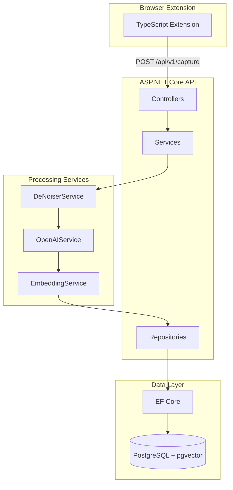

# Sentinel Backend Implementation Plan (.NET)

## Overview

This document provides a comprehensive, step-by-step implementation plan for the Sentinel backend using .NET 8, ASP.NET Core, EF Core with PostgreSQL/pgvector, and xUnit for testing.

## Architecture Overview



## Project Structure

```
sentinel-backend/
├── src/
│   ├── Sentinel.API/                    # ASP.NET Core Web API
│   │   ├── Controllers/
│   │   ├── Middleware/
│   │   ├── appsettings.json
│   │   ├── Program.cs
│   │   └── Sentinel.API.csproj
│   │
│   ├── Sentinel.Application/            # Business logic, services, DTOs
│   │   ├── DTOs/
│   │   ├── Interfaces/
│   │   ├── Services/
│   │   ├── Validators/
│   │   └── Sentinel.Application.csproj
│   │
│   ├── Sentinel.Domain/                 # Entities, enums, domain events
│   │   ├── Entities/
│   │   ├── Enums/
│   │   ├── ValueObjects/
│   │   └── Sentinel.Domain.csproj
│   │
│   ├── Sentinel.Infrastructure/         # Data access, external APIs
│   │   ├── Data/
│   │   ├── Migrations/
│   │   ├── Repositories/
│   │   ├── External/
│   │   │   └── OpenAI/
│   │   └── Sentinel.Infrastructure.csproj
│   │
│   └── Sentinel.Worker/                 # Optional: Background processing
│       ├── Services/
│       ├── Program.cs
│       └── Sentinel.Worker.csproj
│
├── tests/
│   ├── Sentinel.IntegrationTests/       # xUnit integration tests
│   │   ├── Controllers/
│   │   ├── Fixtures/
│   │   ├── Helpers/
│   │   └── Sentinel.IntegrationTests.csproj
│   │
│   └── Sentinel.UnitTests/              # xUnit unit tests
│       ├── Services/
│       └── Sentinel.UnitTests.csproj
│
├── docker-compose.yml
├── Dockerfile
└── Sentinel.sln
```

---

## Phase 1: Project Setup and Infrastructure

### Step 1.1: Create Solution Structure

**Objective**: Initialize the .NET solution with all projects

**Commands**:
```bash
# Create solution directory
mkdir sentinel-backend
cd sentinel-backend

# Create solution file
dotnet new sln -n Sentinel

# Create projects
dotnet new webapi -n Sentinel.API -o src/Sentinel.API
dotnet new classlib -n Sentinel.Domain -o src/Sentinel.Domain
dotnet new classlib -n Sentinel.Application -o src/Sentinel.Application
dotnet new classlib -n Sentinel.Infrastructure -o src/Sentinel.Infrastructure
dotnet new xunit -n Sentinel.IntegrationTests -o tests/Sentinel.IntegrationTests
dotnet new xunit -n Sentinel.UnitTests -o tests/Sentinel.UnitTests

# Add projects to solution
dotnet sln add src/Sentinel.API/Sentinel.API.csproj
dotnet sln add src/Sentinel.Domain/Sentinel.Domain.csproj
dotnet sln add src/Sentinel.Application/Sentinel.Application.csproj
dotnet sln add src/Sentinel.Infrastructure/Sentinel.Infrastructure.csproj
dotnet sln add tests/Sentinel.IntegrationTests/Sentinel.IntegrationTests.csproj
dotnet sln add tests/Sentinel.UnitTests/Sentinel.UnitTests.csproj

# Add project references
dotnet add src/Sentinel.API reference src/Sentinel.Application src/Sentinel.Infrastructure
dotnet add src/Sentinel.Application reference src/Sentinel.Domain
dotnet add src/Sentinel.Infrastructure reference src/Sentinel.Domain src/Sentinel.Application
dotnet add tests/Sentinel.IntegrationTests reference src/Sentinel.API
dotnet add tests/Sentinel.UnitTests reference src/Sentinel.Application
```

**Verification**:
```bash
dotnet build
# Should compile without errors
```

---

### Step 1.2: Configure NuGet Packages

**Objective**: Add required NuGet packages to each project

**Commands**:
```bash
# Sentinel.API
dotnet add src/Sentinel.API package Microsoft.AspNetCore.OpenApi
dotnet add src/Sentinel.API package Swashbuckle.AspNetCore
dotnet add src/Sentinel.API package Serilog.AspNetCore
dotnet add src/Sentinel.API package FluentValidation.AspNetCore

# Sentinel.Infrastructure
dotnet add src/Sentinel.Infrastructure package Npgsql.EntityFrameworkCore.PostgreSQL
dotnet add src/Sentinel.Infrastructure package Pgvector.EntityFrameworkCore
dotnet add src/Sentinel.Infrastructure package Azure.AI.OpenAI
dotnet add src/Sentinel.Infrastructure package Microsoft.EntityFrameworkCore.Design

# Sentinel.Application
dotnet add src/Sentinel.Application package FluentValidation

# Sentinel.IntegrationTests
dotnet add tests/Sentinel.IntegrationTests package Microsoft.AspNetCore.Mvc.Testing
dotnet add tests/Sentinel.IntegrationTests package Testcontainers.PostgreSql
dotnet add tests/Sentinel.IntegrationTests package FluentAssertions
dotnet add tests/Sentinel.IntegrationTests package NSubstitute

# Sentinel.UnitTests
dotnet add tests/Sentinel.UnitTests package FluentAssertions
dotnet add tests/Sentinel.UnitTests package NSubstitute
```

**Verification**:
```bash
dotnet restore
dotnet build
# All packages should restore successfully
```

---

### Step 1.3: Setup Docker and PostgreSQL

**Objective**: Create Docker Compose configuration for local development and testing

**Create `docker-compose.yml`**:
```yaml
version: '3.8'

services:
  postgres:
    image: ankane/pgvector:latest
    container_name: sentinel-postgres
    environment:
      POSTGRES_USER: sentinel
      POSTGRES_PASSWORD: sentinel123
      POSTGRES_DB: sentinel_db
    ports:
      - "5432:5432"
    volumes:
      - postgres_data:/var/lib/postgresql/data
    healthcheck:
      test: ["CMD-SHELL", "pg_isready -U sentinel"]
      interval: 10s
      timeout: 5s
      retries: 5

  api:
    build:
      context: .
      dockerfile: Dockerfile
    container_name: sentinel-api
    ports:
      - "8080:8080"
    environment:
      - ASPNETCORE_ENVIRONMENT=Development
      - ConnectionStrings__DefaultConnection=Host=postgres;Database=sentinel_db;Username=sentinel;Password=sentinel123
      - OpenAI__ApiKey=${OPENAI_API_KEY}
    depends_on:
      postgres:
        condition: service_healthy

volumes:
  postgres_data:
```

**Create `Dockerfile`**:
```dockerfile
FROM mcr.microsoft.com/dotnet/aspnet:8.0 AS base
WORKDIR /app
EXPOSE 8080

FROM mcr.microsoft.com/dotnet/sdk:8.0 AS build
WORKDIR /src
COPY ["src/Sentinel.API/Sentinel.API.csproj", "src/Sentinel.API/"]
COPY ["src/Sentinel.Domain/Sentinel.Domain.csproj", "src/Sentinel.Domain/"]
COPY ["src/Sentinel.Application/Sentinel.Application.csproj", "src/Sentinel.Application/"]
COPY ["src/Sentinel.Infrastructure/Sentinel.Infrastructure.csproj", "src/Sentinel.Infrastructure/"]
RUN dotnet restore "src/Sentinel.API/Sentinel.API.csproj"
COPY . .
WORKDIR "/src/src/Sentinel.API"
RUN dotnet build "Sentinel.API.csproj" -c Release -o /app/build

FROM build AS publish
RUN dotnet publish "Sentinel.API.csproj" -c Release -o /app/publish

FROM base AS final
WORKDIR /app
COPY --from=publish /app/publish .
ENTRYPOINT ["dotnet", "Sentinel.API.dll"]
```

**Verification**:
```bash
docker-compose up -d postgres
# Wait for healthcheck to pass
docker-compose logs postgres
# Should show "database system is ready"
```

---

## Phase 2: Domain Layer

### Step 2.1: Create Domain Entities

**Objective**: Define core domain entities

**Create `src/Sentinel.Domain/Entities/RawCapture.cs`**:
```csharp
namespace Sentinel.Domain.Entities;

public class RawCapture
{
    public Guid Id { get; set; }
    public string SourceType { get; set; } = "twitter"; // twitter, article, etc.
    public string SourceId { get; set; } = string.Empty; // tweet ID, URL, etc.
    public string SourceUrl { get; set; } = string.Empty;
    public string Author { get; set; } = string.Empty;
    public string Content { get; set; } = string.Empty;
    public DateTime CapturedAt { get; set; }
    public DateTime CreatedAt { get; set; } = DateTime.UtcNow;
    
    // Navigation property
    public ProcessedInsight? ProcessedInsight { get; set; }
}
```

**Create `src/Sentinel.Domain/Entities/ProcessedInsight.cs`**:
```csharp
using Pgvector;

namespace Sentinel.Domain.Entities;

public class ProcessedInsight
{
    public Guid Id { get; set; }
    public Guid RawCaptureId { get; set; }
    public RawCapture RawCapture { get; set; } = null!;
    
    // Extracted insights
    public string Summary { get; set; } = string.Empty;
    public string CoreInsight { get; set; } = string.Empty;
    public string Sentiment { get; set; } = string.Empty;
    public List<string> Tags { get; set; } = new();
    
    // Vector embedding for semantic search
    public Vector? Embedding { get; set; }
    
    public DateTime ProcessedAt { get; set; } = DateTime.UtcNow;
    public ProcessingStatus Status { get; set; } = ProcessingStatus.Pending;
}

public enum ProcessingStatus
{
    Pending,
    Processing,
    Completed,
    Failed
}
```

**Verification**:
```bash
dotnet build
# Should compile without errors
```

---

## Phase 3: Data Access Layer

### Step 3.1: Create DbContext

**Objective**: Configure EF Core with PostgreSQL and pgvector

**Create `src/Sentinel.Infrastructure/Data/SentinelDbContext.cs`**:
```csharp
using Microsoft.EntityFrameworkCore;
using Sentinel.Domain.Entities;

namespace Sentinel.Infrastructure.Data;

public class SentinelDbContext : DbContext
{
    public SentinelDbContext(DbContextOptions<SentinelDbContext> options) : base(options)
    {
    }

    public DbSet<RawCapture> RawCaptures => Set<RawCapture>();
    public DbSet<ProcessedInsight> ProcessedInsights => Set<ProcessedInsight>();

    protected override void OnModelCreating(ModelBuilder modelBuilder)
    {
        base.OnModelCreating(modelBuilder);

        // Configure RawCapture
        modelBuilder.Entity<RawCapture>(entity =>
        {
            entity.HasKey(e => e.Id);
            entity.HasIndex(e => e.SourceId).IsUnique();
            entity.HasIndex(e => e.CapturedAt);
            entity.Property(e => e.SourceType).HasMaxLength(50);
            entity.Property(e => e.SourceId).HasMaxLength(255);
            entity.Property(e => e.SourceUrl).HasMaxLength(2048);
            entity.Property(e => e.Author).HasMaxLength(255);
        });

        // Configure ProcessedInsight
        modelBuilder.Entity<ProcessedInsight>(entity =>
        {
            entity.HasKey(e => e.Id);
            entity.HasIndex(e => e.Status);
            
            entity.HasOne(e => e.RawCapture)
                .WithOne(e => e.ProcessedInsight)
                .HasForeignKey<ProcessedInsight>(e => e.RawCaptureId)
                .OnDelete(DeleteBehavior.Cascade);

            // Configure vector embedding with pgvector
            entity.Property(e => e.Tags)
                .HasColumnType("text[]");
            
            entity.Property(e => e.Embedding)
                .HasColumnType("vector(1536)"); // OpenAI text-embedding-3-small
        });
    }
}
```

**Verification**:
```bash
dotnet build
# Should compile without errors
```

---

### Step 3.2: Create Repository Interfaces

**Objective**: Define repository interfaces

**Create `src/Sentinel.Application/Interfaces/IRawCaptureRepository.cs`**:
```csharp
using Sentinel.Domain.Entities;

namespace Sentinel.Application.Interfaces;

public interface IRawCaptureRepository
{
    Task<RawCapture?> GetByIdAsync(Guid id, CancellationToken cancellationToken = default);
    Task<RawCapture?> GetBySourceIdAsync(string sourceId, CancellationToken cancellationToken = default);
    Task<IEnumerable<RawCapture>> GetAllAsync(int page = 1, int pageSize = 50, CancellationToken cancellationToken = default);
    Task<RawCapture> AddAsync(RawCapture capture, CancellationToken cancellationToken = default);
    Task UpdateAsync(RawCapture capture, CancellationToken cancellationToken = default);
    Task DeleteAsync(Guid id, CancellationToken cancellationToken = default);
    Task<bool> ExistsAsync(string sourceId, CancellationToken cancellationToken = default);
}
```

**Create `src/Sentinel.Application/Interfaces/IProcessedInsightRepository.cs`**:
```csharp
using Pgvector;
using Sentinel.Domain.Entities;

namespace Sentinel.Application.Interfaces;

public interface IProcessedInsightRepository
{
    Task<ProcessedInsight?> GetByIdAsync(Guid id, CancellationToken cancellationToken = default);
    Task<ProcessedInsight?> GetByRawCaptureIdAsync(Guid rawCaptureId, CancellationToken cancellationToken = default);
    Task<IEnumerable<ProcessedInsight>> SearchByEmbeddingAsync(Vector embedding, int topK = 10, CancellationToken cancellationToken = default);
    Task<IEnumerable<ProcessedInsight>> GetByTagsAsync(IEnumerable<string> tags, CancellationToken cancellationToken = default);
    Task<ProcessedInsight> AddAsync(ProcessedInsight insight, CancellationToken cancellationToken = default);
    Task UpdateAsync(ProcessedInsight insight, CancellationToken cancellationToken = default);
}
```

**Verification**:
```bash
dotnet build
# Should compile without errors
```

---

### Step 3.3: Create and Apply Migrations

**Objective**: Generate and apply database migrations

**Commands**:
```bash
# Create initial migration
dotnet ef migrations add InitialCreate --project src/Sentinel.Infrastructure --startup-project src/Sentinel.API

# Apply migrations (ensure PostgreSQL is running)
dotnet ef database update --project src/Sentinel.Infrastructure --startup-project src/Sentinel.API --connection "Host=localhost;Database=sentinel_db;Username=sentinel;Password=sentinel123"
```

**Verification**:
```bash
# Connect to PostgreSQL and verify tables
docker exec -it sentinel-postgres psql -U sentinel -d sentinel_db -c "\dt"
# Should show: raw_captures, processed_insights
```

---

## Phase 4: Application Services

### Step 4.1: Create DTOs

**Objective**: Define Data Transfer Objects for API contracts

**Create `src/Sentinel.Application/DTOs/CaptureRequest.cs`**:
```csharp
namespace Sentinel.Application.DTOs;

public class CaptureRequest
{
    public string SourceType { get; set; } = "twitter";
    public string SourceId { get; set; } = string.Empty;
    public string SourceUrl { get; set; } = string.Empty;
    public string Author { get; set; } = string.Empty;
    public string Content { get; set; } = string.Empty;
    public DateTime CapturedAt { get; set; }
}

public class CaptureResponse
{
    public Guid Id { get; set; }
    public string Status { get; set; } = string.Empty;
    public string Message { get; set; } = string.Empty;
}
```

**Create `src/Sentinel.Application/DTOs/InsightResponse.cs`**:
```csharp
namespace Sentinel.Application.DTOs;

public class InsightResponse
{
    public Guid Id { get; set; }
    public Guid RawCaptureId { get; set; }
    public string SourceUrl { get; set; } = string.Empty;
    public string Author { get; set; } = string.Empty;
    public string OriginalContent { get; set; } = string.Empty;
    public string Summary { get; set; } = string.Empty;
    public string CoreInsight { get; set; } = string.Empty;
    public string Sentiment { get; set; } = string.Empty;
    public List<string> Tags { get; set; } = new();
    public DateTime CapturedAt { get; set; }
    public DateTime ProcessedAt { get; set; }
    public string ProcessingStatus { get; set; } = string.Empty;
}
```

**Create `src/Sentinel.Application/DTOs/SearchRequest.cs`**:
```csharp
namespace Sentinel.Application.DTOs;

public class SearchRequest
{
    public string Query { get; set; } = string.Empty;
    public int TopK { get; set; } = 10;
}

public class SearchByTagsRequest
{
    public List<string> Tags { get; set; } = new();
}
```

**Verification**:
```bash
dotnet build
# Should compile without errors
```

---

### Step 4.2: Create Validators

**Objective**: Implement FluentValidation validators

**Create `src/Sentinel.Application/Validators/CaptureRequestValidator.cs`**:
```csharp
using FluentValidation;
using Sentinel.Application.DTOs;

namespace Sentinel.Application.Validators;

public class CaptureRequestValidator : AbstractValidator<CaptureRequest>
{
    public CaptureRequestValidator()
    {
        RuleFor(x => x.SourceId)
            .NotEmpty().WithMessage("SourceId is required")
            .MaximumLength(255);

        RuleFor(x => x.Content)
            .NotEmpty().WithMessage("Content is required")
            .MaximumLength(10000);

        RuleFor(x => x.Author)
            .NotEmpty().WithMessage("Author is required")
            .MaximumLength(255);

        RuleFor(x => x.SourceType)
            .NotEmpty()
            .Must(x => x == "twitter" || x == "article" || x == "note")
            .WithMessage("SourceType must be 'twitter', 'article', or 'note'");
    }
}
```

**Verification**:
```bash
dotnet build
# Should compile without errors
```

---

### Step 4.3: Create Service Interfaces

**Objective**: Define service interfaces for business logic

**Create `src/Sentinel.Application/Interfaces/IDeNoiserService.cs`**:
```csharp
namespace Sentinel.Application.Interfaces;

public interface IDeNoiserService
{
    string CleanTweet(string content);
    string ExtractUrls(string content);
    string RemoveTrackingParameters(string url);
}
```

**Create `src/Sentinel.Application/Interfaces/IOpenAIService.cs`**:
```csharp
using Sentinel.Application.DTOs;

namespace Sentinel.Application.Interfaces;

public interface IOpenAIService
{
    Task<InsightExtractionResult> ExtractInsightsAsync(string content);
    Task<float[]> GenerateEmbeddingAsync(string text);
}

public class InsightExtractionResult
{
    public string Summary { get; set; } = string.Empty;
    public string CoreInsight { get; set; } = string.Empty;
    public string Sentiment { get; set; } = string.Empty;
    public List<string> Tags { get; set; } = new();
}
```

**Create `src/Sentinel.Application/Interfaces/ICaptureService.cs`**:
```csharp
using Sentinel.Application.DTOs;

namespace Sentinel.Application.Interfaces;

public interface ICaptureService
{
    Task<CaptureResponse> CaptureAsync(CaptureRequest request, CancellationToken cancellationToken = default);
    Task<InsightResponse?> GetInsightAsync(Guid id, CancellationToken cancellationToken = default);
    Task<IEnumerable<InsightResponse>> SearchAsync(SearchRequest request, CancellationToken cancellationToken = default);
    Task<IEnumerable<InsightResponse>> SearchByTagsAsync(SearchByTagsRequest request, CancellationToken cancellationToken = default);
}
```

**Verification**:
```bash
dotnet build
# Should compile without errors
```

---

## Phase 5: API Layer

### Step 5.1: Configure Dependency Injection

**Objective**: Set up DI container and services

**Create/Update `src/Sentinel.API/Program.cs`**:
```csharp
using FluentValidation;
using FluentValidation.AspNetCore;
using Microsoft.EntityFrameworkCore;
using Sentinel.Application.Interfaces;
using Sentinel.Application.Services;
using Sentinel.Application.Validators;
using Sentinel.Infrastructure.Data;
using Sentinel.Infrastructure.External.OpenAI;
using Sentinel.Infrastructure.Repositories;
using Serilog;

var builder = WebApplication.CreateBuilder(args);

// Configure Serilog
Log.Logger = new LoggerConfiguration()
    .ReadFrom.Configuration(builder.Configuration)
    .Enrich.FromLogContext()
    .WriteTo.Console()
    .CreateLogger();

builder.Host.UseSerilog();

// Add services to the container
builder.Services.AddControllers();
builder.Services.AddEndpointsApiExplorer();
builder.Services.AddSwaggerGen();

// Configure DbContext
builder.Services.AddDbContext<SentinelDbContext>(options =>
{
    options.UseNpgsql(
        builder.Configuration.GetConnectionString("DefaultConnection"),
        o => o.UseVector()
    );
});

// Configure OpenAI
builder.Services.AddSingleton<IOpenAIService>(_ =>
{
    var apiKey = builder.Configuration["OpenAI:ApiKey"] ?? throw new InvalidOperationException("OpenAI API key not configured");
    return new OpenAIService(
        apiKey,
        builder.Configuration["OpenAI:Model"] ?? "gpt-4o-mini",
        builder.Configuration["OpenAI:EmbeddingModel"] ?? "text-embedding-3-small"
    );
});

// Register repositories
builder.Services.AddScoped<IRawCaptureRepository, RawCaptureRepository>();
builder.Services.AddScoped<IProcessedInsightRepository, ProcessedInsightRepository>();

// Register services
builder.Services.AddScoped<IDeNoiserService, DeNoiserService>();
builder.Services.AddScoped<ICaptureService, CaptureService>();

// Configure FluentValidation
builder.Services.AddFluentValidationAutoValidation();
builder.Services.AddValidatorsFromAssemblyContaining<CaptureRequestValidator>();

var app = builder.Build();

// Configure the HTTP request pipeline
if (app.Environment.IsDevelopment())
{
    app.UseSwagger();
    app.UseSwaggerUI();
}

app.UseHttpsRedirection();
app.UseAuthorization();
app.MapControllers();

// Ensure database is created and migrated
using (var scope = app.Services.CreateScope())
{
    var dbContext = scope.ServiceProvider.GetRequiredService<SentinelDbContext>();
    dbContext.Database.Migrate();
}

app.Run();
```

**Create `src/Sentinel.API/appsettings.json`**:
```json
{
  "Logging": {
    "LogLevel": {
      "Default": "Information",
      "Microsoft.AspNetCore": "Warning"
    }
  },
  "ConnectionStrings": {
    "DefaultConnection": "Host=localhost;Database=sentinel_db;Username=sentinel;Password=sentinel123"
  },
  "OpenAI": {
    "ApiKey": "",
    "Model": "gpt-4o-mini",
    "EmbeddingModel": "text-embedding-3-small"
  },
  "AllowedHosts": "*"
}
```

**Verification**:
```bash
dotnet build
# Should compile without errors
```

---

### Step 5.2: Create Controllers

**Objective**: Implement API controllers

**Create `src/Sentinel.API/Controllers/CaptureController.cs`**:
```csharp
using Microsoft.AspNetCore.Mvc;
using Sentinel.Application.DTOs;
using Sentinel.Application.Interfaces;

namespace Sentinel.API.Controllers;

[ApiController]
[Route("api/v1/[controller]")]
public class CaptureController : ControllerBase
{
    private readonly ICaptureService _captureService;
    private readonly ILogger<CaptureController> _logger;

    public CaptureController(ICaptureService captureService, ILogger<CaptureController> logger)
    {
        _captureService = captureService;
        _logger = logger;
    }

    [HttpPost]
    [ProducesResponseType(typeof(CaptureResponse), StatusCodes.Status202Accepted)]
    [ProducesResponseType(StatusCodes.Status400BadRequest)]
    [ProducesResponseType(StatusCodes.Status409Conflict)]
    public async Task<ActionResult<CaptureResponse>> Capture([FromBody] CaptureRequest request)
    {
        _logger.LogInformation("Received capture request for SourceId: {SourceId}", request.SourceId);

        var response = await _captureService.CaptureAsync(request);

        if (response.Status == "Duplicate")
        {
            return Conflict(response);
        }

        return Accepted(response);
    }

    [HttpGet("{id:guid}")]
    [ProducesResponseType(typeof(InsightResponse), StatusCodes.Status200OK)]
    [ProducesResponseType(StatusCodes.Status404NotFound)]
    public async Task<ActionResult<InsightResponse>> GetInsight(Guid id)
    {
        var insight = await _captureService.GetInsightAsync(id);

        if (insight == null)
        {
            return NotFound();
        }

        return Ok(insight);
    }
}
```

**Create `src/Sentinel.API/Controllers/SearchController.cs`**:
```csharp
using Microsoft.AspNetCore.Mvc;
using Sentinel.Application.DTOs;
using Sentinel.Application.Interfaces;

namespace Sentinel.API.Controllers;

[ApiController]
[Route("api/v1/[controller]")]
public class SearchController : ControllerBase
{
    private readonly ICaptureService _captureService;
    private readonly ILogger<SearchController> _logger;

    public SearchController(ICaptureService captureService, ILogger<SearchController> logger)
    {
        _captureService = captureService;
        _logger = logger;
    }

    [HttpPost("semantic")]
    [ProducesResponseType(typeof(IEnumerable<InsightResponse>), StatusCodes.Status200OK)]
    public async Task<ActionResult<IEnumerable<InsightResponse>>> SemanticSearch([FromBody] SearchRequest request)
    {
        _logger.LogInformation("Semantic search for query: {Query}", request.Query);

        var results = await _captureService.SearchAsync(request);
        return Ok(results);
    }

    [HttpPost("tags")]
    [ProducesResponseType(typeof(IEnumerable<InsightResponse>), StatusCodes.Status200OK)]
    public async Task<ActionResult<IEnumerable<InsightResponse>>> SearchByTags([FromBody] SearchByTagsRequest request)
    {
        _logger.LogInformation("Tag search for tags: {Tags}", string.Join(", ", request.Tags));

        var results = await _captureService.SearchByTagsAsync(request);
        return Ok(results);
    }
}
```

**Verification**:
```bash
dotnet build
dotnet run --project src/Sentinel.API
# Should start successfully
# Navigate to https://localhost:5001/swagger to verify
```

---

## Phase 6: Integration Tests with xUnit

### Step 6.1: Setup Test Infrastructure

**Objective**: Create test fixtures and base classes

**Create `tests/Sentinel.IntegrationTests/Fixtures/IntegrationTestFixture.cs`**:
```csharp
using Microsoft.AspNetCore.Mvc.Testing;
using Microsoft.EntityFrameworkCore;
using Microsoft.Extensions.DependencyInjection;
using Sentinel.Infrastructure.Data;
using Testcontainers.PostgreSql;

namespace Sentinel.IntegrationTests.Fixtures;

public class IntegrationTestFixture : IAsyncLifetime
{
    private readonly PostgreSqlContainer _postgres;
    public WebApplicationFactory<Program> Factory { get; private set; } = null!;

    public IntegrationTestFixture()
    {
        _postgres = new PostgreSqlBuilder()
            .WithImage("ankane/pgvector:latest")
            .WithDatabase("sentinel_test")
            .WithUsername("test")
            .WithPassword("test")
            .Build();
    }

    public async Task InitializeAsync()
    {
        await _postgres.StartAsync();

        Factory = new WebApplicationFactory<Program>()
            .WithWebHostBuilder(builder =>
            {
                builder.ConfigureServices(services =>
                {
                    // Remove existing DbContext registration
                    var descriptor = services.SingleOrDefault(
                        d => d.ServiceType == typeof(DbContextOptions<SentinelDbContext>));
                    if (descriptor != null)
                    {
                        services.Remove(descriptor);
                    }

                    // Add test DbContext with test container
                    services.AddDbContext<SentinelDbContext>(options =>
                    {
                        options.UseNpgsql(_postgres.GetConnectionString(), o => o.UseVector());
                    });
                });
            });

        // Ensure database is created
        using var scope = Factory.Services.CreateScope();
        var dbContext = scope.ServiceProvider.GetRequiredService<SentinelDbContext>();
        await dbContext.Database.MigrateAsync();
    }

    public async Task DisposeAsync()
    {
        await Factory.DisposeAsync();
        await _postgres.StopAsync();
        await _postgres.DisposeAsync();
    }
}

[CollectionDefinition("IntegrationTests")]
public class IntegrationTestCollection : ICollectionFixture<IntegrationTestFixture>
{
    // This class has no code, and is never created.
    // Its purpose is simply to be the place to apply [CollectionDefinition]
}
```

**Verification**:
```bash
dotnet build tests/Sentinel.IntegrationTests
# Should compile without errors
```

---

### Step 6.2: Create Integration Tests

**Objective**: Implement integration tests for controllers

**Create `tests/Sentinel.IntegrationTests/Controllers/CaptureControllerTests.cs`**:
```csharp
using System.Net;
using System.Net.Http.Json;
using FluentAssertions;
using Sentinel.Application.DTOs;
using Sentinel.IntegrationTests.Fixtures;

namespace Sentinel.IntegrationTests.Controllers;

[Collection("IntegrationTests")]
public class CaptureControllerTests
{
    private readonly HttpClient _client;
    private readonly IntegrationTestFixture _fixture;

    public CaptureControllerTests(IntegrationTestFixture fixture)
    {
        _fixture = fixture;
        _client = fixture.Factory.CreateClient();
    }

    [Fact]
    public async Task Capture_WithValidRequest_ReturnsAccepted()
    {
        // Arrange
        var request = new CaptureRequest
        {
            SourceType = "twitter",
            SourceId = $"tweet_{Guid.NewGuid()}",
            SourceUrl = "https://twitter.com/user/status/123",
            Author = "testuser",
            Content = "This is a test tweet content",
            CapturedAt = DateTime.UtcNow
        };

        // Act
        var response = await _client.PostAsJsonAsync("/api/v1/capture", request);

        // Assert
        response.StatusCode.Should().Be(HttpStatusCode.Accepted);
        var result = await response.Content.ReadFromJsonAsync<CaptureResponse>();
        result.Should().NotBeNull();
        result!.Status.Should().Be("Accepted");
        result.Id.Should().NotBeEmpty();
    }

    [Fact]
    public async Task Capture_WithDuplicateSourceId_ReturnsConflict()
    {
        // Arrange
        var sourceId = $"tweet_{Guid.NewGuid()}";
        var request = new CaptureRequest
        {
            SourceType = "twitter",
            SourceId = sourceId,
            SourceUrl = "https://twitter.com/user/status/123",
            Author = "testuser",
            Content = "This is a test tweet content",
            CapturedAt = DateTime.UtcNow
        };

        // First capture
        await _client.PostAsJsonAsync("/api/v1/capture", request);

        // Act - Second capture with same SourceId
        var response = await _client.PostAsJsonAsync("/api/v1/capture", request);

        // Assert
        response.StatusCode.Should().Be(HttpStatusCode.Conflict);
    }

    [Fact]
    public async Task GetInsight_WithNonExistentId_ReturnsNotFound()
    {
        // Act
        var response = await _client.GetAsync($"/api/v1/capture/{Guid.NewGuid()}");

        // Assert
        response.StatusCode.Should().Be(HttpStatusCode.NotFound);
    }
}
```

**Create `tests/Sentinel.IntegrationTests/Controllers/SearchControllerTests.cs`**:
```csharp
using System.Net;
using System.Net.Http.Json;
using FluentAssertions;
using Sentinel.Application.DTOs;
using Sentinel.IntegrationTests.Fixtures;

namespace Sentinel.IntegrationTests.Controllers;

[Collection("IntegrationTests")]
public class SearchControllerTests
{
    private readonly HttpClient _client;
    private readonly IntegrationTestFixture _fixture;

    public SearchControllerTests(IntegrationTestFixture fixture)
    {
        _fixture = fixture;
        _client = fixture.Factory.CreateClient();
    }

    [Fact]
    public async Task SemanticSearch_WithValidQuery_ReturnsResults()
    {
        // Arrange
        var request = new SearchRequest
        {
            Query = "artificial intelligence",
            TopK = 5
        };

        // Act
        var response = await _client.PostAsJsonAsync("/api/v1/search/semantic", request);

        // Assert
        response.StatusCode.Should().Be(HttpStatusCode.OK);
        var results = await response.Content.ReadFromJsonAsync<List<InsightResponse>>();
        results.Should().NotBeNull();
    }

    [Fact]
    public async Task SearchByTags_WithEmptyTags_ReturnsEmptyList()
    {
        // Arrange
        var request = new SearchByTagsRequest
        {
            Tags = new List<string>()
        };

        // Act
        var response = await _client.PostAsJsonAsync("/api/v1/search/tags", request);

        // Assert
        response.StatusCode.Should().Be(HttpStatusCode.OK);
        var results = await response.Content.ReadFromJsonAsync<List<InsightResponse>>();
        results.Should().BeEmpty();
    }
}
```

**Verification**:
```bash
dotnet test tests/Sentinel.IntegrationTests --list-tests
# Should list all test methods
```

---

### Step 6.3: Create Unit Tests

**Objective**: Implement unit tests for services

**Create `tests/Sentinel.UnitTests/Services/DeNoiserServiceTests.cs`**:
```csharp
using FluentAssertions;
using Sentinel.Application.Services;

namespace Sentinel.UnitTests.Services;

public class DeNoiserServiceTests
{
    private readonly DeNoiserService _service;

    public DeNoiserServiceTests()
    {
        _service = new DeNoiserService();
    }

    [Theory]
    [InlineData("Thread 1/n Hello world", "Hello world")]
    [InlineData("Thread 1/5 Hello world", "Hello world")]
    [InlineData("1/n Hello world", "Hello world")]
    [InlineData("1/5 Hello world", "Hello world")]
    [InlineData("Hello world", "Hello world")]
    public void CleanTweet_WithThreadMarkers_RemovesMarkers(string input, string expected)
    {
        // Act
        var result = _service.CleanTweet(input);

        // Assert
        result.Should().Be(expected);
    }

    [Fact]
    public void ExtractUrls_WithMultipleUrls_ReturnsAllUrls()
    {
        // Arrange
        var input = "Check out https://example.com and https://test.org here";

        // Act
        var result = _service.ExtractUrls(input);

        // Assert
        result.Should().Be("https://example.com, https://test.org");
    }

    [Fact]
    public void ExtractUrls_WithNoUrls_ReturnsEmptyString()
    {
        // Arrange
        var input = "No URLs here";

        // Act
        var result = _service.ExtractUrls(input);

        // Assert
        result.Should().BeEmpty();
    }
}
```

**Create `tests/Sentinel.UnitTests/Validators/CaptureRequestValidatorTests.cs`**:
```csharp
using FluentAssertions;
using Sentinel.Application.DTOs;
using Sentinel.Application.Validators;

namespace Sentinel.UnitTests.Validators;

public class CaptureRequestValidatorTests
{
    private readonly CaptureRequestValidator _validator;

    public CaptureRequestValidatorTests()
    {
        _validator = new CaptureRequestValidator();
    }

    [Fact]
    public void Validate_WithValidRequest_PassesValidation()
    {
        // Arrange
        var request = new CaptureRequest
        {
            SourceId = "tweet_123",
            Content = "Valid content",
            Author = "user",
            SourceType = "twitter"
        };

        // Act
        var result = _validator.Validate(request);

        // Assert
        result.IsValid.Should().BeTrue();
    }

    [Theory]
    [InlineData("", "Content", "Author", "twitter")] // Empty SourceId
    [InlineData("SourceId", "", "Author", "twitter")] // Empty Content
    [InlineData("SourceId", "Content", "", "twitter")] // Empty Author
    public void Validate_WithMissingRequiredFields_FailsValidation(string sourceId, string content, string author, string sourceType)
    {
        // Arrange
        var request = new CaptureRequest
        {
            SourceId = sourceId,
            Content = content,
            Author = author,
            SourceType = sourceType
        };

        // Act
        var result = _validator.Validate(request);

        // Assert
        result.IsValid.Should().BeFalse();
    }

    [Fact]
    public void Validate_WithInvalidSourceType_FailsValidation()
    {
        // Arrange
        var request = new CaptureRequest
        {
            SourceId = "tweet_123",
            Content = "Valid content",
            Author = "user",
            SourceType = "invalid"
        };

        // Act
        var result = _validator.Validate(request);

        // Assert
        result.IsValid.Should().BeFalse();
        result.Errors.Should().Contain(e => e.PropertyName == "SourceType");
    }
}
```

**Verification**:
```bash
dotnet test tests/Sentinel.UnitTests --list-tests
# Should list all test methods
```

---

## Phase 7: Running Tests

### Step 7.1: Run All Tests

**Objective**: Execute test suite and verify functionality

**Commands**:
```bash
# Run all tests
dotnet test

# Run with verbosity
dotnet test --verbosity normal

# Run specific test project
dotnet test tests/Sentinel.IntegrationTests
dotnet test tests/Sentinel.UnitTests

# Run with filter
dotnet test --filter "FullyQualifiedName~CaptureControllerTests"

# Run with coverage (requires coverlet)
dotnet test --collect:"XPlat Code Coverage"
```

**Verification Checklist**:
- [ ] All unit tests pass
- [ ] All integration tests pass
- [ ] PostgreSQL test container starts and stops correctly
- [ ] Migrations run successfully in test environment
- [ ] API endpoints respond correctly

---

## Phase 8: Deployment

### Step 8.1: Build and Run with Docker

**Objective**: Verify Docker deployment

**Commands**:
```bash
# Build and run with Docker Compose
docker-compose up --build

# Or build and run manually
docker build -t sentinel-api .
docker run -p 8080:8080 \
  -e ConnectionStrings__DefaultConnection="Host=host.docker.internal;Database=sentinel_db;Username=sentinel;Password=sentinel123" \
  -e OpenAI__ApiKey="your-api-key" \
  sentinel-api
```

**Verification**:
```bash
# Test the running API
curl -X POST http://localhost:8080/api/v1/capture \
  -H "Content-Type: application/json" \
  -d '{
    "sourceType": "twitter",
    "sourceId": "tweet_123456",
    "sourceUrl": "https://twitter.com/user/status/123",
    "author": "testuser",
    "content": "This is a test tweet for the Sentinel system",
    "capturedAt": "2024-01-15T10:30:00Z"
  }'

# Should return 202 Accepted
```

---

## Summary

This implementation plan provides:

1. **Clean Architecture**: Separation of concerns with Domain, Application, Infrastructure, and API layers
2. **Entity Framework Core**: With PostgreSQL and pgvector for vector search
3. **OpenAI Integration**: For LLM extraction and embeddings
4. **xUnit Integration Tests**: Using Testcontainers for PostgreSQL
5. **Unit Tests**: For service logic and validators
6. **Docker Support**: For easy deployment

### Key Verification Points

| Phase | Verification Command | Expected Result |
|-------|---------------------|-----------------|
| 1.1 | `dotnet build` | Compiles |
| 1.2 | `dotnet restore` | Packages restored |
| 1.3 | `docker-compose up -d postgres` | PostgreSQL running |
| 3.3 | `dotnet ef database update` | Tables created |
| 4.4 | `dotnet build` | Services compiled |
| 5.2 | `dotnet run --project src/Sentinel.API` | API accessible at /swagger |
| 6.2 | `dotnet test` | All tests pass |
| 8.1 | `curl POST localhost:8080/api/v1/capture` | 202 Accepted |

### Next Steps After Implementation

1. Configure CI/CD pipeline (GitHub Actions, Azure DevOps, etc.)
2. Add authentication/authorization (JWT, API keys)
3. Implement rate limiting
4. Add health checks endpoint
5. Set up logging and monitoring (Application Insights, Serilog sinks)
6. Create frontend dashboard (Phase 4)

## Overview

This document provides a comprehensive, step-by-step implementation plan for the Sentinel backend using .NET 8, ASP.NET Core, EF Core with PostgreSQL/pgvector, and xUnit for testing.

## Architecture Overview


## Project Structure

```
sentinel-backend/
├── src/
│   ├── Sentinel.API/                    # ASP.NET Core Web API
│   │   ├── Controllers/
│   │   ├── Middleware/
│   │   ├── appsettings.json
│   │   ├── Program.cs
│   │   └── Sentinel.API.csproj
│   │
│   ├── Sentinel.Application/            # Business logic, services, DTOs
│   │   ├── DTOs/
│   │   ├── Interfaces/
│   │   ├── Services/
│   │   ├── Validators/
│   │   └── Sentinel.Application.csproj
│   │
│   ├── Sentinel.Domain/                 # Entities, enums, domain events
│   │   ├── Entities/
│   │   ├── Enums/
│   │   ├── ValueObjects/
│   │   └── Sentinel.Domain.csproj
│   │
│   ├── Sentinel.Infrastructure/         # Data access, external APIs
│   │   ├── Data/
│   │   ├── Migrations/
│   │   ├── Repositories/
│   │   ├── External/
│   │   │   └── OpenAI/
│   │   └── Sentinel.Infrastructure.csproj
│   │
│   └── Sentinel.Worker/                 # Optional: Background processing
│       ├── Services/
│       ├── Program.cs
│       └── Sentinel.Worker.csproj
│
├── tests/
│   ├── Sentinel.IntegrationTests/       # xUnit integration tests
│   │   ├── Controllers/
│   │   ├── Fixtures/
│   │   ├── Helpers/
│   │   └── Sentinel.IntegrationTests.csproj
│   │
│   └── Sentinel.UnitTests/              # xUnit unit tests
│       ├── Services/
│       └── Sentinel.UnitTests.csproj
│
├── docker-compose.yml
├── Dockerfile
└── Sentinel.sln
```

---

## Phase 1: Project Setup and Infrastructure

### Step 1.1: Create Solution Structure

**Objective**: Initialize the .NET solution with all projects

**Commands**:
```bash
# Create solution directory
mkdir sentinel-backend
cd sentinel-backend

# Create solution file
dotnet new sln -n Sentinel

# Create projects
dotnet new webapi -n Sentinel.API -o src/Sentinel.API
dotnet new classlib -n Sentinel.Domain -o src/Sentinel.Domain
dotnet new classlib -n Sentinel.Application -o src/Sentinel.Application
dotnet new classlib -n Sentinel.Infrastructure -o src/Sentinel.Infrastructure
dotnet new xunit -n Sentinel.IntegrationTests -o tests/Sentinel.IntegrationTests
dotnet new xunit -n Sentinel.UnitTests -o tests/Sentinel.UnitTests

# Add projects to solution
dotnet sln add src/Sentinel.API/Sentinel.API.csproj
dotnet sln add src/Sentinel.Domain/Sentinel.Domain.csproj
dotnet sln add src/Sentinel.Application/Sentinel.Application.csproj
dotnet sln add src/Sentinel.Infrastructure/Sentinel.Infrastructure.csproj
dotnet sln add tests/Sentinel.IntegrationTests/Sentinel.IntegrationTests.csproj
dotnet sln add tests/Sentinel.UnitTests/Sentinel.UnitTests.csproj

# Add project references
dotnet add src/Sentinel.API reference src/Sentinel.Application src/Sentinel.Infrastructure
dotnet add src/Sentinel.Application reference src/Sentinel.Domain
dotnet add src/Sentinel.Infrastructure reference src/Sentinel.Domain src/Sentinel.Application
dotnet add tests/Sentinel.IntegrationTests reference src/Sentinel.API
dotnet add tests/Sentinel.UnitTests reference src/Sentinel.Application
```

**Verification**:
```bash
dotnet build
# Should compile without errors
```

---

### Step 1.2: Configure NuGet Packages

**Objective**: Add required NuGet packages to each project

**Commands**:
```bash
# Sentinel.API
dotnet add src/Sentinel.API package Microsoft.AspNetCore.OpenApi
dotnet add src/Sentinel.API package Swashbuckle.AspNetCore
dotnet add src/Sentinel.API package Serilog.AspNetCore
dotnet add src/Sentinel.API package FluentValidation.AspNetCore

# Sentinel.Infrastructure
dotnet add src/Sentinel.Infrastructure package Npgsql.EntityFrameworkCore.PostgreSQL
dotnet add src/Sentinel.Infrastructure package Pgvector.EntityFrameworkCore
dotnet add src/Sentinel.Infrastructure package Azure.AI.OpenAI
dotnet add src/Sentinel.Infrastructure package Microsoft.EntityFrameworkCore.Design

# Sentinel.Application
dotnet add src/Sentinel.Application package FluentValidation

# Sentinel.IntegrationTests
dotnet add tests/Sentinel.IntegrationTests package Microsoft.AspNetCore.Mvc.Testing
dotnet add tests/Sentinel.IntegrationTests package Testcontainers.PostgreSql
dotnet add tests/Sentinel.IntegrationTests package FluentAssertions
dotnet add tests/Sentinel.IntegrationTests package NSubstitute

# Sentinel.UnitTests
dotnet add tests/Sentinel.UnitTests package FluentAssertions
dotnet add tests/Sentinel.UnitTests package NSubstitute
```

**Verification**:
```bash
dotnet restore
dotnet build
# All packages should restore successfully
```

---

### Step 1.3: Setup Docker and PostgreSQL

**Objective**: Create Docker Compose configuration for local development and testing

**Create `docker-compose.yml`**:
```yaml
version: '3.8'

services:
  postgres:
    image: ankane/pgvector:latest
    container_name: sentinel-postgres
    environment:
      POSTGRES_USER: sentinel
      POSTGRES_PASSWORD: sentinel123
      POSTGRES_DB: sentinel_db
    ports:
      - "5432:5432"
    volumes:
      - postgres_data:/var/lib/postgresql/data
    healthcheck:
      test: ["CMD-SHELL", "pg_isready -U sentinel"]
      interval: 10s
      timeout: 5s
      retries: 5

  api:
    build:
      context: .
      dockerfile: Dockerfile
    container_name: sentinel-api
    ports:
      - "8080:8080"
    environment:
      - ASPNETCORE_ENVIRONMENT=Development
      - ConnectionStrings__DefaultConnection=Host=postgres;Database=sentinel_db;Username=sentinel;Password=sentinel123
      - OpenAI__ApiKey=${OPENAI_API_KEY}
    depends_on:
      postgres:
        condition: service_healthy

volumes:
  postgres_data:
```

**Create `Dockerfile`**:
```dockerfile
FROM mcr.microsoft.com/dotnet/aspnet:8.0 AS base
WORKDIR /app
EXPOSE 8080

FROM mcr.microsoft.com/dotnet/sdk:8.0 AS build
WORKDIR /src
COPY ["src/Sentinel.API/Sentinel.API.csproj", "src/Sentinel.API/"]
COPY ["src/Sentinel.Domain/Sentinel.Domain.csproj", "src/Sentinel.Domain/"]
COPY ["src/Sentinel.Application/Sentinel.Application.csproj", "src/Sentinel.Application/"]
COPY ["src/Sentinel.Infrastructure/Sentinel.Infrastructure.csproj", "src/Sentinel.Infrastructure/"]
RUN dotnet restore "src/Sentinel.API/Sentinel.API.csproj"
COPY . .
WORKDIR "/src/src/Sentinel.API"
RUN dotnet build "Sentinel.API.csproj" -c Release -o /app/build

FROM build AS publish
RUN dotnet publish "Sentinel.API.csproj" -c Release -o /app/publish

FROM base AS final
WORKDIR /app
COPY --from=publish /app/publish .
ENTRYPOINT ["dotnet", "Sentinel.API.dll"]
```

**Verification**:
```bash
docker-compose up -d postgres
# Wait for healthcheck to pass
docker-compose logs postgres
# Should show "database system is ready"
```

---

## Phase 2: Domain Layer

### Step 2.1: Create Domain Entities

**Objective**: Define core domain entities

**Create `src/Sentinel.Domain/Entities/RawCapture.cs`**:
```csharp
namespace Sentinel.Domain.Entities;

public class RawCapture
{
    public Guid Id { get; set; }
    public string SourceType { get; set; } = "twitter"; // twitter, article, etc.
    public string SourceId { get; set; } = string.Empty; // tweet ID, URL, etc.
    public string SourceUrl { get; set; } = string.Empty;
    public string Author { get; set; } = string.Empty;
    public string Content { get; set; } = string.Empty;
    public DateTime CapturedAt { get; set; }
    public DateTime CreatedAt { get; set; } = DateTime.UtcNow;
    
    // Navigation property
    public ProcessedInsight? ProcessedInsight { get; set; }
}
```

**Create `src/Sentinel.Domain/Entities/ProcessedInsight.cs`**:
```csharp
using Pgvector;

namespace Sentinel.Domain.Entities;

public class ProcessedInsight
{
    public Guid Id { get; set; }
    public Guid RawCaptureId { get; set; }
    public RawCapture RawCapture { get; set; } = null!;
    
    // Extracted insights
    public string Summary { get; set; } = string.Empty;
    public string CoreInsight { get; set; } = string.Empty;
    public string Sentiment { get; set; } = string.Empty;
    public List<string> Tags { get; set; } = new();
    
    // Vector embedding for semantic search
    public Vector? Embedding { get; set; }
    
    public DateTime ProcessedAt { get; set; } = DateTime.UtcNow;
    public ProcessingStatus Status { get; set; } = ProcessingStatus.Pending;
}

public enum ProcessingStatus
{
    Pending,
    Processing,
    Completed,
    Failed
}
```

**Verification**:
```bash
dotnet build
# Should compile without errors
```

---

## Phase 3: Data Access Layer

### Step 3.1: Create DbContext

**Objective**: Configure EF Core with PostgreSQL and pgvector

**Create `src/Sentinel.Infrastructure/Data/SentinelDbContext.cs`**:
```csharp
using Microsoft.EntityFrameworkCore;
using Sentinel.Domain.Entities;

namespace Sentinel.Infrastructure.Data;

public class SentinelDbContext : DbContext
{
    public SentinelDbContext(DbContextOptions<SentinelDbContext> options) : base(options)
    {
    }

    public DbSet<RawCapture> RawCaptures => Set<RawCapture>();
    public DbSet<ProcessedInsight> ProcessedInsights => Set<ProcessedInsight>();

    protected override void OnModelCreating(ModelBuilder modelBuilder)
    {
        base.OnModelCreating(modelBuilder);

        // Configure RawCapture
        modelBuilder.Entity<RawCapture>(entity =>
        {
            entity.HasKey(e => e.Id);
            entity.HasIndex(e => e.SourceId).IsUnique();
            entity.HasIndex(e => e.CapturedAt);
            entity.Property(e => e.SourceType).HasMaxLength(50);
            entity.Property(e => e.SourceId).HasMaxLength(255);
            entity.Property(e => e.SourceUrl).HasMaxLength(2048);
            entity.Property(e => e.Author).HasMaxLength(255);
        });

        // Configure ProcessedInsight
        modelBuilder.Entity<ProcessedInsight>(entity =>
        {
            entity.HasKey(e => e.Id);
            entity.HasIndex(e => e.Status);
            
            entity.HasOne(e => e.RawCapture)
                .WithOne(e => e.ProcessedInsight)
                .HasForeignKey<ProcessedInsight>(e => e.RawCaptureId)
                .OnDelete(DeleteBehavior.Cascade);

            // Configure vector embedding with pgvector
            entity.Property(e => e.Tags)
                .HasColumnType("text[]");
            
            entity.Property(e => e.Embedding)
                .HasColumnType("vector(1536)"); // OpenAI text-embedding-3-small
        });
    }
}
```

**Verification**:
```bash
dotnet build
# Should compile without errors
```

---

### Step 3.2: Create Repository Interfaces

**Objective**: Define repository interfaces

**Create `src/Sentinel.Application/Interfaces/IRawCaptureRepository.cs`**:
```csharp
using Sentinel.Domain.Entities;

namespace Sentinel.Application.Interfaces;

public interface IRawCaptureRepository
{
    Task<RawCapture?> GetByIdAsync(Guid id, CancellationToken cancellationToken = default);
    Task<RawCapture?> GetBySourceIdAsync(string sourceId, CancellationToken cancellationToken = default);
    Task<IEnumerable<RawCapture>> GetAllAsync(int page = 1, int pageSize = 50, CancellationToken cancellationToken = default);
    Task<RawCapture> AddAsync(RawCapture capture, CancellationToken cancellationToken = default);
    Task UpdateAsync(RawCapture capture, CancellationToken cancellationToken = default);
    Task DeleteAsync(Guid id, CancellationToken cancellationToken = default);
    Task<bool> ExistsAsync(string sourceId, CancellationToken cancellationToken = default);
}
```

**Create `src/Sentinel.Application/Interfaces/IProcessedInsightRepository.cs`**:
```csharp
using Pgvector;
using Sentinel.Domain.Entities;

namespace Sentinel.Application.Interfaces;

public interface IProcessedInsightRepository
{
    Task<ProcessedInsight?> GetByIdAsync(Guid id, CancellationToken cancellationToken = default);
    Task<ProcessedInsight?> GetByRawCaptureIdAsync(Guid rawCaptureId, CancellationToken cancellationToken = default);
    Task<IEnumerable<ProcessedInsight>> SearchByEmbeddingAsync(Vector embedding, int topK = 10, CancellationToken cancellationToken = default);
    Task<IEnumerable<ProcessedInsight>> GetByTagsAsync(IEnumerable<string> tags, CancellationToken cancellationToken = default);
    Task<ProcessedInsight> AddAsync(ProcessedInsight insight, CancellationToken cancellationToken = default);
    Task UpdateAsync(ProcessedInsight insight, CancellationToken cancellationToken = default);
}
```

**Verification**:
```bash
dotnet build
# Should compile without errors
```

---

### Step 3.3: Create and Apply Migrations

**Objective**: Generate and apply database migrations

**Commands**:
```bash
# Create initial migration
dotnet ef migrations add InitialCreate --project src/Sentinel.Infrastructure --startup-project src/Sentinel.API

# Apply migrations (ensure PostgreSQL is running)
dotnet ef database update --project src/Sentinel.Infrastructure --startup-project src/Sentinel.API --connection "Host=localhost;Database=sentinel_db;Username=sentinel;Password=sentinel123"
```

**Verification**:
```bash
# Connect to PostgreSQL and verify tables
docker exec -it sentinel-postgres psql -U sentinel -d sentinel_db -c "\dt"
# Should show: raw_captures, processed_insights
```

---

## Phase 4: Application Services

### Step 4.1: Create DTOs

**Objective**: Define Data Transfer Objects for API contracts

**Create `src/Sentinel.Application/DTOs/CaptureRequest.cs`**:
```csharp
namespace Sentinel.Application.DTOs;

public class CaptureRequest
{
    public string SourceType { get; set; } = "twitter";
    public string SourceId { get; set; } = string.Empty;
    public string SourceUrl { get; set; } = string.Empty;
    public string Author { get; set; } = string.Empty;
    public string Content { get; set; } = string.Empty;
    public DateTime CapturedAt { get; set; }
}

public class CaptureResponse
{
    public Guid Id { get; set; }
    public string Status { get; set; } = string.Empty;
    public string Message { get; set; } = string.Empty;
}
```

**Create `src/Sentinel.Application/DTOs/InsightResponse.cs`**:
```csharp
namespace Sentinel.Application.DTOs;

public class InsightResponse
{
    public Guid Id { get; set; }
    public Guid RawCaptureId { get; set; }
    public string SourceUrl { get; set; } = string.Empty;
    public string Author { get; set; } = string.Empty;
    public string OriginalContent { get; set; } = string.Empty;
    public string Summary { get; set; } = string.Empty;
    public string CoreInsight { get; set; } = string.Empty;
    public string Sentiment { get; set; } = string.Empty;
    public List<string> Tags { get; set; } = new();
    public DateTime CapturedAt { get; set; }
    public DateTime ProcessedAt { get; set; }
    public string ProcessingStatus { get; set; } = string.Empty;
}
```

**Create `src/Sentinel.Application/DTOs/SearchRequest.cs`**:
```csharp
namespace Sentinel.Application.DTOs;

public class SearchRequest
{
    public string Query { get; set; } = string.Empty;
    public int TopK { get; set; } = 10;
}

public class SearchByTagsRequest
{
    public List<string> Tags { get; set; } = new();
}
```

**Verification**:
```bash
dotnet build
# Should compile without errors
```

---

### Step 4.2: Create Validators

**Objective**: Implement FluentValidation validators

**Create `src/Sentinel.Application/Validators/CaptureRequestValidator.cs`**:
```csharp
using FluentValidation;
using Sentinel.Application.DTOs;

namespace Sentinel.Application.Validators;

public class CaptureRequestValidator : AbstractValidator<CaptureRequest>
{
    public CaptureRequestValidator()
    {
        RuleFor(x => x.SourceId)
            .NotEmpty().WithMessage("SourceId is required")
            .MaximumLength(255);

        RuleFor(x => x.Content)
            .NotEmpty().WithMessage("Content is required")
            .MaximumLength(10000);

        RuleFor(x => x.Author)
            .NotEmpty().WithMessage("Author is required")
            .MaximumLength(255);

        RuleFor(x => x.SourceType)
            .NotEmpty()
            .Must(x => x == "twitter" || x == "article" || x == "note")
            .WithMessage("SourceType must be 'twitter', 'article', or 'note'");
    }
}
```

**Verification**:
```bash
dotnet build
# Should compile without errors
```

---

### Step 4.3: Create Service Interfaces

**Objective**: Define service interfaces for business logic

**Create `src/Sentinel.Application/Interfaces/IDeNoiserService.cs`**:
```csharp
namespace Sentinel.Application.Interfaces;

public interface IDeNoiserService
{
    string CleanTweet(string content);
    string ExtractUrls(string content);
    string RemoveTrackingParameters(string url);
}
```

**Create `src/Sentinel.Application/Interfaces/IOpenAIService.cs`**:
```csharp
using Sentinel.Application.DTOs;

namespace Sentinel.Application.Interfaces;

public interface IOpenAIService
{
    Task<InsightExtractionResult> ExtractInsightsAsync(string content);
    Task<float[]> GenerateEmbeddingAsync(string text);
}

public class InsightExtractionResult
{
    public string Summary { get; set; } = string.Empty;
    public string CoreInsight { get; set; } = string.Empty;
    public string Sentiment { get; set; } = string.Empty;
    public List<string> Tags { get; set; } = new();
}
```

**Create `src/Sentinel.Application/Interfaces/ICaptureService.cs`**:
```csharp
using Sentinel.Application.DTOs;

namespace Sentinel.Application.Interfaces;

public interface ICaptureService
{
    Task<CaptureResponse> CaptureAsync(CaptureRequest request, CancellationToken cancellationToken = default);
    Task<InsightResponse?> GetInsightAsync(Guid id, CancellationToken cancellationToken = default);
    Task<IEnumerable<InsightResponse>> SearchAsync(SearchRequest request, CancellationToken cancellationToken = default);
    Task<IEnumerable<InsightResponse>> SearchByTagsAsync(SearchByTagsRequest request, CancellationToken cancellationToken = default);
}
```

**Verification**:
```bash
dotnet build
# Should compile without errors
```

---

## Phase 5: API Layer

### Step 5.1: Configure Dependency Injection

**Objective**: Set up DI container and services

**Create/Update `src/Sentinel.API/Program.cs`**:
```csharp
using FluentValidation;
using FluentValidation.AspNetCore;
using Microsoft.EntityFrameworkCore;
using Sentinel.Application.Interfaces;
using Sentinel.Application.Services;
using Sentinel.Application.Validators;
using Sentinel.Infrastructure.Data;
using Sentinel.Infrastructure.External.OpenAI;
using Sentinel.Infrastructure.Repositories;
using Serilog;

var builder = WebApplication.CreateBuilder(args);

// Configure Serilog
Log.Logger = new LoggerConfiguration()
    .ReadFrom.Configuration(builder.Configuration)
    .Enrich.FromLogContext()
    .WriteTo.Console()
    .CreateLogger();

builder.Host.UseSerilog();

// Add services to the container
builder.Services.AddControllers();
builder.Services.AddEndpointsApiExplorer();
builder.Services.AddSwaggerGen();

// Configure DbContext
builder.Services.AddDbContext<SentinelDbContext>(options =>
{
    options.UseNpgsql(
        builder.Configuration.GetConnectionString("DefaultConnection"),
        o => o.UseVector()
    );
});

// Configure OpenAI
builder.Services.AddSingleton<IOpenAIService>(_ =>
{
    var apiKey = builder.Configuration["OpenAI:ApiKey"] ?? throw new InvalidOperationException("OpenAI API key not configured");
    return new OpenAIService(
        apiKey,
        builder.Configuration["OpenAI:Model"] ?? "gpt-4o-mini",
        builder.Configuration["OpenAI:EmbeddingModel"] ?? "text-embedding-3-small"
    );
});

// Register repositories
builder.Services.AddScoped<IRawCaptureRepository, RawCaptureRepository>();
builder.Services.AddScoped<IProcessedInsightRepository, ProcessedInsightRepository>();

// Register services
builder.Services.AddScoped<IDeNoiserService, DeNoiserService>();
builder.Services.AddScoped<ICaptureService, CaptureService>();

// Configure FluentValidation
builder.Services.AddFluentValidationAutoValidation();
builder.Services.AddValidatorsFromAssemblyContaining<CaptureRequestValidator>();

var app = builder.Build();

// Configure the HTTP request pipeline
if (app.Environment.IsDevelopment())
{
    app.UseSwagger();
    app.UseSwaggerUI();
}

app.UseHttpsRedirection();
app.UseAuthorization();
app.MapControllers();

// Ensure database is created and migrated
using (var scope = app.Services.CreateScope())
{
    var dbContext = scope.ServiceProvider.GetRequiredService<SentinelDbContext>();
    dbContext.Database.Migrate();
}

app.Run();
```

**Create `src/Sentinel.API/appsettings.json`**:
```json
{
  "Logging": {
    "LogLevel": {
      "Default": "Information",
      "Microsoft.AspNetCore": "Warning"
    }
  },
  "ConnectionStrings": {
    "DefaultConnection": "Host=localhost;Database=sentinel_db;Username=sentinel;Password=sentinel123"
  },
  "OpenAI": {
    "ApiKey": "",
    "Model": "gpt-4o-mini",
    "EmbeddingModel": "text-embedding-3-small"
  },
  "AllowedHosts": "*"
}
```

**Verification**:
```bash
dotnet build
# Should compile without errors
```

---

### Step 5.2: Create Controllers

**Objective**: Implement API controllers

**Create `src/Sentinel.API/Controllers/CaptureController.cs`**:
```csharp
using Microsoft.AspNetCore.Mvc;
using Sentinel.Application.DTOs;
using Sentinel.Application.Interfaces;

namespace Sentinel.API.Controllers;

[ApiController]
[Route("api/v1/[controller]")]
public class CaptureController : ControllerBase
{
    private readonly ICaptureService _captureService;
    private readonly ILogger<CaptureController> _logger;

    public CaptureController(ICaptureService captureService, ILogger<CaptureController> logger)
    {
        _captureService = captureService;
        _logger = logger;
    }

    [HttpPost]
    [ProducesResponseType(typeof(CaptureResponse), StatusCodes.Status202Accepted)]
    [ProducesResponseType(StatusCodes.Status400BadRequest)]
    [ProducesResponseType(StatusCodes.Status409Conflict)]
    public async Task<ActionResult<CaptureResponse>> Capture([FromBody] CaptureRequest request)
    {
        _logger.LogInformation("Received capture request for SourceId: {SourceId}", request.SourceId);

        var response = await _captureService.CaptureAsync(request);

        if (response.Status == "Duplicate")
        {
            return Conflict(response);
        }

        return Accepted(response);
    }

    [HttpGet("{id:guid}")]
    [ProducesResponseType(typeof(InsightResponse), StatusCodes.Status200OK)]
    [ProducesResponseType(StatusCodes.Status404NotFound)]
    public async Task<ActionResult<InsightResponse>> GetInsight(Guid id)
    {
        var insight = await _captureService.GetInsightAsync(id);

        if (insight == null)
        {
            return NotFound();
        }

        return Ok(insight);
    }
}
```

**Create `src/Sentinel.API/Controllers/SearchController.cs`**:
```csharp
using Microsoft.AspNetCore.Mvc;
using Sentinel.Application.DTOs;
using Sentinel.Application.Interfaces;

namespace Sentinel.API.Controllers;

[ApiController]
[Route("api/v1/[controller]")]
public class SearchController : ControllerBase
{
    private readonly ICaptureService _captureService;
    private readonly ILogger<SearchController> _logger;

    public SearchController(ICaptureService captureService, ILogger<SearchController> logger)
    {
        _captureService = captureService;
        _logger = logger;
    }

    [HttpPost("semantic")]
    [ProducesResponseType(typeof(IEnumerable<InsightResponse>), StatusCodes.Status200OK)]
    public async Task<ActionResult<IEnumerable<InsightResponse>>> SemanticSearch([FromBody] SearchRequest request)
    {
        _logger.LogInformation("Semantic search for query: {Query}", request.Query);

        var results = await _captureService.SearchAsync(request);
        return Ok(results);
    }

    [HttpPost("tags")]
    [ProducesResponseType(typeof(IEnumerable<InsightResponse>), StatusCodes.Status200OK)]
    public async Task<ActionResult<IEnumerable<InsightResponse>>> SearchByTags([FromBody] SearchByTagsRequest request)
    {
        _logger.LogInformation("Tag search for tags: {Tags}", string.Join(", ", request.Tags));

        var results = await _captureService.SearchByTagsAsync(request);
        return Ok(results);
    }
}
```

**Verification**:
```bash
dotnet build
dotnet run --project src/Sentinel.API
# Should start successfully
# Navigate to https://localhost:5001/swagger to verify
```

---

## Phase 6: Integration Tests with xUnit

### Step 6.1: Setup Test Infrastructure

**Objective**: Create test fixtures and base classes

**Create `tests/Sentinel.IntegrationTests/Fixtures/IntegrationTestFixture.cs`**:
```csharp
using Microsoft.AspNetCore.Mvc.Testing;
using Microsoft.EntityFrameworkCore;
using Microsoft.Extensions.DependencyInjection;
using Sentinel.Infrastructure.Data;
using Testcontainers.PostgreSql;

namespace Sentinel.IntegrationTests.Fixtures;

public class IntegrationTestFixture : IAsyncLifetime
{
    private readonly PostgreSqlContainer _postgres;
    public WebApplicationFactory<Program> Factory { get; private set; } = null!;

    public IntegrationTestFixture()
    {
        _postgres = new PostgreSqlBuilder()
            .WithImage("ankane/pgvector:latest")
            .WithDatabase("sentinel_test")
            .WithUsername("test")
            .WithPassword("test")
            .Build();
    }

    public async Task InitializeAsync()
    {
        await _postgres.StartAsync();

        Factory = new WebApplicationFactory<Program>()
            .WithWebHostBuilder(builder =>
            {
                builder.ConfigureServices(services =>
                {
                    // Remove existing DbContext registration
                    var descriptor = services.SingleOrDefault(
                        d => d.ServiceType == typeof(DbContextOptions<SentinelDbContext>));
                    if (descriptor != null)
                    {
                        services.Remove(descriptor);
                    }

                    // Add test DbContext with test container
                    services.AddDbContext<SentinelDbContext>(options =>
                    {
                        options.UseNpgsql(_postgres.GetConnectionString(), o => o.UseVector());
                    });
                });
            });

        // Ensure database is created
        using var scope = Factory.Services.CreateScope();
        var dbContext = scope.ServiceProvider.GetRequiredService<SentinelDbContext>();
        await dbContext.Database.MigrateAsync();
    }

    public async Task DisposeAsync()
    {
        await Factory.DisposeAsync();
        await _postgres.StopAsync();
        await _postgres.DisposeAsync();
    }
}

[CollectionDefinition("IntegrationTests")]
public class IntegrationTestCollection : ICollectionFixture<IntegrationTestFixture>
{
    // This class has no code, and is never created.
    // Its purpose is simply to be the place to apply [CollectionDefinition]
}
```

**Verification**:
```bash
dotnet build tests/Sentinel.IntegrationTests
# Should compile without errors
```

---

### Step 6.2: Create Integration Tests

**Objective**: Implement integration tests for controllers

**Create `tests/Sentinel.IntegrationTests/Controllers/CaptureControllerTests.cs`**:
```csharp
using System.Net;
using System.Net.Http.Json;
using FluentAssertions;
using Sentinel.Application.DTOs;
using Sentinel.IntegrationTests.Fixtures;

namespace Sentinel.IntegrationTests.Controllers;

[Collection("IntegrationTests")]
public class CaptureControllerTests
{
    private readonly HttpClient _client;
    private readonly IntegrationTestFixture _fixture;

    public CaptureControllerTests(IntegrationTestFixture fixture)
    {
        _fixture = fixture;
        _client = fixture.Factory.CreateClient();
    }

    [Fact]
    public async Task Capture_WithValidRequest_ReturnsAccepted()
    {
        // Arrange
        var request = new CaptureRequest
        {
            SourceType = "twitter",
            SourceId = $"tweet_{Guid.NewGuid()}",
            SourceUrl = "https://twitter.com/user/status/123",
            Author = "testuser",
            Content = "This is a test tweet content",
            CapturedAt = DateTime.UtcNow
        };

        // Act
        var response = await _client.PostAsJsonAsync("/api/v1/capture", request);

        // Assert
        response.StatusCode.Should().Be(HttpStatusCode.Accepted);
        var result = await response.Content.ReadFromJsonAsync<CaptureResponse>();
        result.Should().NotBeNull();
        result!.Status.Should().Be("Accepted");
        result.Id.Should().NotBeEmpty();
    }

    [Fact]
    public async Task Capture_WithDuplicateSourceId_ReturnsConflict()
    {
        // Arrange
        var sourceId = $"tweet_{Guid.NewGuid()}";
        var request = new CaptureRequest
        {
            SourceType = "twitter",
            SourceId = sourceId,
            SourceUrl = "https://twitter.com/user/status/123",
            Author = "testuser",
            Content = "This is a test tweet content",
            CapturedAt = DateTime.UtcNow
        };

        // First capture
        await _client.PostAsJsonAsync("/api/v1/capture", request);

        // Act - Second capture with same SourceId
        var response = await _client.PostAsJsonAsync("/api/v1/capture", request);

        // Assert
        response.StatusCode.Should().Be(HttpStatusCode.Conflict);
    }

    [Fact]
    public async Task GetInsight_WithNonExistentId_ReturnsNotFound()
    {
        // Act
        var response = await _client.GetAsync($"/api/v1/capture/{Guid.NewGuid()}");

        // Assert
        response.StatusCode.Should().Be(HttpStatusCode.NotFound);
    }
}
```

**Create `tests/Sentinel.IntegrationTests/Controllers/SearchControllerTests.cs`**:
```csharp
using System.Net;
using System.Net.Http.Json;
using FluentAssertions;
using Sentinel.Application.DTOs;
using Sentinel.IntegrationTests.Fixtures;

namespace Sentinel.IntegrationTests.Controllers;

[Collection("IntegrationTests")]
public class SearchControllerTests
{
    private readonly HttpClient _client;
    private readonly IntegrationTestFixture _fixture;

    public SearchControllerTests(IntegrationTestFixture fixture)
    {
        _fixture = fixture;
        _client = fixture.Factory.CreateClient();
    }

    [Fact]
    public async Task SemanticSearch_WithValidQuery_ReturnsResults()
    {
        // Arrange
        var request = new SearchRequest
        {
            Query = "artificial intelligence",
            TopK = 5
        };

        // Act
        var response = await _client.PostAsJsonAsync("/api/v1/search/semantic", request);

        // Assert
        response.StatusCode.Should().Be(HttpStatusCode.OK);
        var results = await response.Content.ReadFromJsonAsync<List<InsightResponse>>();
        results.Should().NotBeNull();
    }

    [Fact]
    public async Task SearchByTags_WithEmptyTags_ReturnsEmptyList()
    {
        // Arrange
        var request = new SearchByTagsRequest
        {
            Tags = new List<string>()
        };

        // Act
        var response = await _client.PostAsJsonAsync("/api/v1/search/tags", request);

        // Assert
        response.StatusCode.Should().Be(HttpStatusCode.OK);
        var results = await response.Content.ReadFromJsonAsync<List<InsightResponse>>();
        results.Should().BeEmpty();
    }
}
```

**Verification**:
```bash
dotnet test tests/Sentinel.IntegrationTests --list-tests
# Should list all test methods
```

---

### Step 6.3: Create Unit Tests

**Objective**: Implement unit tests for services

**Create `tests/Sentinel.UnitTests/Services/DeNoiserServiceTests.cs`**:
```csharp
using FluentAssertions;
using Sentinel.Application.Services;

namespace Sentinel.UnitTests.Services;

public class DeNoiserServiceTests
{
    private readonly DeNoiserService _service;

    public DeNoiserServiceTests()
    {
        _service = new DeNoiserService();
    }

    [Theory]
    [InlineData("Thread 1/n Hello world", "Hello world")]
    [InlineData("Thread 1/5 Hello world", "Hello world")]
    [InlineData("1/n Hello world", "Hello world")]
    [InlineData("1/5 Hello world", "Hello world")]
    [InlineData("Hello world", "Hello world")]
    public void CleanTweet_WithThreadMarkers_RemovesMarkers(string input, string expected)
    {
        // Act
        var result = _service.CleanTweet(input);

        // Assert
        result.Should().Be(expected);
    }

    [Fact]
    public void ExtractUrls_WithMultipleUrls_ReturnsAllUrls()
    {
        // Arrange
        var input = "Check out https://example.com and https://test.org here";

        // Act
        var result = _service.ExtractUrls(input);

        // Assert
        result.Should().Be("https://example.com, https://test.org");
    }

    [Fact]
    public void ExtractUrls_WithNoUrls_ReturnsEmptyString()
    {
        // Arrange
        var input = "No URLs here";

        // Act
        var result = _service.ExtractUrls(input);

        // Assert
        result.Should().BeEmpty();
    }
}
```

**Create `tests/Sentinel.UnitTests/Validators/CaptureRequestValidatorTests.cs`**:
```csharp
using FluentAssertions;
using Sentinel.Application.DTOs;
using Sentinel.Application.Validators;

namespace Sentinel.UnitTests.Validators;

public class CaptureRequestValidatorTests
{
    private readonly CaptureRequestValidator _validator;

    public CaptureRequestValidatorTests()
    {
        _validator = new CaptureRequestValidator();
    }

    [Fact]
    public void Validate_WithValidRequest_PassesValidation()
    {
        // Arrange
        var request = new CaptureRequest
        {
            SourceId = "tweet_123",
            Content = "Valid content",
            Author = "user",
            SourceType = "twitter"
        };

        // Act
        var result = _validator.Validate(request);

        // Assert
        result.IsValid.Should().BeTrue();
    }

    [Theory]
    [InlineData("", "Content", "Author", "twitter")] // Empty SourceId
    [InlineData("SourceId", "", "Author", "twitter")] // Empty Content
    [InlineData("SourceId", "Content", "", "twitter")] // Empty Author
    public void Validate_WithMissingRequiredFields_FailsValidation(string sourceId, string content, string author, string sourceType)
    {
        // Arrange
        var request = new CaptureRequest
        {
            SourceId = sourceId,
            Content = content,
            Author = author,
            SourceType = sourceType
        };

        // Act
        var result = _validator.Validate(request);

        // Assert
        result.IsValid.Should().BeFalse();
    }

    [Fact]
    public void Validate_WithInvalidSourceType_FailsValidation()
    {
        // Arrange
        var request = new CaptureRequest
        {
            SourceId = "tweet_123",
            Content = "Valid content",
            Author = "user",
            SourceType = "invalid"
        };

        // Act
        var result = _validator.Validate(request);

        // Assert
        result.IsValid.Should().BeFalse();
        result.Errors.Should().Contain(e => e.PropertyName == "SourceType");
    }
}
```

**Verification**:
```bash
dotnet test tests/Sentinel.UnitTests --list-tests
# Should list all test methods
```

---

## Phase 7: Running Tests

### Step 7.1: Run All Tests

**Objective**: Execute test suite and verify functionality

**Commands**:
```bash
# Run all tests
dotnet test

# Run with verbosity
dotnet test --verbosity normal

# Run specific test project
dotnet test tests/Sentinel.IntegrationTests
dotnet test tests/Sentinel.UnitTests

# Run with filter
dotnet test --filter "FullyQualifiedName~CaptureControllerTests"

# Run with coverage (requires coverlet)
dotnet test --collect:"XPlat Code Coverage"
```

**Verification Checklist**:
- [ ] All unit tests pass
- [ ] All integration tests pass
- [ ] PostgreSQL test container starts and stops correctly
- [ ] Migrations run successfully in test environment
- [ ] API endpoints respond correctly

---

## Phase 8: Deployment

### Step 8.1: Build and Run with Docker

**Objective**: Verify Docker deployment

**Commands**:
```bash
# Build and run with Docker Compose
docker-compose up --build

# Or build and run manually
docker build -t sentinel-api .
docker run -p 8080:8080 \
  -e ConnectionStrings__DefaultConnection="Host=host.docker.internal;Database=sentinel_db;Username=sentinel;Password=sentinel123" \
  -e OpenAI__ApiKey="your-api-key" \
  sentinel-api
```

**Verification**:
```bash
# Test the running API
curl -X POST http://localhost:8080/api/v1/capture \
  -H "Content-Type: application/json" \
  -d '{
    "sourceType": "twitter",
    "sourceId": "tweet_123456",
    "sourceUrl": "https://twitter.com/user/status/123",
    "author": "testuser",
    "content": "This is a test tweet for the Sentinel system",
    "capturedAt": "2024-01-15T10:30:00Z"
  }'

# Should return 202 Accepted
```

---

## Summary

This implementation plan provides:

1. **Clean Architecture**: Separation of concerns with Domain, Application, Infrastructure, and API layers
2. **Entity Framework Core**: With PostgreSQL and pgvector for vector search
3. **OpenAI Integration**: For LLM extraction and embeddings
4. **xUnit Integration Tests**: Using Testcontainers for PostgreSQL
5. **Unit Tests**: For service logic and validators
6. **Docker Support**: For easy deployment

### Key Verification Points

| Phase | Verification Command | Expected Result |
|-------|---------------------|-----------------|
| 1.1 | `dotnet build` | Compiles |
| 1.2 | `dotnet restore` | Packages restored |
| 1.3 | `docker-compose up -d postgres` | PostgreSQL running |
| 3.3 | `dotnet ef database update` | Tables created |
| 4.4 | `dotnet build` | Services compiled |
| 5.2 | `dotnet run --project src/Sentinel.API` | API accessible at /swagger |
| 6.2 | `dotnet test` | All tests pass |
| 8.1 | `curl POST localhost:8080/api/v1/capture` | 202 Accepted |

### Next Steps After Implementation

1. Configure CI/CD pipeline (GitHub Actions, Azure DevOps, etc.)
2. Add authentication/authorization (JWT, API keys)
3. Implement rate limiting
4. Add health checks endpoint
5. Set up logging and monitoring (Application Insights, Serilog sinks)
6. Create frontend dashboard (Phase 4)

