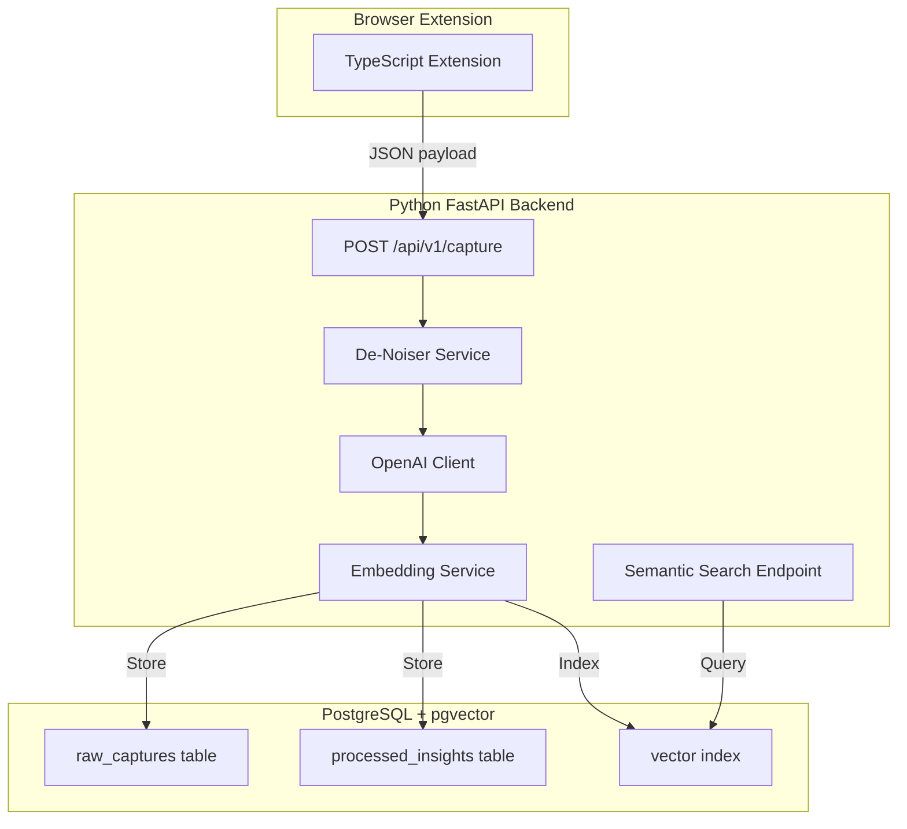

# Backend Technology Recommendations for Sentinel

## Executive Summary

Based on the Sentinel project requirements, here are 3 recommended backend technology stacks, each suited to different priorities and trade-offs.

---

## Recommendation 1: Python + FastAPI

**Best for: AI/ML-heavy workloads, rapid development, excellent async performance**

### Pros

| # | Advantage | Details |
|---|-----------|---------|
| 1 | **Native AI ecosystem** | Best-in-class OpenAI SDK, LangChain, LlamaIndex integrations |
| 2 | **Async by default** | FastAPI's async/await handles concurrent LLM API calls efficiently |
| 3 | **Automatic OpenAPI docs** | Auto-generated Swagger UI for API testing and documentation |
| 4 | **Type hints & validation** | Pydantic integration provides runtime validation + TypeScript-like safety |
| 5 | **PostgreSQL + pgvector** | Excellent SQLAlchemy async support, mature pgvector Python bindings |
| 6 | **Embedding pipelines** | Native support for sentence-transformers, OpenAI embeddings |
| 7 | **Deployment options** | Works everywhere: Docker, serverless (AWS Lambda), PaaS (Railway, Render) |
| 8 | **Data science integration** | Easy to add analytics, ML models, or data processing later |
| 9 | **Large community** | Extensive tutorials, libraries, and StackOverflow support |
| 10 | **Testing ecosystem** | pytest + httpx make async API testing straightforward |

### Cons

| # | Disadvantage | Details |
|---|--------------|---------|
| 1 | **Language context switch** | Team needs to switch between TypeScript (frontend) and Python (backend) |
| 2 | **Runtime overhead** | Python's GIL can be a bottleneck for CPU-intensive tasks |
| 3 | **Dependency management** | pip/poetry complexity vs npm's simplicity |
| 4 | **Type safety gaps** | Runtime type checking (Pydantic) vs compile-time (TypeScript) |
| 5 | **Package size** | Python Docker images larger than Node.js or Go equivalents |
| 6 | **Hiring pool** | May need to hire Python specialists vs full-stack TypeScript developers |
| 7 | **Cold starts** | Python serverless functions have slower cold starts than Go/Rust |
| 8 | **Memory usage** | Higher baseline memory than compiled languages |

---

## Recommendation 2: Node.js + Express/Fastify

**Best for: Full-stack TypeScript, shared code between frontend/backend, rapid iteration**

### Pros

| # | Advantage | Details |
|---|-----------|---------|
| 1 | **Full-stack TypeScript** | Single language across browser extension, backend, and frontend dashboard |
| 2 | **Code sharing** | Share types, validation schemas, utilities between client and server |
| 3 | **V8 performance** | Excellent for I/O-bound workloads like API calls to OpenAI |
| 4 | **Massive ecosystem** | npm has packages for everything: OpenAI SDK, pgvector clients, ORMs |
| 5 | **Fastify option** | 2x faster than Express with built-in JSON schema validation |
| 6 | **JSON-native** | Perfect fit for LLM APIs which all speak JSON |
| 7 | **Developer velocity** | Hot reload, familiar tooling, no context switching |
| 8 | **Deployment ease** | Excellent PaaS support: Vercel, Railway, Render, Fly.io |
| 9 | **Hiring advantage** | Full-stack JavaScript developers are abundant |
| 10 | **Frontend synergy** | Easy to integrate with Phase 4 React/Vue dashboard |

### Cons

| # | Disadvantage | Details |
|---|--------------|---------|
| 1 | **CPU-intensive tasks** | Single-threaded event loop struggles with heavy computation |
| 2 | **Embedding computation** | May need Python microservice for local embedding generation |
| 3 | **Type safety limitations** | Runtime validation requires Zod/Joi vs Python's Pydantic |
| 4 | **Callback complexity** | Legacy callback APIs can clutter code (though async/await helps) |
| 5 | **Package quality variance** | npm quality varies more than Python's mature ML libraries |
| 6 | **Memory leaks** | Easier to create memory leaks than in Python/Go |
| 7 | **pgvector maturity** | Node.js pgvector libraries less mature than Python's |
| 8 | **CPU-bound processing** | LLM response processing can block the event loop |

---

## Recommendation 3: Go (Golang)

**Best for: High performance, concurrent processing, resource efficiency, long-term scalability**

### Pros

| # | Advantage | Details |
|---|-----------|---------|
| 1 | **Blazing performance** | Compiled binary, 10-100x faster than Python for CPU tasks |
| 2 | **Goroutines** | Lightweight concurrency - handle thousands of concurrent LLM requests |
| 3 | **Memory efficiency** | Tiny memory footprint, perfect for cost-effective deployment |
| 4 | **Single binary deployment** | One static binary - no runtime, no dependency hell |
| 5 | **Built-in concurrency** | Channels and goroutines make parallel processing elegant |
| 6 | **Fast startup** | Millisecond cold starts - excellent for serverless |
| 7 | **Type safety** | Compile-time type checking catches errors before deployment |
| 8 | **Standard library** | Robust HTTP server, JSON handling, database drivers built-in |
| 9 | **Production proven** | Used by Google, Uber, Dropbox for high-scale systems |
| 10 | **pgvector support** | pgx + pgvector-go provide excellent PostgreSQL integration |

### Cons

| # | Disadvantage | Details |
|---|--------------|---------|
| 1 | **Steeper learning curve** | Less intuitive than Python/JS, especially for concurrency patterns |
| 2 | **Verbose code** | More boilerplate than Python/TypeScript for the same functionality |
| 3 | **Smaller AI ecosystem** | Fewer LLM/ML libraries - often call external APIs instead |
| 4 | **No generics until recently** | Some libraries still use interface{} patterns |
| 5 | **Error handling** | Explicit error checking is verbose (if err != nil everywhere) |
| 6 | **Development speed** | Slower initial development than Python/Node.js |
| 7 | **Hiring challenges** | Fewer Go developers than Python/JavaScript |
| 8 | **JSON ergonomics** | Struct tags and marshaling less convenient than dynamic languages |

---

## Comparison Matrix

| Criteria | Python + FastAPI | Node.js + Express | Go |
|----------|-----------------|-------------------|-----|
| **AI/LLM Integration** | ⭐⭐⭐⭐⭐ | ⭐⭐⭐⭐ | ⭐⭐⭐ |
| **Development Speed** | ⭐⭐⭐⭐⭐ | ⭐⭐⭐⭐⭐ | ⭐⭐⭐ |
| **Performance** | ⭐⭐⭐ | ⭐⭐⭐⭐ | ⭐⭐⭐⭐⭐ |
| **Concurrency** | ⭐⭐⭐⭐ | ⭐⭐⭐ | ⭐⭐⭐⭐⭐ |
| **Type Safety** | ⭐⭐⭐⭐ | ⭐⭐⭐⭐ | ⭐⭐⭐⭐⭐ |
| **Ecosystem Maturity** | ⭐⭐⭐⭐⭐ | ⭐⭐⭐⭐⭐ | ⭐⭐⭐⭐ |
| **Deployment Simplicity** | ⭐⭐⭐⭐ | ⭐⭐⭐⭐⭐ | ⭐⭐⭐⭐⭐ |
| **Team Onboarding** | ⭐⭐⭐⭐ | ⭐⭐⭐⭐⭐ | ⭐⭐⭐ |
| **Resource Efficiency** | ⭐⭐⭐ | ⭐⭐⭐ | ⭐⭐⭐⭐⭐ |
| **Long-term Scalability** | ⭐⭐⭐⭐ | ⭐⭐⭐⭐ | ⭐⭐⭐⭐⭐ |

---

## Final Recommendation for Sentinel

### Primary Choice: **Python + FastAPI**

**Rationale:**

1. **AI-centric workload**: Sentinel's core value is LLM processing (extraction, embeddings, tagging). Python's AI ecosystem is unmatched.

2. **Async LLM calls**: FastAPI's native async handles multiple concurrent OpenAI API calls efficiently - critical for the ingestion pipeline.

3. **Vector search**: Mature pgvector + SQLAlchemy async support for semantic search requirements.

4. **Rapid iteration**: Get Phase 2 (Ingestion Engine) and Phase 3 (Vault) running quickly.

### Alternative: **Node.js + Fastify**

If the team strongly prefers TypeScript everywhere, Node.js is viable but consider:
- Using OpenAI's Node.js SDK (excellent)
- Offloading embedding generation to a Python microservice if needed
- Using Zod for runtime validation to match Pydantic's safety

### When to choose Go:

- If you anticipate very high traffic (thousands of captures/minute)
- If cost optimization (memory/CPU) becomes critical
- If you want to process embeddings locally with onnxruntime-go

---

## Suggested Architecture (Python Stack)



## Key Dependencies (Python)

```txt
# Core framework
fastapi>=0.104.0
uvicorn[standard]>=0.24.0

# Database
sqlalchemy[asyncio]>=2.0.0
asyncpg>=0.29.0  # PostgreSQL async driver
pgvector>=0.2.0  # Vector extension support

# AI/LLM
openai>=1.0.0
langchain>=0.1.0  # Optional: for complex pipelines

# Validation
pydantic>=2.0.0
pydantic-settings>=2.0.0

# Utilities
python-multipart>=0.0.6  # Form data
httpx>=0.25.0  # Async HTTP client
```

## Executive Summary

Based on the Sentinel project requirements, here are 3 recommended backend technology stacks, each suited to different priorities and trade-offs.

---

## Recommendation 1: Python + FastAPI

**Best for: AI/ML-heavy workloads, rapid development, excellent async performance**

### Pros

| # | Advantage | Details |
|---|-----------|---------|
| 1 | **Native AI ecosystem** | Best-in-class OpenAI SDK, LangChain, LlamaIndex integrations |
| 2 | **Async by default** | FastAPI's async/await handles concurrent LLM API calls efficiently |
| 3 | **Automatic OpenAPI docs** | Auto-generated Swagger UI for API testing and documentation |
| 4 | **Type hints & validation** | Pydantic integration provides runtime validation + TypeScript-like safety |
| 5 | **PostgreSQL + pgvector** | Excellent SQLAlchemy async support, mature pgvector Python bindings |
| 6 | **Embedding pipelines** | Native support for sentence-transformers, OpenAI embeddings |
| 7 | **Deployment options** | Works everywhere: Docker, serverless (AWS Lambda), PaaS (Railway, Render) |
| 8 | **Data science integration** | Easy to add analytics, ML models, or data processing later |
| 9 | **Large community** | Extensive tutorials, libraries, and StackOverflow support |
| 10 | **Testing ecosystem** | pytest + httpx make async API testing straightforward |

### Cons

| # | Disadvantage | Details |
|---|--------------|---------|
| 1 | **Language context switch** | Team needs to switch between TypeScript (frontend) and Python (backend) |
| 2 | **Runtime overhead** | Python's GIL can be a bottleneck for CPU-intensive tasks |
| 3 | **Dependency management** | pip/poetry complexity vs npm's simplicity |
| 4 | **Type safety gaps** | Runtime type checking (Pydantic) vs compile-time (TypeScript) |
| 5 | **Package size** | Python Docker images larger than Node.js or Go equivalents |
| 6 | **Hiring pool** | May need to hire Python specialists vs full-stack TypeScript developers |
| 7 | **Cold starts** | Python serverless functions have slower cold starts than Go/Rust |
| 8 | **Memory usage** | Higher baseline memory than compiled languages |

---

## Recommendation 2: Node.js + Express/Fastify

**Best for: Full-stack TypeScript, shared code between frontend/backend, rapid iteration**

### Pros

| # | Advantage | Details |
|---|-----------|---------|
| 1 | **Full-stack TypeScript** | Single language across browser extension, backend, and frontend dashboard |
| 2 | **Code sharing** | Share types, validation schemas, utilities between client and server |
| 3 | **V8 performance** | Excellent for I/O-bound workloads like API calls to OpenAI |
| 4 | **Massive ecosystem** | npm has packages for everything: OpenAI SDK, pgvector clients, ORMs |
| 5 | **Fastify option** | 2x faster than Express with built-in JSON schema validation |
| 6 | **JSON-native** | Perfect fit for LLM APIs which all speak JSON |
| 7 | **Developer velocity** | Hot reload, familiar tooling, no context switching |
| 8 | **Deployment ease** | Excellent PaaS support: Vercel, Railway, Render, Fly.io |
| 9 | **Hiring advantage** | Full-stack JavaScript developers are abundant |
| 10 | **Frontend synergy** | Easy to integrate with Phase 4 React/Vue dashboard |

### Cons

| # | Disadvantage | Details |
|---|--------------|---------|
| 1 | **CPU-intensive tasks** | Single-threaded event loop struggles with heavy computation |
| 2 | **Embedding computation** | May need Python microservice for local embedding generation |
| 3 | **Type safety limitations** | Runtime validation requires Zod/Joi vs Python's Pydantic |
| 4 | **Callback complexity** | Legacy callback APIs can clutter code (though async/await helps) |
| 5 | **Package quality variance** | npm quality varies more than Python's mature ML libraries |
| 6 | **Memory leaks** | Easier to create memory leaks than in Python/Go |
| 7 | **pgvector maturity** | Node.js pgvector libraries less mature than Python's |
| 8 | **CPU-bound processing** | LLM response processing can block the event loop |

---

## Recommendation 3: Go (Golang)

**Best for: High performance, concurrent processing, resource efficiency, long-term scalability**

### Pros

| # | Advantage | Details |
|---|-----------|---------|
| 1 | **Blazing performance** | Compiled binary, 10-100x faster than Python for CPU tasks |
| 2 | **Goroutines** | Lightweight concurrency - handle thousands of concurrent LLM requests |
| 3 | **Memory efficiency** | Tiny memory footprint, perfect for cost-effective deployment |
| 4 | **Single binary deployment** | One static binary - no runtime, no dependency hell |
| 5 | **Built-in concurrency** | Channels and goroutines make parallel processing elegant |
| 6 | **Fast startup** | Millisecond cold starts - excellent for serverless |
| 7 | **Type safety** | Compile-time type checking catches errors before deployment |
| 8 | **Standard library** | Robust HTTP server, JSON handling, database drivers built-in |
| 9 | **Production proven** | Used by Google, Uber, Dropbox for high-scale systems |
| 10 | **pgvector support** | pgx + pgvector-go provide excellent PostgreSQL integration |

### Cons

| # | Disadvantage | Details |
|---|--------------|---------|
| 1 | **Steeper learning curve** | Less intuitive than Python/JS, especially for concurrency patterns |
| 2 | **Verbose code** | More boilerplate than Python/TypeScript for the same functionality |
| 3 | **Smaller AI ecosystem** | Fewer LLM/ML libraries - often call external APIs instead |
| 4 | **No generics until recently** | Some libraries still use interface{} patterns |
| 5 | **Error handling** | Explicit error checking is verbose (if err != nil everywhere) |
| 6 | **Development speed** | Slower initial development than Python/Node.js |
| 7 | **Hiring challenges** | Fewer Go developers than Python/JavaScript |
| 8 | **JSON ergonomics** | Struct tags and marshaling less convenient than dynamic languages |

---

## Comparison Matrix

| Criteria | Python + FastAPI | Node.js + Express | Go |
|----------|-----------------|-------------------|-----|
| **AI/LLM Integration** | ⭐⭐⭐⭐⭐ | ⭐⭐⭐⭐ | ⭐⭐⭐ |
| **Development Speed** | ⭐⭐⭐⭐⭐ | ⭐⭐⭐⭐⭐ | ⭐⭐⭐ |
| **Performance** | ⭐⭐⭐ | ⭐⭐⭐⭐ | ⭐⭐⭐⭐⭐ |
| **Concurrency** | ⭐⭐⭐⭐ | ⭐⭐⭐ | ⭐⭐⭐⭐⭐ |
| **Type Safety** | ⭐⭐⭐⭐ | ⭐⭐⭐⭐ | ⭐⭐⭐⭐⭐ |
| **Ecosystem Maturity** | ⭐⭐⭐⭐⭐ | ⭐⭐⭐⭐⭐ | ⭐⭐⭐⭐ |
| **Deployment Simplicity** | ⭐⭐⭐⭐ | ⭐⭐⭐⭐⭐ | ⭐⭐⭐⭐⭐ |
| **Team Onboarding** | ⭐⭐⭐⭐ | ⭐⭐⭐⭐⭐ | ⭐⭐⭐ |
| **Resource Efficiency** | ⭐⭐⭐ | ⭐⭐⭐ | ⭐⭐⭐⭐⭐ |
| **Long-term Scalability** | ⭐⭐⭐⭐ | ⭐⭐⭐⭐ | ⭐⭐⭐⭐⭐ |

---

## Final Recommendation for Sentinel

### Primary Choice: **Python + FastAPI**

**Rationale:**

1. **AI-centric workload**: Sentinel's core value is LLM processing (extraction, embeddings, tagging). Python's AI ecosystem is unmatched.

2. **Async LLM calls**: FastAPI's native async handles multiple concurrent OpenAI API calls efficiently - critical for the ingestion pipeline.

3. **Vector search**: Mature pgvector + SQLAlchemy async support for semantic search requirements.

4. **Rapid iteration**: Get Phase 2 (Ingestion Engine) and Phase 3 (Vault) running quickly.

### Alternative: **Node.js + Fastify**

If the team strongly prefers TypeScript everywhere, Node.js is viable but consider:
- Using OpenAI's Node.js SDK (excellent)
- Offloading embedding generation to a Python microservice if needed
- Using Zod for runtime validation to match Pydantic's safety

### When to choose Go:

- If you anticipate very high traffic (thousands of captures/minute)
- If cost optimization (memory/CPU) becomes critical
- If you want to process embeddings locally with onnxruntime-go

---

## Suggested Architecture (Python Stack)


## Key Dependencies (Python)

```txt
# Core framework
fastapi>=0.104.0
uvicorn[standard]>=0.24.0

# Database
sqlalchemy[asyncio]>=2.0.0
asyncpg>=0.29.0  # PostgreSQL async driver
pgvector>=0.2.0  # Vector extension support

# AI/LLM
openai>=1.0.0
langchain>=0.1.0  # Optional: for complex pipelines

# Validation
pydantic>=2.0.0
pydantic-settings>=2.0.0

# Utilities
python-multipart>=0.0.6  # Form data
httpx>=0.25.0  # Async HTTP client
```

