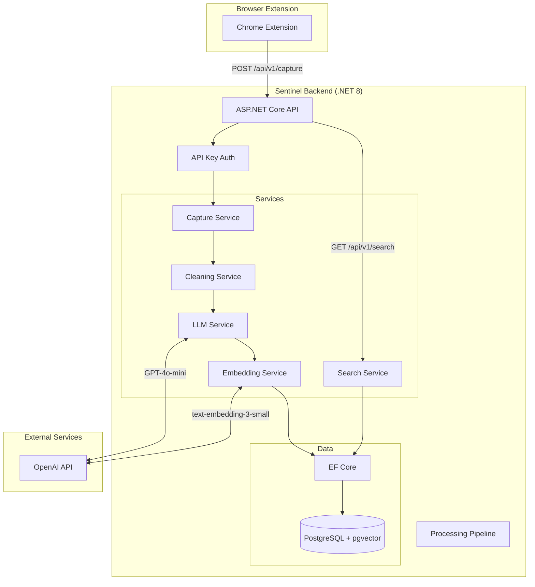

# .NET Backend Implementation Plan for Sentinel Knowledgebase

## Executive Summary

This document provides a comprehensive implementation plan for the Sentinel backend using **.NET 8 (LTS)** with ASP.NET Core. The plan includes step-by-step implementation with verification checkpoints and a complete integration test strategy using xUnit.

## Architecture Overview



## Technology Stack

| Component | Technology | Version |
|-----------|------------|---------|
| Framework | .NET | 8.0 LTS |
| Web API | ASP.NET Core | 8.0 |
| ORM | Entity Framework Core | 8.0 |
| Database | PostgreSQL | 15+ |
| Vector Extension | pgvector | 0.5+ |
| OpenAI SDK | Azure.AI.OpenAI | 1.0+ |
| Testing | xUnit | 2.6+ |
| Test HTTP | Microsoft.AspNetCore.Mvc.Testing | 8.0 |
| Test DB | Testcontainers.PostgreSql | 3.8+ |
| Assertions | FluentAssertions | 6.12+ |
| Mocking | NSubstitute | 5.1+ |

## Project Structure

```
sentinel-backend/
├── Sentinel.Api/                          # Main API project
│   ├── Controllers/
│   │   ├── CaptureController.cs
│   │   ├── SearchController.cs
│   │   └── HealthController.cs
│   ├── Middleware/
│   │   ├── ApiKeyAuthenticationMiddleware.cs
│   │   └── ExceptionHandlingMiddleware.cs
│   ├── appsettings.json
│   ├── appsettings.Development.json
│   └── Program.cs
│
├── Sentinel.Application/                  # Business logic layer
│   ├── Interfaces/
│   │   ├── ICaptureService.cs
│   │   ├── ICleaningService.cs
│   │   ├── ILlmService.cs
│   │   ├── IEmbeddingService.cs
│   │   ├── ISearchService.cs
│   │   └── IUnitOfWork.cs
│   ├── Services/
│   │   ├── CaptureService.cs
│   │   ├── CleaningService.cs
│   │   ├── LlmService.cs
│   │   ├── EmbeddingService.cs
│   │   └── SearchService.cs
│   ├── DTOs/
│   │   ├── Capture/
│   │   ├── Search/
│   │   └── Common/
│   ├── Pipeline/
│   │   └── ProcessingPipeline.cs
│   └── DependencyInjection.cs
│
├── Sentinel.Domain/                       # Domain entities and enums
│   ├── Entities/
│   │   ├── RawCapture.cs
│   │   ├── ProcessedInsight.cs
│   │   └── BaseEntity.cs
│   ├── Enums/
│   │   ├── CaptureSource.cs
│   │   └── ProcessingStatus.cs
│   └── ValueObjects/
│       ├── AuthorInfo.cs
│       └── ContentData.cs
│
├── Sentinel.Infrastructure/               # Data access and external services
│   ├── Data/
│   │   ├── SentinelDbContext.cs
│   │   ├── Configurations/
│   │   │   ├── RawCaptureConfiguration.cs
│   │   │   └── ProcessedInsightConfiguration.cs
│   │   └── Migrations/
│   ├── Repositories/
│   │   ├── RawCaptureRepository.cs
│   │   └── ProcessedInsightRepository.cs
│   ├── Vector/
│   │   └── VectorSearchService.cs
│   └── DependencyInjection.cs
│
├── Sentinel.IntegrationTests/             # Integration tests
│   ├── Fixtures/
│   │   ├── SentinelApiFactory.cs
│   │   └── DatabaseFixture.cs
│   ├── TestCollections/
│   ├── Controllers/
│   │   ├── CaptureControllerTests.cs
│   │   └── SearchControllerTests.cs
│   ├── Services/
│   │   ├── ProcessingPipelineTests.cs
│   │   └── CleaningServiceTests.cs
│   ├── Helpers/
│   │   ├── TestDataGenerator.cs
│   │   └── HttpClientExtensions.cs
│   └── IntegrationTestBase.cs
│
├── Sentinel.UnitTests/                    # Unit tests
│   ├── Services/
│   ├── Pipeline/
│   └── Domain/
│
└── sentinel-backend.sln
```

## Phase 1: Project Setup and Infrastructure

### Task 1.1: Create Solution Structure

**Goal:** Initialize the .NET solution with all projects and dependencies.

**Steps:**

1. Create solution directory and solution file:
```bash
cd c:/projects/ai/sentinel-knowledgebase
mkdir backend
cd backend
dotnet new sln -n sentinel-backend
```

2. Create API project:
```bash
dotnet new webapi -n Sentinel.Api
dotnet sln add Sentinel.Api/Sentinel.Api.csproj
```

3. Create class library projects:
```bash
dotnet new classlib -n Sentinel.Domain
dotnet new classlib -n Sentinel.Application
dotnet new classlib -n Sentinel.Infrastructure
dotnet sln add Sentinel.Domain/Sentinel.Domain.csproj
dotnet sln add Sentinel.Application/Sentinel.Application.csproj
dotnet sln add Sentinel.Infrastructure/Sentinel.Infrastructure.csproj
```

4. Create test projects:
```bash
dotnet new xunit -n Sentinel.IntegrationTests
dotnet new xunit -n Sentinel.UnitTests
dotnet sln add Sentinel.IntegrationTests/Sentinel.IntegrationTests.csproj
dotnet sln add Sentinel.UnitTests/Sentinel.UnitTests.csproj
```

5. Add project references:
```bash
# API references Application and Infrastructure
cd Sentinel.Api
dotnet add reference ../Sentinel.Application/Sentinel.Application.csproj
dotnet add reference ../Sentinel.Infrastructure/Sentinel.Infrastructure.csproj
cd ..

# Application references Domain
cd Sentinel.Application
dotnet add reference ../Sentinel.Domain/Sentinel.Domain.csproj
cd ..

# Infrastructure references Domain and Application
cd Sentinel.Infrastructure
dotnet add reference ../Sentinel.Domain/Sentinel.Domain.csproj
dotnet add reference ../Sentinel.Application/Sentinel.Application.csproj
cd ..

# Test projects reference all others
cd Sentinel.IntegrationTests
dotnet add reference ../Sentinel.Api/Sentinel.Api.csproj
dotnet add reference ../Sentinel.Application/Sentinel.Application.csproj
dotnet add reference ../Sentinel.Infrastructure/Sentinel.Infrastructure.csproj
cd ..

cd Sentinel.UnitTests
dotnet add reference ../Sentinel.Domain/Sentinel.Domain.csproj
dotnet add reference ../Sentinel.Application/Sentinel.Application.csproj
cd ..
```

6. Add NuGet packages:
```bash
# API packages
cd Sentinel.Api
dotnet add package Swashbuckle.AspNetCore
dotnet add package Microsoft.EntityFrameworkCore.Design
cd ..

# Infrastructure packages
cd Sentinel.Infrastructure
dotnet add package Npgsql.EntityFrameworkCore.PostgreSQL
dotnet add package Microsoft.EntityFrameworkCore
dotnet add package Azure.AI.OpenAI
dotnet add package Pgvector.EntityFrameworkCore
cd ..

# Application packages
cd Sentinel.Application
dotnet add package Microsoft.Extensions.DependencyInjection.Abstractions
dotnet add package Microsoft.Extensions.Logging.Abstractions
cd ..

# Integration test packages
cd Sentinel.IntegrationTests
dotnet add package Microsoft.AspNetCore.Mvc.Testing
dotnet add package Testcontainers.PostgreSql
dotnet add package FluentAssertions
dotnet add package NSubstitute
dotnet add package Microsoft.EntityFrameworkCore.InMemory
cd ..

# Unit test packages
cd Sentinel.UnitTests
dotnet add package FluentAssertions
dotnet add package NSubstitute
cd ..
```

**Verification:**
```bash
dotnet build
# Expected: Build succeeds with no errors
dotnet test
# Expected: Test discovery succeeds (no tests yet)
```

---

### Task 1.2: Configure Entity Framework Core with pgvector

**Goal:** Set up database context with PostgreSQL and vector support.

**Files to Create:**

1. **Sentinel.Domain/Entities/BaseEntity.cs**
2. **Sentinel.Domain/Entities/RawCapture.cs**
3. **Sentinel.Domain/Entities/ProcessedInsight.cs**
4. **Sentinel.Domain/Enums/CaptureSource.cs**
5. **Sentinel.Domain/Enums/ProcessingStatus.cs**
6. **Sentinel.Domain/ValueObjects/AuthorInfo.cs**
7. **Sentinel.Domain/ValueObjects/ContentData.cs**
8. **Sentinel.Infrastructure/Data/SentinelDbContext.cs**
9. **Sentinel.Infrastructure/Data/Configurations/RawCaptureConfiguration.cs**
10. **Sentinel.Infrastructure/Data/Configurations/ProcessedInsightConfiguration.cs**

**Verification:**
```bash
cd Sentinel.Infrastructure
dotnet ef migrations add InitialCreate --startup-project ../Sentinel.Api
# Expected: Migration created successfully
dotnet ef database update --startup-project ../Sentinel.Api
# Expected: Database created with tables
```

---

### Task 1.3: Implement API Key Authentication Middleware

**Goal:** Secure API endpoints with API key authentication matching browser extension expectations.

**Files to Create:**

1. **Sentinel.Api/Middleware/ApiKeyAuthenticationMiddleware.cs**
2. **Sentinel.Api/Middleware/ExceptionHandlingMiddleware.cs**

**Verification (Integration Test):**

Create test: **Sentinel.IntegrationTests/Middleware/ApiKeyAuthenticationTests.cs**

```csharp
[Fact]
public async Task Request_WithoutApiKey_Returns401()
{
    // Arrange
    var client = _factory.CreateClient();
    
    // Act
    var response = await client.PostAsJsonAsync("/api/v1/capture", new {});
    
    // Assert
    response.StatusCode.Should().Be(HttpStatusCode.Unauthorized);
}

[Fact]
public async Task Request_WithValidApiKey_ReturnsSuccess()
{
    // Arrange
    var client = _factory.CreateClient();
    client.DefaultRequestHeaders.Add("Authorization", "Bearer test-api-key");
    
    // Act
    var response = await client.PostAsJsonAsync("/api/v1/capture", TestDataGenerator.CreateTweetCapture());
    
    // Assert
    response.StatusCode.Should().Be(HttpStatusCode.Accepted);
}
```

---

## Phase 2: Domain Layer Implementation

### Task 2.1: Define Domain Entities

**Goal:** Create domain entities matching browser extension data contracts.

**Data Contract from Browser Extension:**

```typescript
// Tweet Data
interface TweetData {
  source: 'tweet';
  tweet_id: string;
  author: {
    username: string;
    display_name: string;
  };
  content: {
    text: string;
    timestamp: string | null;
    url: string;
  };
  captured_at: string;
}

// Webpage Data
interface WebpageData {
  source: 'webpage';
  url: string;
  title: string;
  author: string | null;
  publish_date: string | null;
  description: string | null;
  content: {
    text: string;
    html: string;
    excerpt: string;
  };
  metadata: {
    site_name: string | null;
    favicon: string | null;
    language: string | null;
  };
  captured_at: string;
}
```

**Files to Create:**

1. **Sentinel.Domain/Enums/CaptureSource.cs**
```csharp
public enum CaptureSource
{
    Tweet,
    Webpage,
    WebpageSelection
}
```

2. **Sentinel.Domain/Enums/ProcessingStatus.cs**
```csharp
public enum ProcessingStatus
{
    Pending,
    Processing,
    Completed,
    Failed
}
```

3. **Sentinel.Domain/ValueObjects/AuthorInfo.cs**
```csharp
public record AuthorInfo
{
    public string Username { get; init; } = string.Empty;
    public string DisplayName { get; init; } = string.Empty;
}
```

4. **Sentinel.Domain/ValueObjects/ContentData.cs**
```csharp
public record ContentData
{
    public string Text { get; init; } = string.Empty;
    public string? Html { get; init; }
    public string? Excerpt { get; init; }
    public DateTime? Timestamp { get; init; }
    public string Url { get; init; } = string.Empty;
}
```

5. **Sentinel.Domain/Entities/BaseEntity.cs**
```csharp
public abstract class BaseEntity
{
    public Guid Id { get; protected set; }
    public DateTime CreatedAt { get; protected set; }
    public DateTime UpdatedAt { get; protected set; }
}
```

6. **Sentinel.Domain/Entities/RawCapture.cs**
```csharp
public class RawCapture : BaseEntity
{
    public CaptureSource Source { get; private set; }
    public string SourceId { get; private set; } = string.Empty;  // tweet_id or URL
    public AuthorInfo Author { get; private set; } = null!;
    public ContentData Content { get; private set; } = null!;
    public string? RawJson { get; private set; }
    public DateTime CapturedAt { get; private set; }
    public ProcessingStatus Status { get; private set; }
    
    // Navigation property
    public ProcessedInsight? ProcessedInsight { get; private set; }
    
    // Factory methods
    public static RawCapture CreateTweet(...)
    public static RawCapture CreateWebpage(...)
}
```

7. **Sentinel.Domain/Entities/ProcessedInsight.cs**
```csharp
public class ProcessedInsight : BaseEntity
{
    public Guid RawCaptureId { get; private set; }
    public RawCapture RawCapture { get; private set; } = null!;
    
    // AI-extracted fields
    public string Summary { get; private set; } = string.Empty;  // BLUF
    public List<string> ActionableBullets { get; private set; } = new();
    public List<string> Tags { get; private set; } = new();
    public string? Sentiment { get; private set; }
    
    // Vector embedding for semantic search
    public float[] Embedding { get; private set; } = Array.Empty<float>();
    
    // Processing metadata
    public string ModelUsed { get; private set; } = string.Empty;
    public int TokensUsed { get; private set; }
    public DateTime ProcessedAt { get; private set; }
}
```

**Verification (Unit Test):**

Create test: **Sentinel.UnitTests/Domain/RawCaptureTests.cs**

```csharp
[Fact]
public void CreateTweet_WithValidData_CreatesCapture()
{
    // Arrange & Act
    var capture = RawCapture.CreateTweet(
        tweetId: "123456",
        author: new AuthorInfo { Username = "testuser", DisplayName = "Test User" },
        content: new ContentData { Text = "Test tweet", Url = "https://x.com/test/123" },
        capturedAt: DateTime.UtcNow
    );
    
    // Assert
    capture.Source.Should().Be(CaptureSource.Tweet);
    capture.Status.Should().Be(ProcessingStatus.Pending);
    capture.SourceId.Should().Be("123456");
}
```

---

## Phase 3: Application Layer Implementation

### Task 3.1: Define Service Interfaces

**Goal:** Create contracts for all business logic services.

**Files to Create:**

1. **Sentinel.Application/Interfaces/ICaptureService.cs**
```csharp
public interface ICaptureService
{
    Task<Guid> CaptureTweetAsync(TweetCaptureRequest request, CancellationToken ct = default);
    Task<Guid> CaptureWebpageAsync(WebpageCaptureRequest request, CancellationToken ct = default);
    Task<RawCaptureDto?> GetCaptureAsync(Guid id, CancellationToken ct = default);
}
```

2. **Sentinel.Application/Interfaces/ICleaningService.cs**
```csharp
public interface ICleaningService
{
    string CleanTweetText(string text);
    string CleanWebpageContent(string content);
    string RemoveTrackingParameters(string url);
}
```

3. **Sentinel.Application/Interfaces/ILlmService.cs**
```csharp
public interface ILlmService
{
    Task<LlmExtractionResult> ExtractInsightsAsync(string cleanedText, CancellationToken ct = default);
    Task<List<string>> GenerateTagsAsync(string summary, List<string> existingTags, CancellationToken ct = default);
}
```

4. **Sentinel.Application/Interfaces/IEmbeddingService.cs**
```csharp
public interface IEmbeddingService
{
    Task<float[]> GenerateEmbeddingAsync(string text, CancellationToken ct = default);
}
```

5. **Sentinel.Application/Interfaces/ISearchService.cs**
```csharp
public interface ISearchService
{
    Task<List<SearchResultDto>> SearchAsync(string query, int limit = 10, CancellationToken ct = default);
    Task<List<SearchResultDto>> SemanticSearchAsync(string query, int limit = 10, float minSimilarity = 0.7f, CancellationToken ct = default);
}
```

6. **Sentinel.Application/Interfaces/IUnitOfWork.cs**
```csharp
public interface IUnitOfWork
{
    Task<int> SaveChangesAsync(CancellationToken ct = default);
}
```

---

### Task 3.2: Implement DTOs

**Goal:** Define data transfer objects for API contracts.

**Files to Create:**

1. **Sentinel.Application/DTOs/Capture/TweetCaptureRequest.cs**
```csharp
public record TweetCaptureRequest
{
    public string TweetId { get; init; } = string.Empty;
    public AuthorInfoDto Author { get; init; } = null!;
    public TweetContentDto Content { get; init; } = null!;
    public DateTime CapturedAt { get; init; }
}

public record AuthorInfoDto
{
    public string Username { get; init; } = string.Empty;
    public string DisplayName { get; init; } = string.Empty;
}

public record TweetContentDto
{
    public string Text { get; init; } = string.Empty;
    public DateTime? Timestamp { get; init; }
    public string Url { get; init; } = string.Empty;
}
```

2. **Sentinel.Application/DTOs/Capture/WebpageCaptureRequest.cs**
```csharp
public record WebpageCaptureRequest
{
    public string Url { get; init; } = string.Empty;
    public string Title { get; init; } = string.Empty;
    public string? Author { get; init; }
    public DateTime? PublishDate { get; init; }
    public string? Description { get; init; }
    public WebpageContentDto Content { get; init; } = null!;
    public WebpageMetadataDto Metadata { get; init; } = null!;
    public DateTime CapturedAt { get; init; }
}

public record WebpageContentDto
{
    public string Text { get; init; } = string.Empty;
    public string Html { get; init; } = string.Empty;
    public string Excerpt { get; init; } = string.Empty;
}

public record WebpageMetadataDto
{
    public string? SiteName { get; init; }
    public string? Favicon { get; init; }
    public string? Language { get; init; }
}
```

3. **Sentinel.Application/DTOs/Capture/CaptureResponse.cs**
```csharp
public record CaptureResponse
{
    public bool Success { get; init; }
    public Guid Id { get; init; }
    public string Message { get; init; } = string.Empty;
}
```

4. **Sentinel.Application/DTOs/Search/SearchResultDto.cs**
```csharp
public record SearchResultDto
{
    public Guid Id { get; init; }
    public string Source { get; init; } = string.Empty;
    public string Title { get; init; } = string.Empty;
    public string Summary { get; init; } = string.Empty;
    public List<string> Tags { get; init; } = new();
    public string Url { get; init; } = string.Empty;
    public DateTime CapturedAt { get; init; }
    public float? SimilarityScore { get; init; }
}
```

5. **Sentinel.Application/DTOs/Llm/LlmExtractionResult.cs**
```csharp
public record LlmExtractionResult
{
    public string Summary { get; init; } = string.Empty;
    public List<string> ActionableBullets { get; init; } = new();
    public string? Sentiment { get; init; }
    public int TokensUsed { get; init; }
}
```

---

### Task 3.3: Implement Cleaning Service

**Goal:** Create the "De-Noiser" to clean raw content.

**File:** **Sentinel.Application/Services/CleaningService.cs**

**Features:**
- Remove "Thread 1/n" patterns
- Strip excessive emojis (keep max 3 per tweet)
- Remove tracking parameters from URLs
- Normalize whitespace
- Remove common Twitter clutter ("RT @", "via @")

**Verification (Unit Test):**

Create test: **Sentinel.UnitTests/Services/CleaningServiceTests.cs**

```csharp
[Theory]
[InlineData("Thread 1/5 This is important", "This is important")]
[InlineData("RT @user Check this out", "Check this out")]
[InlineData("Hello 👋👋👋👋👋 world", "Hello 👋👋👋 world")]
public void CleanTweetText_RemovesClutter(string input, string expected)
{
    // Arrange
    var service = new CleaningService();
    
    // Act
    var result = service.CleanTweetText(input);
    
    // Assert
    result.Should().Be(expected);
}

[Fact]
public void RemoveTrackingParameters_RemovesUtmParams()
{
    // Arrange
    var service = new CleaningService();
    var url = "https://example.com/article?utm_source=twitter&utm_medium=social";
    
    // Act
    var result = service.RemoveTrackingParameters(url);
    
    // Assert
    result.Should().Be("https://example.com/article");
}
```

---

### Task 3.4: Implement LLM Service

**Goal:** Integrate with OpenAI API for content extraction.

**File:** **Sentinel.Application/Services/LlmService.cs**

**System Prompt for Extraction:**
```
You are an expert content analyzer. Extract the following from the provided text:
1. Summary: A one-sentence "Bottom Line Up Front" (BLUF) capturing the core insight
2. Actionable Bullets: 2-5 specific, actionable takeaways or lessons
3. Sentiment: Overall tone (positive, negative, neutral, or mixed)

Return ONLY valid JSON in this format:
{
  "summary": "string",
  "actionableBullets": ["string"],
  "sentiment": "string"
}
```

**System Prompt for Tagging:**
```
Assign 3-5 relevant tags to categorize this content. Use lowercase, hyphenated format.
Examples: saas-marketing, product-management, ai-ml, leadership, productivity

Return ONLY a JSON array of strings.
```

**Configuration:**
```json
{
  "OpenAi": {
    "ApiKey": "${OPENAI_API_KEY}",
    "Model": "gpt-4o-mini",
    "EmbeddingModel": "text-embedding-3-small",
    "MaxTokens": 1000,
    "Temperature": 0.3
  }
}
```

**Verification (Integration Test with Mock):**

Create test: **Sentinel.IntegrationTests/Services/LlmServiceTests.cs**

```csharp
[Fact]
public async Task ExtractInsightsAsync_WithValidText_ReturnsStructuredData()
{
    // Arrange
    var mockClient = Substitute.For<OpenAIClient>();
    // Setup mock response...
    var service = new LlmService(mockClient, _options);
    
    // Act
    var result = await service.ExtractInsightsAsync("This is a test tweet about SaaS marketing.");
    
    // Assert
    result.Summary.Should().NotBeNullOrEmpty();
    result.ActionableBullets.Should().NotBeEmpty();
}
```

---

### Task 3.5: Implement Embedding Service

**Goal:** Generate vector embeddings for semantic search.

**File:** **Sentinel.Application/Services/EmbeddingService.cs**

**Features:**
- Call OpenAI Embeddings API with text-embedding-3-small
- Handle batching for multiple texts
- Cache embeddings to reduce API calls

**Verification (Integration Test):**

```csharp
[Fact]
public async Task GenerateEmbeddingAsync_ReturnsVector()
{
    // Arrange
    var service = new EmbeddingService(_mockClient, _options);
    
    // Act
    var embedding = await service.GenerateEmbeddingAsync("Test text for embedding");
    
    // Assert
    embedding.Should().NotBeNull();
    embedding.Length.Should().Be(1536); // text-embedding-3-small dimension
}
```

---

### Task 3.6: Implement Processing Pipeline

**Goal:** Orchestrate the full processing flow.

**File:** **Sentinel.Application/Pipeline/ProcessingPipeline.cs**

```csharp
public class ProcessingPipeline
{
    private readonly ICleaningService _cleaningService;
    private readonly ILlmService _llmService;
    private readonly IEmbeddingService _embeddingService;
    private readonly IRawCaptureRepository _captureRepository;
    private readonly IUnitOfWork _unitOfWork;
    private readonly ILogger<ProcessingPipeline> _logger;

    public async Task ProcessCaptureAsync(Guid captureId, CancellationToken ct = default)
    {
        // 1. Retrieve capture
        var capture = await _captureRepository.GetByIdAsync(captureId, ct);
        if (capture == null) throw new NotFoundException();
        
        // 2. Update status to Processing
        capture.StartProcessing();
        await _unitOfWork.SaveChangesAsync(ct);
        
        try
        {
            // 3. Clean the content
            var cleanedText = _cleaningService.CleanTweetText(capture.Content.Text);
            
            // 4. Extract insights with LLM
            var extraction = await _llmService.ExtractInsightsAsync(cleanedText, ct);
            
            // 5. Generate tags
            var tags = await _llmService.GenerateTagsAsync(extraction.Summary, new List<string>(), ct);
            
            // 6. Generate embedding
            var embedding = await _embeddingService.GenerateEmbeddingAsync(extraction.Summary, ct);
            
            // 7. Create processed insight
            var insight = ProcessedInsight.Create(
                rawCaptureId: captureId,
                summary: extraction.Summary,
                actionableBullets: extraction.ActionableBullets,
                tags: tags,
                sentiment: extraction.Sentiment,
                embedding: embedding,
                modelUsed: "gpt-4o-mini",
                tokensUsed: extraction.TokensUsed
            );
            
            // 8. Save and complete
            capture.CompleteProcessing(insight);
            await _unitOfWork.SaveChangesAsync(ct);
            
            _logger.LogInformation("Processed capture {CaptureId} successfully", captureId);
        }
        catch (Exception ex)
        {
            capture.FailProcessing(ex.Message);
            await _unitOfWork.SaveChangesAsync(ct);
            throw;
        }
    }
}
```

**Verification (Integration Test):**

Create test: **Sentinel.IntegrationTests/Pipeline/ProcessingPipelineTests.cs**

```csharp
[Fact]
public async Task ProcessCaptureAsync_CompletesFullPipeline()
{
    // Arrange
    var capture = await SeedCaptureAsync();
    
    // Act
    await _pipeline.ProcessCaptureAsync(capture.Id);
    
    // Assert
    var processed = await _dbContext.ProcessedInsights
        .FirstOrDefaultAsync(p => p.RawCaptureId == capture.Id);
    
    processed.Should().NotBeNull();
    processed!.Summary.Should().NotBeNullOrEmpty();
    processed.Tags.Should().NotBeEmpty();
    processed.Embedding.Should().NotBeEmpty();
}
```

---

## Phase 4: Infrastructure Layer Implementation

### Task 4.1: Implement Database Context and Migrations

**Goal:** Configure EF Core with PostgreSQL and pgvector.

**File:** **Sentinel.Infrastructure/Data/SentinelDbContext.cs**

```csharp
public class SentinelDbContext : DbContext, IUnitOfWork
{
    public DbSet<RawCapture> RawCaptures { get; set; } = null!;
    public DbSet<ProcessedInsight> ProcessedInsights { get; set; } = null!;

    protected override void OnModelCreating(ModelBuilder modelBuilder)
    {
        modelBuilder.ApplyConfigurationsFromAssembly(typeof(SentinelDbContext).Assembly);
        
        // Enable pgvector extension
        modelBuilder.HasPostgresExtension("vector");
    }
}
```

**File:** **Sentinel.Infrastructure/Data/Configurations/ProcessedInsightConfiguration.cs**

```csharp
public class ProcessedInsightConfiguration : IEntityTypeConfiguration<ProcessedInsight>
{
    public void Configure(EntityTypeBuilder<ProcessedInsight> builder)
    {
        builder.Property(p => p.Embedding)
            .HasColumnType("vector(1536)");  // text-embedding-3-small dimension
            
        builder.HasIndex(p => p.Embedding)
            .HasMethod("ivfflat")
            .HasOperators("vector_cosine_ops");
    }
}
```

**Verification:**
```bash
dotnet ef migrations add InitialCreate --startup-project ../Sentinel.Api
dotnet ef database update --startup-project ../Sentinel.Api
```

---

### Task 4.2: Implement Vector Search

**Goal:** Enable semantic search using pgvector.

**File:** **Sentinel.Infrastructure/Vector/VectorSearchService.cs**

```csharp
public class VectorSearchService : IVectorSearchService
{
    private readonly SentinelDbContext _dbContext;

    public async Task<List<ProcessedInsight>> SearchSimilarAsync(
        float[] queryEmbedding, 
        int limit = 10, 
        float minSimilarity = 0.7f,
        CancellationToken ct = default)
    {
        return await _dbContext.ProcessedInsights
            .Where(p => 1 - p.Embedding.CosineDistance(queryEmbedding) >= minSimilarity)
            .OrderBy(p => p.Embedding.CosineDistance(queryEmbedding))
            .Take(limit)
            .Include(p => p.RawCapture)
            .ToListAsync(ct);
    }
}
```

---

## Phase 5: API Layer Implementation

### Task 5.1: Implement Capture Controller

**Goal:** Create REST endpoints for content capture.

**File:** **Sentinel.Api/Controllers/CaptureController.cs**

```csharp
[ApiController]
[Route("api/v1/capture")]
[Authorize(AuthenticationSchemes = "ApiKey")]
public class CaptureController : ControllerBase
{
    private readonly ICaptureService _captureService;
    private readonly IProcessingPipeline _pipeline;

    [HttpPost]
    [ProducesResponseType(typeof(CaptureResponse), StatusCodes.Status202Accepted)]
    [ProducesResponseType(StatusCodes.Status400BadRequest)]
    [ProducesResponseType(StatusCodes.Status401Unauthorized)]
    public async Task<ActionResult<CaptureResponse>> Capture([FromBody] JsonElement request)
    {
        // Determine source type and route accordingly
        var source = request.GetProperty("source").GetString();
        
        Guid captureId = source switch
        {
            "tweet" => await _captureService.CaptureTweetAsync(
                request.Deserialize<TweetCaptureRequest>()!),
            "webpage" => await _captureService.CaptureWebpageAsync(
                request.Deserialize<WebpageCaptureRequest>()!),
            _ => throw new BadRequestException($"Unknown source: {source}")
        };
        
        // Trigger background processing
        _ = Task.Run(async () => await _pipeline.ProcessCaptureAsync(captureId));
        
        return Accepted(new CaptureResponse
        {
            Success = true,
            Id = captureId,
            Message = "Capture accepted and processing started"
        });
    }

    [HttpPost("webpage")]
    public async Task<ActionResult<CaptureResponse>> CaptureWebpage([FromBody] WebpageCaptureRequest request)
    {
        var captureId = await _captureService.CaptureWebpageAsync(request);
        _ = Task.Run(async () => await _pipeline.ProcessCaptureAsync(captureId));
        
        return Accepted(new CaptureResponse
        {
            Success = true,
            Id = captureId,
            Message = "Webpage captured successfully"
        });
    }
}
```

**Verification (Integration Test):**

Create test: **Sentinel.IntegrationTests/Controllers/CaptureControllerTests.cs**

```csharp
public class CaptureControllerTests : IntegrationTestBase
{
    [Fact]
    public async Task Capture_Tweet_ReturnsAccepted()
    {
        // Arrange
        var request = TestDataGenerator.CreateTweetCaptureRequest();
        
        // Act
        var response = await Client.PostAsJsonAsync("/api/v1/capture", request);
        
        // Assert
        response.StatusCode.Should().Be(HttpStatusCode.Accepted);
        var result = await response.Content.ReadFromJsonAsync<CaptureResponse>();
        result!.Success.Should().BeTrue();
        result.Id.Should().NotBeEmpty();
    }

    [Fact]
    public async Task Capture_Webpage_ReturnsAccepted()
    {
        // Arrange
        var request = TestDataGenerator.CreateWebpageCaptureRequest();
        
        // Act
        var response = await Client.PostAsJsonAsync("/api/v1/capture/webpage", request);
        
        // Assert
        response.StatusCode.Should().Be(HttpStatusCode.Accepted);
    }
}
```

---

### Task 5.2: Implement Search Controller

**Goal:** Create endpoints for semantic and keyword search.

**File:** **Sentinel.Api/Controllers/SearchController.cs**

```csharp
[ApiController]
[Route("api/v1/search")]
[Authorize(AuthenticationSchemes = "ApiKey")]
public class SearchController : ControllerBase
{
    private readonly ISearchService _searchService;

    [HttpGet]
    [ProducesResponseType(typeof(List<SearchResultDto>), StatusCodes.Status200OK)]
    public async Task<ActionResult<List<SearchResultDto>>> Search(
        [FromQuery] string q,
        [FromQuery] int limit = 10)
    {
        var results = await _searchService.SemanticSearchAsync(q, limit);
        return Ok(results);
    }

    [HttpGet("tags")]
    public async Task<ActionResult<List<SearchResultDto>>> SearchByTag(
        [FromQuery] string tag,
        [FromQuery] int limit = 10)
    {
        var results = await _searchService.SearchByTagAsync(tag, limit);
        return Ok(results);
    }
}
```

**Verification (Integration Test):**

```csharp
[Fact]
public async Task Search_WithValidQuery_ReturnsResults()
{
    // Arrange
    await SeedProcessedInsightAsync("SaaS marketing tips for startups");
    
    // Act
    var response = await Client.GetAsync("/api/v1/search?q=marketing");
    
    // Assert
    response.StatusCode.Should().Be(HttpStatusCode.OK);
    var results = await response.Content.ReadFromJsonAsync<List<SearchResultDto>>();
    results.Should().NotBeEmpty();
}
```

---

### Task 5.3: Configure Program.cs

**Goal:** Wire up all services and middleware.

**File:** **Sentinel.Api/Program.cs**

```csharp
var builder = WebApplication.CreateBuilder(args);

// Add services
builder.Services.AddControllers();
builder.Services.AddEndpointsApiExplorer();
builder.Services.AddSwaggerGen();

// Application services
builder.Services.AddApplicationServices();
builder.Services.AddInfrastructureServices(builder.Configuration);

// Authentication
builder.Services.AddAuthentication("ApiKey")
    .AddScheme<ApiKeyAuthenticationOptions, ApiKeyAuthenticationHandler>("ApiKey", null);

var app = builder.Build();

// Middleware pipeline
if (app.Environment.IsDevelopment())
{
    app.UseSwagger();
    app.UseSwaggerUI();
}

app.UseMiddleware<ExceptionHandlingMiddleware>();
app.UseAuthentication();
app.UseAuthorization();
app.MapControllers();

app.Run();
```

---

## Phase 6: Integration Test Infrastructure

### Task 6.1: Create Test Fixtures

**Goal:** Set up reusable test infrastructure with Testcontainers.

**File:** **Sentinel.IntegrationTests/Fixtures/SentinelApiFactory.cs**

```csharp
public class SentinelApiFactory : WebApplicationFactory<Program>, IAsyncLifetime
{
    private readonly PostgreSqlContainer _postgresContainer;

    public SentinelApiFactory()
    {
        _postgresContainer = new PostgreSqlBuilder()
            .WithDatabase("sentinel_test")
            .WithUsername("test")
            .WithPassword("test")
            .Build();
    }

    protected override void ConfigureWebHost(IWebHostBuilder builder)
    {
        builder.ConfigureServices(services =>
        {
            // Remove real DbContext
            var descriptor = services.SingleOrDefault(
                d => d.ServiceType == typeof(DbContextOptions<SentinelDbContext>));
            if (descriptor != null) services.Remove(descriptor);

            // Add test DbContext with container connection
            services.AddDbContext<SentinelDbContext>(options =>
            {
                options.UseNpgsql(_postgresContainer.GetConnectionString(),
                    npgsql => npgsql.UseVector());
            });

            // Mock OpenAI for tests
            services.AddSingleton<OpenAIClient>(sp => 
                Substitute.For<OpenAIClient>());
        });
    }

    public async Task InitializeAsync()
    {
        await _postgresContainer.StartAsync();
        
        // Run migrations
        using var scope = Services.CreateScope();
        var db = scope.ServiceProvider.GetRequiredService<SentinelDbContext>();
        await db.Database.MigrateAsync();
    }

    public async Task DisposeAsync()
    {
        await _postgresContainer.DisposeAsync();
    }
}
```

**File:** **Sentinel.IntegrationTests/IntegrationTestBase.cs**

```csharp
[Collection("IntegrationTests")]
public abstract class IntegrationTestBase : IAsyncLifetime
{
    protected readonly HttpClient Client;
    protected readonly SentinelDbContext DbContext;
    private readonly SentinelApiFactory _factory;

    protected IntegrationTestBase(SentinelApiFactory factory)
    {
        _factory = factory;
        Client = factory.CreateClient();
        Client.DefaultRequestHeaders.Add("Authorization", "Bearer test-api-key");
        
        var scope = factory.Services.CreateScope();
        DbContext = scope.ServiceProvider.GetRequiredService<SentinelDbContext>();
    }

    public async Task InitializeAsync()
    {
        // Clean database before each test
        await DbContext.RawCaptures.ExecuteDeleteAsync();
        await DbContext.ProcessedInsights.ExecuteDeleteAsync();
    }

    public Task DisposeAsync() => Task.CompletedTask;
}
```

**File:** **Sentinel.IntegrationTests/TestCollections/IntegrationTestCollection.cs**

```csharp
[CollectionDefinition("IntegrationTests")]
public class IntegrationTestCollection : ICollectionFixture<SentinelApiFactory>
{
    // This class has no code, and is never created.
    // Its purpose is simply to be the place to apply [CollectionDefinition]
}
```

---

### Task 6.2: Create Test Data Generator

**File:** **Sentinel.IntegrationTests/Helpers/TestDataGenerator.cs**

```csharp
public static class TestDataGenerator
{
    public static TweetCaptureRequest CreateTweetCaptureRequest(
        string? tweetId = null,
        string? text = null)
    {
        return new TweetCaptureRequest
        {
            TweetId = tweetId ?? Guid.NewGuid().ToString("N")[..10],
            Author = new AuthorInfoDto
            {
                Username = "testuser",
                DisplayName = "Test User"
            },
            Content = new TweetContentDto
            {
                Text = text ?? "This is a test tweet about SaaS marketing tips.",
                Timestamp = DateTime.UtcNow.AddHours(-1),
                Url = $"https://x.com/testuser/status/{tweetId ?? "123456"}"
            },
            CapturedAt = DateTime.UtcNow
        };
    }

    public static WebpageCaptureRequest CreateWebpageCaptureRequest(
        string? url = null,
        string? title = null)
    {
        return new WebpageCaptureRequest
        {
            Url = url ?? "https://example.com/article",
            Title = title ?? "Test Article About Product Management",
            Author = "Test Author",
            PublishDate = DateTime.UtcNow.AddDays(-1),
            Description = "A test article description",
            Content = new WebpageContentDto
            {
                Text = "This is the full article content about product management best practices.",
                Html = "<article>This is the full article content...</article>",
                Excerpt = "This is the excerpt..."
            },
            Metadata = new WebpageMetadataDto
            {
                SiteName = "Example Blog",
                Favicon = "https://example.com/favicon.ico",
                Language = "en"
            },
            CapturedAt = DateTime.UtcNow
        };
    }
}
```

---

## Phase 7: End-to-End Integration Tests

### Task 7.1: Full Capture Flow Test

**File:** **Sentinel.IntegrationTests/EndToEnd/CaptureFlowTests.cs**

```csharp
public class CaptureFlowTests : IntegrationTestBase
{
    public CaptureFlowTests(SentinelApiFactory factory) : base(factory) { }

    [Fact]
    public async Task FullCaptureFlow_Tweet_CapturesProcessesAndStores()
    {
        // Step 1: Submit capture
        var request = TestDataGenerator.CreateTweetCaptureRequest(
            text: "Building a SaaS? Focus on retention before acquisition. Here's why...");
        
        var captureResponse = await Client.PostAsJsonAsync("/api/v1/capture", request);
        captureResponse.StatusCode.Should().Be(HttpStatusCode.Accepted);
        
        var captureResult = await captureResponse.Content.ReadFromJsonAsync<CaptureResponse>();
        var captureId = captureResult!.Id;
        
        // Step 2: Verify raw capture stored
        var rawCapture = await DbContext.RawCaptures
            .FirstOrDefaultAsync(r => r.Id == captureId);
        rawCapture.Should().NotBeNull();
        rawCapture!.Source.Should().Be(CaptureSource.Tweet);
        rawCapture.Status.Should().BeOneOf(ProcessingStatus.Pending, ProcessingStatus.Processing);
        
        // Step 3: Wait for processing (with timeout)
        var processed = await WaitForProcessingAsync(captureId, TimeSpan.FromSeconds(30));
        processed.Should().NotBeNull();
        processed!.Summary.Should().NotBeNullOrEmpty();
        processed.Tags.Should().NotBeEmpty();
        processed.Embedding.Should().NotBeEmpty();
        
        // Step 4: Verify can be searched
        var searchResponse = await Client.GetAsync("/api/v1/search?q=saas+retention");
        searchResponse.StatusCode.Should().Be(HttpStatusCode.OK);
        
        var searchResults = await searchResponse.Content.ReadFromJsonAsync<List<SearchResultDto>>();
        searchResults.Should().Contain(r => r.Id == captureId);
    }

    private async Task<ProcessedInsight?> WaitForProcessingAsync(Guid captureId, TimeSpan timeout)
    {
        var sw = Stopwatch.StartNew();
        while (sw.Elapsed < timeout)
        {
            var processed = await DbContext.ProcessedInsights
                .FirstOrDefaultAsync(p => p.RawCaptureId == captureId);
            if (processed != null) return processed;
            await Task.Delay(100);
        }
        return null;
    }
}
```

---

### Task 7.2: Error Handling Tests

**File:** **Sentinel.IntegrationTests/ErrorHandling/ErrorHandlingTests.cs**

```csharp
public class ErrorHandlingTests : IntegrationTestBase
{
    public ErrorHandlingTests(SentinelApiFactory factory) : base(factory) { }

    [Fact]
    public async Task Capture_InvalidJson_Returns400()
    {
        // Arrange
        var content = new StringContent("invalid json", Encoding.UTF8, "application/json");
        
        // Act
        var response = await Client.PostAsync("/api/v1/capture", content);
        
        // Assert
        response.StatusCode.Should().Be(HttpStatusCode.BadRequest);
    }

    [Fact]
    public async Task Capture_MissingRequiredField_Returns400()
    {
        // Arrange - missing source field
        var request = new { tweet_id = "123" };
        
        // Act
        var response = await Client.PostAsJsonAsync("/api/v1/capture", request);
        
        // Assert
        response.StatusCode.Should().Be(HttpStatusCode.BadRequest);
    }

    [Fact]
    public async Task Capture_InvalidApiKey_Returns401()
    {
        // Arrange
        Client.DefaultRequestHeaders.Remove("Authorization");
        Client.DefaultRequestHeaders.Add("Authorization", "Bearer invalid-key");
        
        // Act
        var response = await Client.PostAsJsonAsync("/api/v1/capture", 
            TestDataGenerator.CreateTweetCaptureRequest());
        
        // Assert
        response.StatusCode.Should().Be(HttpStatusCode.Unauthorized);
    }

    [Fact]
    public async Task Capture_RateLimited_Returns429()
    {
        // Test rate limiting if implemented
    }
}
```

---

## Phase 8: Configuration and Deployment

### Task 8.1: Environment Configuration

**File:** **Sentinel.Api/appsettings.json**

```json
{
  "Logging": {
    "LogLevel": {
      "Default": "Information",
      "Microsoft.AspNetCore": "Warning"
    }
  },
  "AllowedHosts": "*",
  "ConnectionStrings": {
    "DefaultConnection": "Host=localhost;Database=sentinel;Username=sentinel;Password=sentinel"
  },
  "Authentication": {
    "ApiKey": "${SENTINEL_API_KEY}"
  },
  "OpenAi": {
    "ApiKey": "${OPENAI_API_KEY}",
    "Model": "gpt-4o-mini",
    "EmbeddingModel": "text-embedding-3-small",
    "MaxTokens": 1000,
    "Temperature": 0.3
  },
  "Processing": {
    "MaxRetries": 3,
    "RetryDelaySeconds": 5,
    "EnableBackgroundProcessing": true
  }
}
```

**File:** **Sentinel.Api/appsettings.Development.json**

```json
{
  "Logging": {
    "LogLevel": {
      "Default": "Debug",
      "Microsoft.AspNetCore": "Information"
    }
  },
  "ConnectionStrings": {
    "DefaultConnection": "Host=localhost;Database=sentinel_dev;Username=sentinel;Password=sentinel"
  }
}
```

---

### Task 8.2: Docker Support

**File:** **backend/Dockerfile**

```dockerfile
FROM mcr.microsoft.com/dotnet/aspnet:8.0 AS base
WORKDIR /app
EXPOSE 8080

FROM mcr.microsoft.com/dotnet/sdk:8.0 AS build
WORKDIR /src
COPY ["Sentinel.Api/Sentinel.Api.csproj", "Sentinel.Api/"]
COPY ["Sentinel.Application/Sentinel.Application.csproj", "Sentinel.Application/"]
COPY ["Sentinel.Domain/Sentinel.Domain.csproj", "Sentinel.Domain/"]
COPY ["Sentinel.Infrastructure/Sentinel.Infrastructure.csproj", "Sentinel.Infrastructure/"]
RUN dotnet restore "Sentinel.Api/Sentinel.Api.csproj"
COPY . .
WORKDIR "/src/Sentinel.Api"
RUN dotnet build "Sentinel.Api.csproj" -c Release -o /app/build

FROM build AS publish
RUN dotnet publish "Sentinel.Api.csproj" -c Release -o /app/publish /p:UseAppHost=false

FROM base AS final
WORKDIR /app
COPY --from=publish /app/publish .
ENTRYPOINT ["dotnet", "Sentinel.Api.dll"]
```

**File:** **backend/docker-compose.yml**

```yaml
version: '3.8'

services:
  api:
    build:
      context: .
      dockerfile: Dockerfile
    ports:
      - "3000:8080"
    environment:
      - ConnectionStrings__DefaultConnection=Host=postgres;Database=sentinel;Username=sentinel;Password=sentinel
      - Authentication__ApiKey=${SENTINEL_API_KEY}
      - OpenAi__ApiKey=${OPENAI_API_KEY}
    depends_on:
      - postgres
    networks:
      - sentinel-network

  postgres:
    image: ankane/pgvector:latest
    environment:
      - POSTGRES_DB=sentinel
      - POSTGRES_USER=sentinel
      - POSTGRES_PASSWORD=sentinel
    volumes:
      - postgres_data:/var/lib/postgresql/data
    ports:
      - "5432:5432"
    networks:
      - sentinel-network

volumes:
  postgres_data:

networks:
  sentinel-network:
    driver: bridge
```

---

## Verification Checklist

### Build Verification
```bash
cd backend
dotnet build
# Expected: 0 errors, 0 warnings
```

### Unit Test Verification
```bash
cd Sentinel.UnitTests
dotnet test
# Expected: All tests pass
```

### Integration Test Verification
```bash
cd Sentinel.IntegrationTests
dotnet test
# Expected: All tests pass (requires Docker for Testcontainers)
```

### Database Migration Verification
```bash
cd Sentinel.Api
dotnet ef database update
# Expected: Database created with all tables and indexes
```

### API Health Check
```bash
curl http://localhost:3000/health
# Expected: {"status": "healthy", "timestamp": "..."}
```

### End-to-End Capture Test
```bash
curl -X POST http://localhost:3000/api/v1/capture \
  -H "Authorization: Bearer your-api-key" \
  -H "Content-Type: application/json" \
  -d '{
    "source": "tweet",
    "tweet_id": "123456789",
    "author": {
      "username": "testuser",
      "display_name": "Test User"
    },
    "content": {
      "text": "This is a test tweet about SaaS marketing.",
      "timestamp": "2024-01-31T12:00:00Z",
      "url": "https://x.com/testuser/status/123456789"
    },
    "captured_at": "2024-01-31T12:00:00Z"
  }'
# Expected: {"success": true, "id": "...", "message": "..."}
```

---

## Implementation Order Summary

| Phase | Task | Priority | Verification |
|-------|------|----------|--------------|
| 1 | Solution Structure | P0 | `dotnet build` succeeds |
| 1 | EF Core + pgvector | P0 | Migration creates database |
| 1 | API Key Auth | P0 | 401/403 tests pass |
| 2 | Domain Entities | P0 | Unit tests pass |
| 3 | Service Interfaces | P0 | Compilation succeeds |
| 3 | Cleaning Service | P1 | Unit tests pass |
| 3 | LLM Service | P0 | Mocked integration tests pass |
| 3 | Embedding Service | P0 | Mocked integration tests pass |
| 3 | Processing Pipeline | P0 | Full pipeline test passes |
| 4 | Database Context | P0 | Migrations apply successfully |
| 4 | Vector Search | P1 | Semantic search returns results |
| 5 | Capture Controller | P0 | Integration tests pass |
| 5 | Search Controller | P1 | Search integration tests pass |
| 6 | Test Fixtures | P0 | All tests use shared fixtures |
| 7 | E2E Tests | P1 | Full flow tests pass |
| 8 | Docker Support | P2 | `docker-compose up` works |

---

## Next Steps

1. **Review this plan** and confirm the approach
2. **Switch to Code mode** to begin implementation
3. **Start with Phase 1** (Project Setup)
4. **Run verification** after each task
5. **Iterate** based on testing feedback

Co-authored-by: Kilo Code <moonshotai/kimi-k2.5:free>

## Executive Summary

This document provides a comprehensive implementation plan for the Sentinel backend using **.NET 8 (LTS)** with ASP.NET Core. The plan includes step-by-step implementation with verification checkpoints and a complete integration test strategy using xUnit.

## Architecture Overview


## Technology Stack

| Component | Technology | Version |
|-----------|------------|---------|
| Framework | .NET | 8.0 LTS |
| Web API | ASP.NET Core | 8.0 |
| ORM | Entity Framework Core | 8.0 |
| Database | PostgreSQL | 15+ |
| Vector Extension | pgvector | 0.5+ |
| OpenAI SDK | Azure.AI.OpenAI | 1.0+ |
| Testing | xUnit | 2.6+ |
| Test HTTP | Microsoft.AspNetCore.Mvc.Testing | 8.0 |
| Test DB | Testcontainers.PostgreSql | 3.8+ |
| Assertions | FluentAssertions | 6.12+ |
| Mocking | NSubstitute | 5.1+ |

## Project Structure

```
sentinel-backend/
├── Sentinel.Api/                          # Main API project
│   ├── Controllers/
│   │   ├── CaptureController.cs
│   │   ├── SearchController.cs
│   │   └── HealthController.cs
│   ├── Middleware/
│   │   ├── ApiKeyAuthenticationMiddleware.cs
│   │   └── ExceptionHandlingMiddleware.cs
│   ├── appsettings.json
│   ├── appsettings.Development.json
│   └── Program.cs
│
├── Sentinel.Application/                  # Business logic layer
│   ├── Interfaces/
│   │   ├── ICaptureService.cs
│   │   ├── ICleaningService.cs
│   │   ├── ILlmService.cs
│   │   ├── IEmbeddingService.cs
│   │   ├── ISearchService.cs
│   │   └── IUnitOfWork.cs
│   ├── Services/
│   │   ├── CaptureService.cs
│   │   ├── CleaningService.cs
│   │   ├── LlmService.cs
│   │   ├── EmbeddingService.cs
│   │   └── SearchService.cs
│   ├── DTOs/
│   │   ├── Capture/
│   │   ├── Search/
│   │   └── Common/
│   ├── Pipeline/
│   │   └── ProcessingPipeline.cs
│   └── DependencyInjection.cs
│
├── Sentinel.Domain/                       # Domain entities and enums
│   ├── Entities/
│   │   ├── RawCapture.cs
│   │   ├── ProcessedInsight.cs
│   │   └── BaseEntity.cs
│   ├── Enums/
│   │   ├── CaptureSource.cs
│   │   └── ProcessingStatus.cs
│   └── ValueObjects/
│       ├── AuthorInfo.cs
│       └── ContentData.cs
│
├── Sentinel.Infrastructure/               # Data access and external services
│   ├── Data/
│   │   ├── SentinelDbContext.cs
│   │   ├── Configurations/
│   │   │   ├── RawCaptureConfiguration.cs
│   │   │   └── ProcessedInsightConfiguration.cs
│   │   └── Migrations/
│   ├── Repositories/
│   │   ├── RawCaptureRepository.cs
│   │   └── ProcessedInsightRepository.cs
│   ├── Vector/
│   │   └── VectorSearchService.cs
│   └── DependencyInjection.cs
│
├── Sentinel.IntegrationTests/             # Integration tests
│   ├── Fixtures/
│   │   ├── SentinelApiFactory.cs
│   │   └── DatabaseFixture.cs
│   ├── TestCollections/
│   ├── Controllers/
│   │   ├── CaptureControllerTests.cs
│   │   └── SearchControllerTests.cs
│   ├── Services/
│   │   ├── ProcessingPipelineTests.cs
│   │   └── CleaningServiceTests.cs
│   ├── Helpers/
│   │   ├── TestDataGenerator.cs
│   │   └── HttpClientExtensions.cs
│   └── IntegrationTestBase.cs
│
├── Sentinel.UnitTests/                    # Unit tests
│   ├── Services/
│   ├── Pipeline/
│   └── Domain/
│
└── sentinel-backend.sln
```

## Phase 1: Project Setup and Infrastructure

### Task 1.1: Create Solution Structure

**Goal:** Initialize the .NET solution with all projects and dependencies.

**Steps:**

1. Create solution directory and solution file:
```bash
cd c:/projects/ai/sentinel-knowledgebase
mkdir backend
cd backend
dotnet new sln -n sentinel-backend
```

2. Create API project:
```bash
dotnet new webapi -n Sentinel.Api
dotnet sln add Sentinel.Api/Sentinel.Api.csproj
```

3. Create class library projects:
```bash
dotnet new classlib -n Sentinel.Domain
dotnet new classlib -n Sentinel.Application
dotnet new classlib -n Sentinel.Infrastructure
dotnet sln add Sentinel.Domain/Sentinel.Domain.csproj
dotnet sln add Sentinel.Application/Sentinel.Application.csproj
dotnet sln add Sentinel.Infrastructure/Sentinel.Infrastructure.csproj
```

4. Create test projects:
```bash
dotnet new xunit -n Sentinel.IntegrationTests
dotnet new xunit -n Sentinel.UnitTests
dotnet sln add Sentinel.IntegrationTests/Sentinel.IntegrationTests.csproj
dotnet sln add Sentinel.UnitTests/Sentinel.UnitTests.csproj
```

5. Add project references:
```bash
# API references Application and Infrastructure
cd Sentinel.Api
dotnet add reference ../Sentinel.Application/Sentinel.Application.csproj
dotnet add reference ../Sentinel.Infrastructure/Sentinel.Infrastructure.csproj
cd ..

# Application references Domain
cd Sentinel.Application
dotnet add reference ../Sentinel.Domain/Sentinel.Domain.csproj
cd ..

# Infrastructure references Domain and Application
cd Sentinel.Infrastructure
dotnet add reference ../Sentinel.Domain/Sentinel.Domain.csproj
dotnet add reference ../Sentinel.Application/Sentinel.Application.csproj
cd ..

# Test projects reference all others
cd Sentinel.IntegrationTests
dotnet add reference ../Sentinel.Api/Sentinel.Api.csproj
dotnet add reference ../Sentinel.Application/Sentinel.Application.csproj
dotnet add reference ../Sentinel.Infrastructure/Sentinel.Infrastructure.csproj
cd ..

cd Sentinel.UnitTests
dotnet add reference ../Sentinel.Domain/Sentinel.Domain.csproj
dotnet add reference ../Sentinel.Application/Sentinel.Application.csproj
cd ..
```

6. Add NuGet packages:
```bash
# API packages
cd Sentinel.Api
dotnet add package Swashbuckle.AspNetCore
dotnet add package Microsoft.EntityFrameworkCore.Design
cd ..

# Infrastructure packages
cd Sentinel.Infrastructure
dotnet add package Npgsql.EntityFrameworkCore.PostgreSQL
dotnet add package Microsoft.EntityFrameworkCore
dotnet add package Azure.AI.OpenAI
dotnet add package Pgvector.EntityFrameworkCore
cd ..

# Application packages
cd Sentinel.Application
dotnet add package Microsoft.Extensions.DependencyInjection.Abstractions
dotnet add package Microsoft.Extensions.Logging.Abstractions
cd ..

# Integration test packages
cd Sentinel.IntegrationTests
dotnet add package Microsoft.AspNetCore.Mvc.Testing
dotnet add package Testcontainers.PostgreSql
dotnet add package FluentAssertions
dotnet add package NSubstitute
dotnet add package Microsoft.EntityFrameworkCore.InMemory
cd ..

# Unit test packages
cd Sentinel.UnitTests
dotnet add package FluentAssertions
dotnet add package NSubstitute
cd ..
```

**Verification:**
```bash
dotnet build
# Expected: Build succeeds with no errors
dotnet test
# Expected: Test discovery succeeds (no tests yet)
```

---

### Task 1.2: Configure Entity Framework Core with pgvector

**Goal:** Set up database context with PostgreSQL and vector support.

**Files to Create:**

1. **Sentinel.Domain/Entities/BaseEntity.cs**
2. **Sentinel.Domain/Entities/RawCapture.cs**
3. **Sentinel.Domain/Entities/ProcessedInsight.cs**
4. **Sentinel.Domain/Enums/CaptureSource.cs**
5. **Sentinel.Domain/Enums/ProcessingStatus.cs**
6. **Sentinel.Domain/ValueObjects/AuthorInfo.cs**
7. **Sentinel.Domain/ValueObjects/ContentData.cs**
8. **Sentinel.Infrastructure/Data/SentinelDbContext.cs**
9. **Sentinel.Infrastructure/Data/Configurations/RawCaptureConfiguration.cs**
10. **Sentinel.Infrastructure/Data/Configurations/ProcessedInsightConfiguration.cs**

**Verification:**
```bash
cd Sentinel.Infrastructure
dotnet ef migrations add InitialCreate --startup-project ../Sentinel.Api
# Expected: Migration created successfully
dotnet ef database update --startup-project ../Sentinel.Api
# Expected: Database created with tables
```

---

### Task 1.3: Implement API Key Authentication Middleware

**Goal:** Secure API endpoints with API key authentication matching browser extension expectations.

**Files to Create:**

1. **Sentinel.Api/Middleware/ApiKeyAuthenticationMiddleware.cs**
2. **Sentinel.Api/Middleware/ExceptionHandlingMiddleware.cs**

**Verification (Integration Test):**

Create test: **Sentinel.IntegrationTests/Middleware/ApiKeyAuthenticationTests.cs**

```csharp
[Fact]
public async Task Request_WithoutApiKey_Returns401()
{
    // Arrange
    var client = _factory.CreateClient();
    
    // Act
    var response = await client.PostAsJsonAsync("/api/v1/capture", new {});
    
    // Assert
    response.StatusCode.Should().Be(HttpStatusCode.Unauthorized);
}

[Fact]
public async Task Request_WithValidApiKey_ReturnsSuccess()
{
    // Arrange
    var client = _factory.CreateClient();
    client.DefaultRequestHeaders.Add("Authorization", "Bearer test-api-key");
    
    // Act
    var response = await client.PostAsJsonAsync("/api/v1/capture", TestDataGenerator.CreateTweetCapture());
    
    // Assert
    response.StatusCode.Should().Be(HttpStatusCode.Accepted);
}
```

---

## Phase 2: Domain Layer Implementation

### Task 2.1: Define Domain Entities

**Goal:** Create domain entities matching browser extension data contracts.

**Data Contract from Browser Extension:**

```typescript
// Tweet Data
interface TweetData {
  source: 'tweet';
  tweet_id: string;
  author: {
    username: string;
    display_name: string;
  };
  content: {
    text: string;
    timestamp: string | null;
    url: string;
  };
  captured_at: string;
}

// Webpage Data
interface WebpageData {
  source: 'webpage';
  url: string;
  title: string;
  author: string | null;
  publish_date: string | null;
  description: string | null;
  content: {
    text: string;
    html: string;
    excerpt: string;
  };
  metadata: {
    site_name: string | null;
    favicon: string | null;
    language: string | null;
  };
  captured_at: string;
}
```

**Files to Create:**

1. **Sentinel.Domain/Enums/CaptureSource.cs**
```csharp
public enum CaptureSource
{
    Tweet,
    Webpage,
    WebpageSelection
}
```

2. **Sentinel.Domain/Enums/ProcessingStatus.cs**
```csharp
public enum ProcessingStatus
{
    Pending,
    Processing,
    Completed,
    Failed
}
```

3. **Sentinel.Domain/ValueObjects/AuthorInfo.cs**
```csharp
public record AuthorInfo
{
    public string Username { get; init; } = string.Empty;
    public string DisplayName { get; init; } = string.Empty;
}
```

4. **Sentinel.Domain/ValueObjects/ContentData.cs**
```csharp
public record ContentData
{
    public string Text { get; init; } = string.Empty;
    public string? Html { get; init; }
    public string? Excerpt { get; init; }
    public DateTime? Timestamp { get; init; }
    public string Url { get; init; } = string.Empty;
}
```

5. **Sentinel.Domain/Entities/BaseEntity.cs**
```csharp
public abstract class BaseEntity
{
    public Guid Id { get; protected set; }
    public DateTime CreatedAt { get; protected set; }
    public DateTime UpdatedAt { get; protected set; }
}
```

6. **Sentinel.Domain/Entities/RawCapture.cs**
```csharp
public class RawCapture : BaseEntity
{
    public CaptureSource Source { get; private set; }
    public string SourceId { get; private set; } = string.Empty;  // tweet_id or URL
    public AuthorInfo Author { get; private set; } = null!;
    public ContentData Content { get; private set; } = null!;
    public string? RawJson { get; private set; }
    public DateTime CapturedAt { get; private set; }
    public ProcessingStatus Status { get; private set; }
    
    // Navigation property
    public ProcessedInsight? ProcessedInsight { get; private set; }
    
    // Factory methods
    public static RawCapture CreateTweet(...)
    public static RawCapture CreateWebpage(...)
}
```

7. **Sentinel.Domain/Entities/ProcessedInsight.cs**
```csharp
public class ProcessedInsight : BaseEntity
{
    public Guid RawCaptureId { get; private set; }
    public RawCapture RawCapture { get; private set; } = null!;
    
    // AI-extracted fields
    public string Summary { get; private set; } = string.Empty;  // BLUF
    public List<string> ActionableBullets { get; private set; } = new();
    public List<string> Tags { get; private set; } = new();
    public string? Sentiment { get; private set; }
    
    // Vector embedding for semantic search
    public float[] Embedding { get; private set; } = Array.Empty<float>();
    
    // Processing metadata
    public string ModelUsed { get; private set; } = string.Empty;
    public int TokensUsed { get; private set; }
    public DateTime ProcessedAt { get; private set; }
}
```

**Verification (Unit Test):**

Create test: **Sentinel.UnitTests/Domain/RawCaptureTests.cs**

```csharp
[Fact]
public void CreateTweet_WithValidData_CreatesCapture()
{
    // Arrange & Act
    var capture = RawCapture.CreateTweet(
        tweetId: "123456",
        author: new AuthorInfo { Username = "testuser", DisplayName = "Test User" },
        content: new ContentData { Text = "Test tweet", Url = "https://x.com/test/123" },
        capturedAt: DateTime.UtcNow
    );
    
    // Assert
    capture.Source.Should().Be(CaptureSource.Tweet);
    capture.Status.Should().Be(ProcessingStatus.Pending);
    capture.SourceId.Should().Be("123456");
}
```

---

## Phase 3: Application Layer Implementation

### Task 3.1: Define Service Interfaces

**Goal:** Create contracts for all business logic services.

**Files to Create:**

1. **Sentinel.Application/Interfaces/ICaptureService.cs**
```csharp
public interface ICaptureService
{
    Task<Guid> CaptureTweetAsync(TweetCaptureRequest request, CancellationToken ct = default);
    Task<Guid> CaptureWebpageAsync(WebpageCaptureRequest request, CancellationToken ct = default);
    Task<RawCaptureDto?> GetCaptureAsync(Guid id, CancellationToken ct = default);
}
```

2. **Sentinel.Application/Interfaces/ICleaningService.cs**
```csharp
public interface ICleaningService
{
    string CleanTweetText(string text);
    string CleanWebpageContent(string content);
    string RemoveTrackingParameters(string url);
}
```

3. **Sentinel.Application/Interfaces/ILlmService.cs**
```csharp
public interface ILlmService
{
    Task<LlmExtractionResult> ExtractInsightsAsync(string cleanedText, CancellationToken ct = default);
    Task<List<string>> GenerateTagsAsync(string summary, List<string> existingTags, CancellationToken ct = default);
}
```

4. **Sentinel.Application/Interfaces/IEmbeddingService.cs**
```csharp
public interface IEmbeddingService
{
    Task<float[]> GenerateEmbeddingAsync(string text, CancellationToken ct = default);
}
```

5. **Sentinel.Application/Interfaces/ISearchService.cs**
```csharp
public interface ISearchService
{
    Task<List<SearchResultDto>> SearchAsync(string query, int limit = 10, CancellationToken ct = default);
    Task<List<SearchResultDto>> SemanticSearchAsync(string query, int limit = 10, float minSimilarity = 0.7f, CancellationToken ct = default);
}
```

6. **Sentinel.Application/Interfaces/IUnitOfWork.cs**
```csharp
public interface IUnitOfWork
{
    Task<int> SaveChangesAsync(CancellationToken ct = default);
}
```

---

### Task 3.2: Implement DTOs

**Goal:** Define data transfer objects for API contracts.

**Files to Create:**

1. **Sentinel.Application/DTOs/Capture/TweetCaptureRequest.cs**
```csharp
public record TweetCaptureRequest
{
    public string TweetId { get; init; } = string.Empty;
    public AuthorInfoDto Author { get; init; } = null!;
    public TweetContentDto Content { get; init; } = null!;
    public DateTime CapturedAt { get; init; }
}

public record AuthorInfoDto
{
    public string Username { get; init; } = string.Empty;
    public string DisplayName { get; init; } = string.Empty;
}

public record TweetContentDto
{
    public string Text { get; init; } = string.Empty;
    public DateTime? Timestamp { get; init; }
    public string Url { get; init; } = string.Empty;
}
```

2. **Sentinel.Application/DTOs/Capture/WebpageCaptureRequest.cs**
```csharp
public record WebpageCaptureRequest
{
    public string Url { get; init; } = string.Empty;
    public string Title { get; init; } = string.Empty;
    public string? Author { get; init; }
    public DateTime? PublishDate { get; init; }
    public string? Description { get; init; }
    public WebpageContentDto Content { get; init; } = null!;
    public WebpageMetadataDto Metadata { get; init; } = null!;
    public DateTime CapturedAt { get; init; }
}

public record WebpageContentDto
{
    public string Text { get; init; } = string.Empty;
    public string Html { get; init; } = string.Empty;
    public string Excerpt { get; init; } = string.Empty;
}

public record WebpageMetadataDto
{
    public string? SiteName { get; init; }
    public string? Favicon { get; init; }
    public string? Language { get; init; }
}
```

3. **Sentinel.Application/DTOs/Capture/CaptureResponse.cs**
```csharp
public record CaptureResponse
{
    public bool Success { get; init; }
    public Guid Id { get; init; }
    public string Message { get; init; } = string.Empty;
}
```

4. **Sentinel.Application/DTOs/Search/SearchResultDto.cs**
```csharp
public record SearchResultDto
{
    public Guid Id { get; init; }
    public string Source { get; init; } = string.Empty;
    public string Title { get; init; } = string.Empty;
    public string Summary { get; init; } = string.Empty;
    public List<string> Tags { get; init; } = new();
    public string Url { get; init; } = string.Empty;
    public DateTime CapturedAt { get; init; }
    public float? SimilarityScore { get; init; }
}
```

5. **Sentinel.Application/DTOs/Llm/LlmExtractionResult.cs**
```csharp
public record LlmExtractionResult
{
    public string Summary { get; init; } = string.Empty;
    public List<string> ActionableBullets { get; init; } = new();
    public string? Sentiment { get; init; }
    public int TokensUsed { get; init; }
}
```

---

### Task 3.3: Implement Cleaning Service

**Goal:** Create the "De-Noiser" to clean raw content.

**File:** **Sentinel.Application/Services/CleaningService.cs**

**Features:**
- Remove "Thread 1/n" patterns
- Strip excessive emojis (keep max 3 per tweet)
- Remove tracking parameters from URLs
- Normalize whitespace
- Remove common Twitter clutter ("RT @", "via @")

**Verification (Unit Test):**

Create test: **Sentinel.UnitTests/Services/CleaningServiceTests.cs**

```csharp
[Theory]
[InlineData("Thread 1/5 This is important", "This is important")]
[InlineData("RT @user Check this out", "Check this out")]
[InlineData("Hello 👋👋👋👋👋 world", "Hello 👋👋👋 world")]
public void CleanTweetText_RemovesClutter(string input, string expected)
{
    // Arrange
    var service = new CleaningService();
    
    // Act
    var result = service.CleanTweetText(input);
    
    // Assert
    result.Should().Be(expected);
}

[Fact]
public void RemoveTrackingParameters_RemovesUtmParams()
{
    // Arrange
    var service = new CleaningService();
    var url = "https://example.com/article?utm_source=twitter&utm_medium=social";
    
    // Act
    var result = service.RemoveTrackingParameters(url);
    
    // Assert
    result.Should().Be("https://example.com/article");
}
```

---

### Task 3.4: Implement LLM Service

**Goal:** Integrate with OpenAI API for content extraction.

**File:** **Sentinel.Application/Services/LlmService.cs**

**System Prompt for Extraction:**
```
You are an expert content analyzer. Extract the following from the provided text:
1. Summary: A one-sentence "Bottom Line Up Front" (BLUF) capturing the core insight
2. Actionable Bullets: 2-5 specific, actionable takeaways or lessons
3. Sentiment: Overall tone (positive, negative, neutral, or mixed)

Return ONLY valid JSON in this format:
{
  "summary": "string",
  "actionableBullets": ["string"],
  "sentiment": "string"
}
```

**System Prompt for Tagging:**
```
Assign 3-5 relevant tags to categorize this content. Use lowercase, hyphenated format.
Examples: saas-marketing, product-management, ai-ml, leadership, productivity

Return ONLY a JSON array of strings.
```

**Configuration:**
```json
{
  "OpenAi": {
    "ApiKey": "${OPENAI_API_KEY}",
    "Model": "gpt-4o-mini",
    "EmbeddingModel": "text-embedding-3-small",
    "MaxTokens": 1000,
    "Temperature": 0.3
  }
}
```

**Verification (Integration Test with Mock):**

Create test: **Sentinel.IntegrationTests/Services/LlmServiceTests.cs**

```csharp
[Fact]
public async Task ExtractInsightsAsync_WithValidText_ReturnsStructuredData()
{
    // Arrange
    var mockClient = Substitute.For<OpenAIClient>();
    // Setup mock response...
    var service = new LlmService(mockClient, _options);
    
    // Act
    var result = await service.ExtractInsightsAsync("This is a test tweet about SaaS marketing.");
    
    // Assert
    result.Summary.Should().NotBeNullOrEmpty();
    result.ActionableBullets.Should().NotBeEmpty();
}
```

---

### Task 3.5: Implement Embedding Service

**Goal:** Generate vector embeddings for semantic search.

**File:** **Sentinel.Application/Services/EmbeddingService.cs**

**Features:**
- Call OpenAI Embeddings API with text-embedding-3-small
- Handle batching for multiple texts
- Cache embeddings to reduce API calls

**Verification (Integration Test):**

```csharp
[Fact]
public async Task GenerateEmbeddingAsync_ReturnsVector()
{
    // Arrange
    var service = new EmbeddingService(_mockClient, _options);
    
    // Act
    var embedding = await service.GenerateEmbeddingAsync("Test text for embedding");
    
    // Assert
    embedding.Should().NotBeNull();
    embedding.Length.Should().Be(1536); // text-embedding-3-small dimension
}
```

---

### Task 3.6: Implement Processing Pipeline

**Goal:** Orchestrate the full processing flow.

**File:** **Sentinel.Application/Pipeline/ProcessingPipeline.cs**

```csharp
public class ProcessingPipeline
{
    private readonly ICleaningService _cleaningService;
    private readonly ILlmService _llmService;
    private readonly IEmbeddingService _embeddingService;
    private readonly IRawCaptureRepository _captureRepository;
    private readonly IUnitOfWork _unitOfWork;
    private readonly ILogger<ProcessingPipeline> _logger;

    public async Task ProcessCaptureAsync(Guid captureId, CancellationToken ct = default)
    {
        // 1. Retrieve capture
        var capture = await _captureRepository.GetByIdAsync(captureId, ct);
        if (capture == null) throw new NotFoundException();
        
        // 2. Update status to Processing
        capture.StartProcessing();
        await _unitOfWork.SaveChangesAsync(ct);
        
        try
        {
            // 3. Clean the content
            var cleanedText = _cleaningService.CleanTweetText(capture.Content.Text);
            
            // 4. Extract insights with LLM
            var extraction = await _llmService.ExtractInsightsAsync(cleanedText, ct);
            
            // 5. Generate tags
            var tags = await _llmService.GenerateTagsAsync(extraction.Summary, new List<string>(), ct);
            
            // 6. Generate embedding
            var embedding = await _embeddingService.GenerateEmbeddingAsync(extraction.Summary, ct);
            
            // 7. Create processed insight
            var insight = ProcessedInsight.Create(
                rawCaptureId: captureId,
                summary: extraction.Summary,
                actionableBullets: extraction.ActionableBullets,
                tags: tags,
                sentiment: extraction.Sentiment,
                embedding: embedding,
                modelUsed: "gpt-4o-mini",
                tokensUsed: extraction.TokensUsed
            );
            
            // 8. Save and complete
            capture.CompleteProcessing(insight);
            await _unitOfWork.SaveChangesAsync(ct);
            
            _logger.LogInformation("Processed capture {CaptureId} successfully", captureId);
        }
        catch (Exception ex)
        {
            capture.FailProcessing(ex.Message);
            await _unitOfWork.SaveChangesAsync(ct);
            throw;
        }
    }
}
```

**Verification (Integration Test):**

Create test: **Sentinel.IntegrationTests/Pipeline/ProcessingPipelineTests.cs**

```csharp
[Fact]
public async Task ProcessCaptureAsync_CompletesFullPipeline()
{
    // Arrange
    var capture = await SeedCaptureAsync();
    
    // Act
    await _pipeline.ProcessCaptureAsync(capture.Id);
    
    // Assert
    var processed = await _dbContext.ProcessedInsights
        .FirstOrDefaultAsync(p => p.RawCaptureId == capture.Id);
    
    processed.Should().NotBeNull();
    processed!.Summary.Should().NotBeNullOrEmpty();
    processed.Tags.Should().NotBeEmpty();
    processed.Embedding.Should().NotBeEmpty();
}
```

---

## Phase 4: Infrastructure Layer Implementation

### Task 4.1: Implement Database Context and Migrations

**Goal:** Configure EF Core with PostgreSQL and pgvector.

**File:** **Sentinel.Infrastructure/Data/SentinelDbContext.cs**

```csharp
public class SentinelDbContext : DbContext, IUnitOfWork
{
    public DbSet<RawCapture> RawCaptures { get; set; } = null!;
    public DbSet<ProcessedInsight> ProcessedInsights { get; set; } = null!;

    protected override void OnModelCreating(ModelBuilder modelBuilder)
    {
        modelBuilder.ApplyConfigurationsFromAssembly(typeof(SentinelDbContext).Assembly);
        
        // Enable pgvector extension
        modelBuilder.HasPostgresExtension("vector");
    }
}
```

**File:** **Sentinel.Infrastructure/Data/Configurations/ProcessedInsightConfiguration.cs**

```csharp
public class ProcessedInsightConfiguration : IEntityTypeConfiguration<ProcessedInsight>
{
    public void Configure(EntityTypeBuilder<ProcessedInsight> builder)
    {
        builder.Property(p => p.Embedding)
            .HasColumnType("vector(1536)");  // text-embedding-3-small dimension
            
        builder.HasIndex(p => p.Embedding)
            .HasMethod("ivfflat")
            .HasOperators("vector_cosine_ops");
    }
}
```

**Verification:**
```bash
dotnet ef migrations add InitialCreate --startup-project ../Sentinel.Api
dotnet ef database update --startup-project ../Sentinel.Api
```

---

### Task 4.2: Implement Vector Search

**Goal:** Enable semantic search using pgvector.

**File:** **Sentinel.Infrastructure/Vector/VectorSearchService.cs**

```csharp
public class VectorSearchService : IVectorSearchService
{
    private readonly SentinelDbContext _dbContext;

    public async Task<List<ProcessedInsight>> SearchSimilarAsync(
        float[] queryEmbedding, 
        int limit = 10, 
        float minSimilarity = 0.7f,
        CancellationToken ct = default)
    {
        return await _dbContext.ProcessedInsights
            .Where(p => 1 - p.Embedding.CosineDistance(queryEmbedding) >= minSimilarity)
            .OrderBy(p => p.Embedding.CosineDistance(queryEmbedding))
            .Take(limit)
            .Include(p => p.RawCapture)
            .ToListAsync(ct);
    }
}
```

---

## Phase 5: API Layer Implementation

### Task 5.1: Implement Capture Controller

**Goal:** Create REST endpoints for content capture.

**File:** **Sentinel.Api/Controllers/CaptureController.cs**

```csharp
[ApiController]
[Route("api/v1/capture")]
[Authorize(AuthenticationSchemes = "ApiKey")]
public class CaptureController : ControllerBase
{
    private readonly ICaptureService _captureService;
    private readonly IProcessingPipeline _pipeline;

    [HttpPost]
    [ProducesResponseType(typeof(CaptureResponse), StatusCodes.Status202Accepted)]
    [ProducesResponseType(StatusCodes.Status400BadRequest)]
    [ProducesResponseType(StatusCodes.Status401Unauthorized)]
    public async Task<ActionResult<CaptureResponse>> Capture([FromBody] JsonElement request)
    {
        // Determine source type and route accordingly
        var source = request.GetProperty("source").GetString();
        
        Guid captureId = source switch
        {
            "tweet" => await _captureService.CaptureTweetAsync(
                request.Deserialize<TweetCaptureRequest>()!),
            "webpage" => await _captureService.CaptureWebpageAsync(
                request.Deserialize<WebpageCaptureRequest>()!),
            _ => throw new BadRequestException($"Unknown source: {source}")
        };
        
        // Trigger background processing
        _ = Task.Run(async () => await _pipeline.ProcessCaptureAsync(captureId));
        
        return Accepted(new CaptureResponse
        {
            Success = true,
            Id = captureId,
            Message = "Capture accepted and processing started"
        });
    }

    [HttpPost("webpage")]
    public async Task<ActionResult<CaptureResponse>> CaptureWebpage([FromBody] WebpageCaptureRequest request)
    {
        var captureId = await _captureService.CaptureWebpageAsync(request);
        _ = Task.Run(async () => await _pipeline.ProcessCaptureAsync(captureId));
        
        return Accepted(new CaptureResponse
        {
            Success = true,
            Id = captureId,
            Message = "Webpage captured successfully"
        });
    }
}
```

**Verification (Integration Test):**

Create test: **Sentinel.IntegrationTests/Controllers/CaptureControllerTests.cs**

```csharp
public class CaptureControllerTests : IntegrationTestBase
{
    [Fact]
    public async Task Capture_Tweet_ReturnsAccepted()
    {
        // Arrange
        var request = TestDataGenerator.CreateTweetCaptureRequest();
        
        // Act
        var response = await Client.PostAsJsonAsync("/api/v1/capture", request);
        
        // Assert
        response.StatusCode.Should().Be(HttpStatusCode.Accepted);
        var result = await response.Content.ReadFromJsonAsync<CaptureResponse>();
        result!.Success.Should().BeTrue();
        result.Id.Should().NotBeEmpty();
    }

    [Fact]
    public async Task Capture_Webpage_ReturnsAccepted()
    {
        // Arrange
        var request = TestDataGenerator.CreateWebpageCaptureRequest();
        
        // Act
        var response = await Client.PostAsJsonAsync("/api/v1/capture/webpage", request);
        
        // Assert
        response.StatusCode.Should().Be(HttpStatusCode.Accepted);
    }
}
```

---

### Task 5.2: Implement Search Controller

**Goal:** Create endpoints for semantic and keyword search.

**File:** **Sentinel.Api/Controllers/SearchController.cs**

```csharp
[ApiController]
[Route("api/v1/search")]
[Authorize(AuthenticationSchemes = "ApiKey")]
public class SearchController : ControllerBase
{
    private readonly ISearchService _searchService;

    [HttpGet]
    [ProducesResponseType(typeof(List<SearchResultDto>), StatusCodes.Status200OK)]
    public async Task<ActionResult<List<SearchResultDto>>> Search(
        [FromQuery] string q,
        [FromQuery] int limit = 10)
    {
        var results = await _searchService.SemanticSearchAsync(q, limit);
        return Ok(results);
    }

    [HttpGet("tags")]
    public async Task<ActionResult<List<SearchResultDto>>> SearchByTag(
        [FromQuery] string tag,
        [FromQuery] int limit = 10)
    {
        var results = await _searchService.SearchByTagAsync(tag, limit);
        return Ok(results);
    }
}
```

**Verification (Integration Test):**

```csharp
[Fact]
public async Task Search_WithValidQuery_ReturnsResults()
{
    // Arrange
    await SeedProcessedInsightAsync("SaaS marketing tips for startups");
    
    // Act
    var response = await Client.GetAsync("/api/v1/search?q=marketing");
    
    // Assert
    response.StatusCode.Should().Be(HttpStatusCode.OK);
    var results = await response.Content.ReadFromJsonAsync<List<SearchResultDto>>();
    results.Should().NotBeEmpty();
}
```

---

### Task 5.3: Configure Program.cs

**Goal:** Wire up all services and middleware.

**File:** **Sentinel.Api/Program.cs**

```csharp
var builder = WebApplication.CreateBuilder(args);

// Add services
builder.Services.AddControllers();
builder.Services.AddEndpointsApiExplorer();
builder.Services.AddSwaggerGen();

// Application services
builder.Services.AddApplicationServices();
builder.Services.AddInfrastructureServices(builder.Configuration);

// Authentication
builder.Services.AddAuthentication("ApiKey")
    .AddScheme<ApiKeyAuthenticationOptions, ApiKeyAuthenticationHandler>("ApiKey", null);

var app = builder.Build();

// Middleware pipeline
if (app.Environment.IsDevelopment())
{
    app.UseSwagger();
    app.UseSwaggerUI();
}

app.UseMiddleware<ExceptionHandlingMiddleware>();
app.UseAuthentication();
app.UseAuthorization();
app.MapControllers();

app.Run();
```

---

## Phase 6: Integration Test Infrastructure

### Task 6.1: Create Test Fixtures

**Goal:** Set up reusable test infrastructure with Testcontainers.

**File:** **Sentinel.IntegrationTests/Fixtures/SentinelApiFactory.cs**

```csharp
public class SentinelApiFactory : WebApplicationFactory<Program>, IAsyncLifetime
{
    private readonly PostgreSqlContainer _postgresContainer;

    public SentinelApiFactory()
    {
        _postgresContainer = new PostgreSqlBuilder()
            .WithDatabase("sentinel_test")
            .WithUsername("test")
            .WithPassword("test")
            .Build();
    }

    protected override void ConfigureWebHost(IWebHostBuilder builder)
    {
        builder.ConfigureServices(services =>
        {
            // Remove real DbContext
            var descriptor = services.SingleOrDefault(
                d => d.ServiceType == typeof(DbContextOptions<SentinelDbContext>));
            if (descriptor != null) services.Remove(descriptor);

            // Add test DbContext with container connection
            services.AddDbContext<SentinelDbContext>(options =>
            {
                options.UseNpgsql(_postgresContainer.GetConnectionString(),
                    npgsql => npgsql.UseVector());
            });

            // Mock OpenAI for tests
            services.AddSingleton<OpenAIClient>(sp => 
                Substitute.For<OpenAIClient>());
        });
    }

    public async Task InitializeAsync()
    {
        await _postgresContainer.StartAsync();
        
        // Run migrations
        using var scope = Services.CreateScope();
        var db = scope.ServiceProvider.GetRequiredService<SentinelDbContext>();
        await db.Database.MigrateAsync();
    }

    public async Task DisposeAsync()
    {
        await _postgresContainer.DisposeAsync();
    }
}
```

**File:** **Sentinel.IntegrationTests/IntegrationTestBase.cs**

```csharp
[Collection("IntegrationTests")]
public abstract class IntegrationTestBase : IAsyncLifetime
{
    protected readonly HttpClient Client;
    protected readonly SentinelDbContext DbContext;
    private readonly SentinelApiFactory _factory;

    protected IntegrationTestBase(SentinelApiFactory factory)
    {
        _factory = factory;
        Client = factory.CreateClient();
        Client.DefaultRequestHeaders.Add("Authorization", "Bearer test-api-key");
        
        var scope = factory.Services.CreateScope();
        DbContext = scope.ServiceProvider.GetRequiredService<SentinelDbContext>();
    }

    public async Task InitializeAsync()
    {
        // Clean database before each test
        await DbContext.RawCaptures.ExecuteDeleteAsync();
        await DbContext.ProcessedInsights.ExecuteDeleteAsync();
    }

    public Task DisposeAsync() => Task.CompletedTask;
}
```

**File:** **Sentinel.IntegrationTests/TestCollections/IntegrationTestCollection.cs**

```csharp
[CollectionDefinition("IntegrationTests")]
public class IntegrationTestCollection : ICollectionFixture<SentinelApiFactory>
{
    // This class has no code, and is never created.
    // Its purpose is simply to be the place to apply [CollectionDefinition]
}
```

---

### Task 6.2: Create Test Data Generator

**File:** **Sentinel.IntegrationTests/Helpers/TestDataGenerator.cs**

```csharp
public static class TestDataGenerator
{
    public static TweetCaptureRequest CreateTweetCaptureRequest(
        string? tweetId = null,
        string? text = null)
    {
        return new TweetCaptureRequest
        {
            TweetId = tweetId ?? Guid.NewGuid().ToString("N")[..10],
            Author = new AuthorInfoDto
            {
                Username = "testuser",
                DisplayName = "Test User"
            },
            Content = new TweetContentDto
            {
                Text = text ?? "This is a test tweet about SaaS marketing tips.",
                Timestamp = DateTime.UtcNow.AddHours(-1),
                Url = $"https://x.com/testuser/status/{tweetId ?? "123456"}"
            },
            CapturedAt = DateTime.UtcNow
        };
    }

    public static WebpageCaptureRequest CreateWebpageCaptureRequest(
        string? url = null,
        string? title = null)
    {
        return new WebpageCaptureRequest
        {
            Url = url ?? "https://example.com/article",
            Title = title ?? "Test Article About Product Management",
            Author = "Test Author",
            PublishDate = DateTime.UtcNow.AddDays(-1),
            Description = "A test article description",
            Content = new WebpageContentDto
            {
                Text = "This is the full article content about product management best practices.",
                Html = "<article>This is the full article content...</article>",
                Excerpt = "This is the excerpt..."
            },
            Metadata = new WebpageMetadataDto
            {
                SiteName = "Example Blog",
                Favicon = "https://example.com/favicon.ico",
                Language = "en"
            },
            CapturedAt = DateTime.UtcNow
        };
    }
}
```

---

## Phase 7: End-to-End Integration Tests

### Task 7.1: Full Capture Flow Test

**File:** **Sentinel.IntegrationTests/EndToEnd/CaptureFlowTests.cs**

```csharp
public class CaptureFlowTests : IntegrationTestBase
{
    public CaptureFlowTests(SentinelApiFactory factory) : base(factory) { }

    [Fact]
    public async Task FullCaptureFlow_Tweet_CapturesProcessesAndStores()
    {
        // Step 1: Submit capture
        var request = TestDataGenerator.CreateTweetCaptureRequest(
            text: "Building a SaaS? Focus on retention before acquisition. Here's why...");
        
        var captureResponse = await Client.PostAsJsonAsync("/api/v1/capture", request);
        captureResponse.StatusCode.Should().Be(HttpStatusCode.Accepted);
        
        var captureResult = await captureResponse.Content.ReadFromJsonAsync<CaptureResponse>();
        var captureId = captureResult!.Id;
        
        // Step 2: Verify raw capture stored
        var rawCapture = await DbContext.RawCaptures
            .FirstOrDefaultAsync(r => r.Id == captureId);
        rawCapture.Should().NotBeNull();
        rawCapture!.Source.Should().Be(CaptureSource.Tweet);
        rawCapture.Status.Should().BeOneOf(ProcessingStatus.Pending, ProcessingStatus.Processing);
        
        // Step 3: Wait for processing (with timeout)
        var processed = await WaitForProcessingAsync(captureId, TimeSpan.FromSeconds(30));
        processed.Should().NotBeNull();
        processed!.Summary.Should().NotBeNullOrEmpty();
        processed.Tags.Should().NotBeEmpty();
        processed.Embedding.Should().NotBeEmpty();
        
        // Step 4: Verify can be searched
        var searchResponse = await Client.GetAsync("/api/v1/search?q=saas+retention");
        searchResponse.StatusCode.Should().Be(HttpStatusCode.OK);
        
        var searchResults = await searchResponse.Content.ReadFromJsonAsync<List<SearchResultDto>>();
        searchResults.Should().Contain(r => r.Id == captureId);
    }

    private async Task<ProcessedInsight?> WaitForProcessingAsync(Guid captureId, TimeSpan timeout)
    {
        var sw = Stopwatch.StartNew();
        while (sw.Elapsed < timeout)
        {
            var processed = await DbContext.ProcessedInsights
                .FirstOrDefaultAsync(p => p.RawCaptureId == captureId);
            if (processed != null) return processed;
            await Task.Delay(100);
        }
        return null;
    }
}
```

---

### Task 7.2: Error Handling Tests

**File:** **Sentinel.IntegrationTests/ErrorHandling/ErrorHandlingTests.cs**

```csharp
public class ErrorHandlingTests : IntegrationTestBase
{
    public ErrorHandlingTests(SentinelApiFactory factory) : base(factory) { }

    [Fact]
    public async Task Capture_InvalidJson_Returns400()
    {
        // Arrange
        var content = new StringContent("invalid json", Encoding.UTF8, "application/json");
        
        // Act
        var response = await Client.PostAsync("/api/v1/capture", content);
        
        // Assert
        response.StatusCode.Should().Be(HttpStatusCode.BadRequest);
    }

    [Fact]
    public async Task Capture_MissingRequiredField_Returns400()
    {
        // Arrange - missing source field
        var request = new { tweet_id = "123" };
        
        // Act
        var response = await Client.PostAsJsonAsync("/api/v1/capture", request);
        
        // Assert
        response.StatusCode.Should().Be(HttpStatusCode.BadRequest);
    }

    [Fact]
    public async Task Capture_InvalidApiKey_Returns401()
    {
        // Arrange
        Client.DefaultRequestHeaders.Remove("Authorization");
        Client.DefaultRequestHeaders.Add("Authorization", "Bearer invalid-key");
        
        // Act
        var response = await Client.PostAsJsonAsync("/api/v1/capture", 
            TestDataGenerator.CreateTweetCaptureRequest());
        
        // Assert
        response.StatusCode.Should().Be(HttpStatusCode.Unauthorized);
    }

    [Fact]
    public async Task Capture_RateLimited_Returns429()
    {
        // Test rate limiting if implemented
    }
}
```

---

## Phase 8: Configuration and Deployment

### Task 8.1: Environment Configuration

**File:** **Sentinel.Api/appsettings.json**

```json
{
  "Logging": {
    "LogLevel": {
      "Default": "Information",
      "Microsoft.AspNetCore": "Warning"
    }
  },
  "AllowedHosts": "*",
  "ConnectionStrings": {
    "DefaultConnection": "Host=localhost;Database=sentinel;Username=sentinel;Password=sentinel"
  },
  "Authentication": {
    "ApiKey": "${SENTINEL_API_KEY}"
  },
  "OpenAi": {
    "ApiKey": "${OPENAI_API_KEY}",
    "Model": "gpt-4o-mini",
    "EmbeddingModel": "text-embedding-3-small",
    "MaxTokens": 1000,
    "Temperature": 0.3
  },
  "Processing": {
    "MaxRetries": 3,
    "RetryDelaySeconds": 5,
    "EnableBackgroundProcessing": true
  }
}
```

**File:** **Sentinel.Api/appsettings.Development.json**

```json
{
  "Logging": {
    "LogLevel": {
      "Default": "Debug",
      "Microsoft.AspNetCore": "Information"
    }
  },
  "ConnectionStrings": {
    "DefaultConnection": "Host=localhost;Database=sentinel_dev;Username=sentinel;Password=sentinel"
  }
}
```

---

### Task 8.2: Docker Support

**File:** **backend/Dockerfile**

```dockerfile
FROM mcr.microsoft.com/dotnet/aspnet:8.0 AS base
WORKDIR /app
EXPOSE 8080

FROM mcr.microsoft.com/dotnet/sdk:8.0 AS build
WORKDIR /src
COPY ["Sentinel.Api/Sentinel.Api.csproj", "Sentinel.Api/"]
COPY ["Sentinel.Application/Sentinel.Application.csproj", "Sentinel.Application/"]
COPY ["Sentinel.Domain/Sentinel.Domain.csproj", "Sentinel.Domain/"]
COPY ["Sentinel.Infrastructure/Sentinel.Infrastructure.csproj", "Sentinel.Infrastructure/"]
RUN dotnet restore "Sentinel.Api/Sentinel.Api.csproj"
COPY . .
WORKDIR "/src/Sentinel.Api"
RUN dotnet build "Sentinel.Api.csproj" -c Release -o /app/build

FROM build AS publish
RUN dotnet publish "Sentinel.Api.csproj" -c Release -o /app/publish /p:UseAppHost=false

FROM base AS final
WORKDIR /app
COPY --from=publish /app/publish .
ENTRYPOINT ["dotnet", "Sentinel.Api.dll"]
```

**File:** **backend/docker-compose.yml**

```yaml
version: '3.8'

services:
  api:
    build:
      context: .
      dockerfile: Dockerfile
    ports:
      - "3000:8080"
    environment:
      - ConnectionStrings__DefaultConnection=Host=postgres;Database=sentinel;Username=sentinel;Password=sentinel
      - Authentication__ApiKey=${SENTINEL_API_KEY}
      - OpenAi__ApiKey=${OPENAI_API_KEY}
    depends_on:
      - postgres
    networks:
      - sentinel-network

  postgres:
    image: ankane/pgvector:latest
    environment:
      - POSTGRES_DB=sentinel
      - POSTGRES_USER=sentinel
      - POSTGRES_PASSWORD=sentinel
    volumes:
      - postgres_data:/var/lib/postgresql/data
    ports:
      - "5432:5432"
    networks:
      - sentinel-network

volumes:
  postgres_data:

networks:
  sentinel-network:
    driver: bridge
```

---

## Verification Checklist

### Build Verification
```bash
cd backend
dotnet build
# Expected: 0 errors, 0 warnings
```

### Unit Test Verification
```bash
cd Sentinel.UnitTests
dotnet test
# Expected: All tests pass
```

### Integration Test Verification
```bash
cd Sentinel.IntegrationTests
dotnet test
# Expected: All tests pass (requires Docker for Testcontainers)
```

### Database Migration Verification
```bash
cd Sentinel.Api
dotnet ef database update
# Expected: Database created with all tables and indexes
```

### API Health Check
```bash
curl http://localhost:3000/health
# Expected: {"status": "healthy", "timestamp": "..."}
```

### End-to-End Capture Test
```bash
curl -X POST http://localhost:3000/api/v1/capture \
  -H "Authorization: Bearer your-api-key" \
  -H "Content-Type: application/json" \
  -d '{
    "source": "tweet",
    "tweet_id": "123456789",
    "author": {
      "username": "testuser",
      "display_name": "Test User"
    },
    "content": {
      "text": "This is a test tweet about SaaS marketing.",
      "timestamp": "2024-01-31T12:00:00Z",
      "url": "https://x.com/testuser/status/123456789"
    },
    "captured_at": "2024-01-31T12:00:00Z"
  }'
# Expected: {"success": true, "id": "...", "message": "..."}
```

---

## Implementation Order Summary

| Phase | Task | Priority | Verification |
|-------|------|----------|--------------|
| 1 | Solution Structure | P0 | `dotnet build` succeeds |
| 1 | EF Core + pgvector | P0 | Migration creates database |
| 1 | API Key Auth | P0 | 401/403 tests pass |
| 2 | Domain Entities | P0 | Unit tests pass |
| 3 | Service Interfaces | P0 | Compilation succeeds |
| 3 | Cleaning Service | P1 | Unit tests pass |
| 3 | LLM Service | P0 | Mocked integration tests pass |
| 3 | Embedding Service | P0 | Mocked integration tests pass |
| 3 | Processing Pipeline | P0 | Full pipeline test passes |
| 4 | Database Context | P0 | Migrations apply successfully |
| 4 | Vector Search | P1 | Semantic search returns results |
| 5 | Capture Controller | P0 | Integration tests pass |
| 5 | Search Controller | P1 | Search integration tests pass |
| 6 | Test Fixtures | P0 | All tests use shared fixtures |
| 7 | E2E Tests | P1 | Full flow tests pass |
| 8 | Docker Support | P2 | `docker-compose up` works |

---

## Next Steps

1. **Review this plan** and confirm the approach
2. **Switch to Code mode** to begin implementation
3. **Start with Phase 1** (Project Setup)
4. **Run verification** after each task
5. **Iterate** based on testing feedback

Co-authored-by: Kilo Code <moonshotai/kimi-k2.5:free>

