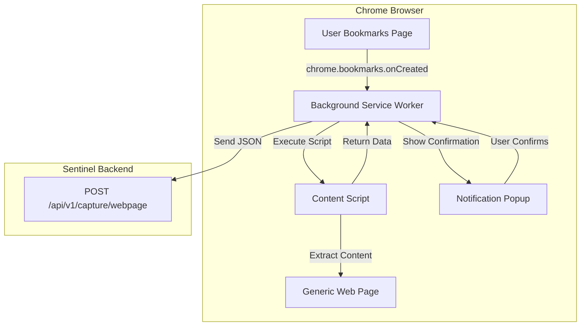
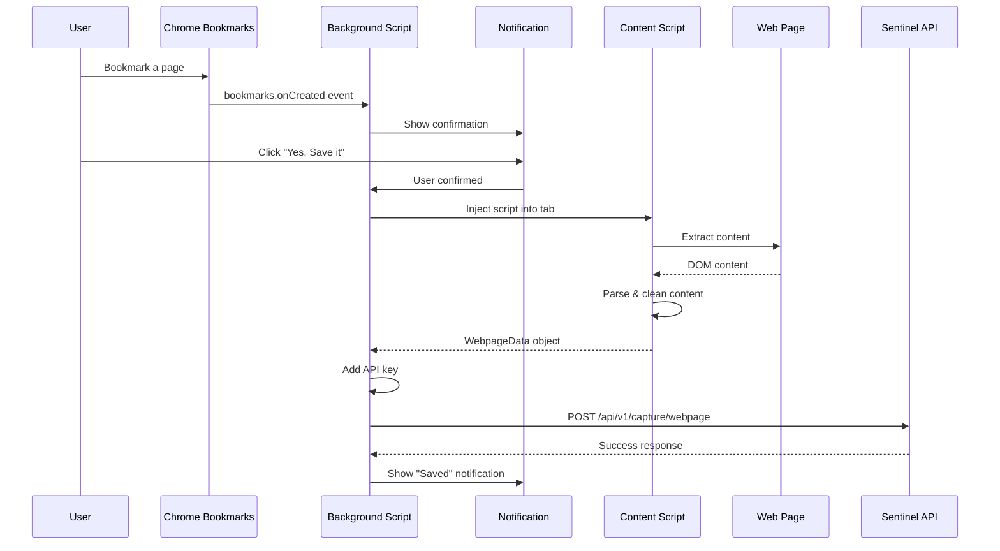

```mermaid
sequenceDiagram
    participant User
    participant Chrome as Chrome Bookmarks
    participant BG as Background Script
    participant Notif as Notification
    participant CS as Content Script
    participant Page as Web Page
    participant API as Sentinel API

    User->>Chrome: Bookmark a page
    Chrome->>BG: bookmarks.onCreated event
    BG->>Notif: Show confirmation
    User->>Notif: Click "Yes, Save it"
    Notif->>BG: User confirmed
    BG->>CS: Inject script into tab
    CS->>Page: Extract content
    Page-->>CS: DOM content
    CS->>CS: Parse & clean content
    CS-->>BG: WebpageData object
    BG->>BG: Add API key
    BG->>API: POST /api/v1/capture/webpage
    API-->>BG: Success response
    BG->>Notif: Show "Saved" notification
```

# Webpage Capture Feature - Implementation Plan

## Overview

This document outlines the implementation plan for adding webpage capture functionality to the Sentinel browser extension. This feature allows users to save web pages to their Sentinel knowledge base when they bookmark them.

## Architecture



## Key Design Decisions

| Aspect | Decision | Rationale |
|--------|----------|-----------|
| **Trigger** | Confirmation before capture | Respects user control, prevents accidental captures |
| **Content** | Full page article extraction | Maximizes knowledge value, uses Readability-style extraction |
| **API Endpoint** | Separate `/api/v1/capture/webpage` | Clean separation from tweet capture, different payload structure |
| **Bookmark Scope** | Only new bookmarks going forward | Simpler implementation, avoids bulk import complexity |
| **Extraction Mode** | Configurable: full page or selection | Users can choose to save entire article or just selected text |

## Implementation Steps

### Task 1: Manifest Updates

**File:** [`browser-extension/manifest.json`](browser-extension/manifest.json)

**Changes Required:**
1. Add `bookmarks` permission
2. Add `notifications` permission (for confirmation UI)
3. Add `scripting` permission (for content script injection)
4. Add `activeTab` permission (already present)
5. Update host permissions to allow all URLs for content script injection

**Updated Permissions:**
```json
{
  "permissions": [
    "storage",
    "activeTab",
    "bookmarks",
    "notifications",
    "scripting"
  ],
  "host_permissions": [
    "https://x.com/*",
    "https://twitter.com/*",
    "<all_urls>"
  ]
}
```

---

### Task 2: Background Script Bookmark Listener

**File:** [`browser-extension/src/background.ts`](browser-extension/src/background.ts)

**Implementation:**
1. Listen for `chrome.bookmarks.onCreated` events
2. Show notification to user asking for confirmation
3. On confirmation, inject content script into the bookmarked page
4. Handle the response and send to backend

**Key Code Pattern:**
```typescript
// Listen for bookmark creation
chrome.bookmarks.onCreated.addListener((id, bookmark) => {
  if (!bookmark.url || bookmark.url.startsWith('javascript:')) return;
  
  // Show confirmation notification
  chrome.notifications.create({
    type: 'basic',
    iconUrl: 'icons/icon48.png',
    title: 'Save to Sentinel?',
    message: `Save "${bookmark.title}" to your knowledge base?`,
    buttons: [
      { title: 'Yes, Save it' },
      { title: 'No, Skip' }
    ]
  });
});

// Handle notification button clicks
chrome.notifications.onButtonClicked.addListener((notifId, btnIdx) => {
  if (btnIdx === 0) {
    // User confirmed - proceed with capture
    captureWebpage(bookmark.url, bookmark.title);
  }
});
```

---

### Task 3: Content Script for Webpage Extraction

**File:** `browser-extension/src/webpage-content.ts` (new file)

**Implementation:**
1. Create a new content script specifically for generic webpage extraction
2. Implement Readability-style content extraction
3. Extract: title, URL, author (if available), publish date, main content, description

**Extraction Strategy:**
```typescript
interface WebpageData {
  source: 'webpage';
  url: string;
  title: string;
  author: string | null;
  publish_date: string | null;
  description: string | null;
  content: {
    text: string;
    html: string;
    excerpt: string;
  };
  metadata: {
    site_name: string | null;
    favicon: string | null;
    language: string | null;
  };
  captured_at: string;
}
```

**Content Extraction Algorithm:**
1. Try to find main article content using common selectors:
   - `article` element
   - `[role="main"]`
   - `.content`, `.post-content`, `.entry-content`
   - `#content`, `#main`
2. Fallback to largest text block heuristic
3. Clean extracted text (remove ads, navigation, etc.)
4. Extract metadata from Open Graph tags, Twitter Cards, or JSON-LD

---

### Task 4: API Integration

**Endpoint:** `POST /api/v1/capture/webpage`

**Request Headers:**
```
Authorization: Bearer {API_KEY}
Content-Type: application/json
```

**Request Body:**
```json
{
  "source": "webpage",
  "url": "https://example.com/article",
  "title": "Article Title",
  "author": "Author Name",
  "publish_date": "2024-01-15T10:30:00Z",
  "description": "Article description or meta description",
  "content": {
    "text": "Full article text content...",
    "html": "<article>...</article>",
    "excerpt": "First 200 characters..."
  },
  "metadata": {
    "site_name": "Example Blog",
    "favicon": "https://example.com/favicon.ico",
    "language": "en"
  },
  "captured_at": "2024-01-31T12:42:16Z"
}
```

**Response:**
```json
{
  "success": true,
  "id": "uuid-of-stored-document",
  "message": "Webpage captured successfully"
}
```

---

### Task 5: Options Page Updates

**File:** [`browser-extension/src/options.ts`](browser-extension/src/options.ts)

**Add Settings:**
1. Toggle to enable/disable bookmark capture feature
2. Option to auto-confirm (skip notification) for specific domains
3. Blacklist/whitelist domains for capture
4. Default extraction mode: full page vs. selection

---

### Task 6: Text Selection Capture (Optional Enhancement)

**Goal:** Allow users to capture only selected text from a webpage instead of the full article.

**Implementation:**

**Option A: Context Menu Approach**
- Add context menu item "Save Selection to Sentinel" when user right-clicks selected text
- Works independently of bookmark flow
- Immediate capture without confirmation (or with mini-popup)

**Option B: Selection + Bookmark Approach**
- When user bookmarks a page with text selected, notification offers 3 options:
  - "Save Full Page"
  - "Save Selection Only"
  - "Skip"

**Option C: Floating Toolbar Approach**
- When user selects text on any page, show floating "Save to Sentinel" button
- Similar to Medium's highlight feature
- Clicking saves selection directly

**Recommended: Option A (Context Menu)**
- Cleanest UX
- No UI clutter on pages
- Familiar pattern for users

**Implementation Details:**

1. **Manifest Update:**
```json
"permissions": [
  "contextMenus"
]
```

2. **Background Script:**
```typescript
// Create context menu item
chrome.runtime.onInstalled.addListener(() => {
  chrome.contextMenus.create({
    id: 'saveSelectionToSentinel',
    title: 'Save Selection to Sentinel',
    contexts: ['selection']
  });
});

// Handle context menu click
chrome.contextMenus.onClicked.addListener((info, tab) => {
  if (info.menuItemId === 'saveSelectionToSentinel') {
    const selectedText = info.selectionText;
    captureSelection(tab.url, tab.title, selectedText);
  }
});
```

3. **API Payload for Selection:**
```typescript
interface SelectionData {
  source: 'webpage_selection';
  url: string;
  title: string;
  content: {
    text: string;
    excerpt: string; // First 200 chars
  };
  context: {
    surrounding_text: string | null; // Text before/after selection
    selection_only: boolean;
  };
  captured_at: string;
}
```

**UI Considerations:**
- Show success toast notification after saving selection
- Allow user to add tags/notes to selection before saving (optional)
- Keyboard shortcut (e.g., Ctrl+Shift+S) to save selection

**Files to Create/Modify:**
- Modify [`browser-extension/src/background.ts`](browser-extension/src/background.ts) - Add context menu handlers
- Modify [`browser-extension/manifest.json`](browser-extension/manifest.json) - Add contextMenus permission

---

## Data Flow



## Files to Create/Modify

### New Files:
- `browser-extension/src/webpage-content.ts` - Content script for webpage extraction
- `browser-extension/src/content-extractor.ts` - Shared content extraction utilities

### Modified Files:
- [`browser-extension/manifest.json`](browser-extension/manifest.json) - Add permissions
- [`browser-extension/src/background.ts`](browser-extension/src/background.ts) - Add bookmark listener
- [`browser-extension/src/options.ts`](browser-extension/src/options.ts) - Add feature settings
- [`browser-extension/options.html`](browser-extension/options.html) - Add UI controls

## Security Considerations

1. **URL Validation**: Skip capture for:
   - `javascript:` URLs
   - `chrome://` URLs
   - `file://` URLs
   - Private IP ranges (optional)

2. **Content Sanitization**:
   - Strip script tags from extracted HTML
   - Remove event handlers
   - Limit content size (e.g., max 100KB)

3. **User Consent**:
   - Always show confirmation before capture
   - Respect user preferences (blacklist/whitelist)

## Future Enhancements

1. **Smart Extraction**: Use Mozilla's Readability library for better article detection
2. **Batch Import**: Option to import existing bookmarks
3. **Auto-tagging**: Extract keywords/tags from content
4. **Screenshot Capture**: Include page screenshot with capture
5. **PDF Support**: Handle PDF documents differently

## Testing Checklist

- [ ] Bookmark creation triggers notification
- [ ] Notification buttons work correctly
- [ ] Content extraction works on major sites (news, blogs, docs)
- [ ] API call succeeds with correct payload
- [ ] Error handling for network failures
- [ ] Settings persist correctly
- [ ] Feature can be disabled via options

## Overview

This document outlines the implementation plan for adding webpage capture functionality to the Sentinel browser extension. This feature allows users to save web pages to their Sentinel knowledge base when they bookmark them.

## Architecture


## Key Design Decisions

| Aspect | Decision | Rationale |
|--------|----------|-----------|
| **Trigger** | Confirmation before capture | Respects user control, prevents accidental captures |
| **Content** | Full page article extraction | Maximizes knowledge value, uses Readability-style extraction |
| **API Endpoint** | Separate `/api/v1/capture/webpage` | Clean separation from tweet capture, different payload structure |
| **Bookmark Scope** | Only new bookmarks going forward | Simpler implementation, avoids bulk import complexity |

## Implementation Steps

### Task 1: Manifest Updates

**File:** [`browser-extension/manifest.json`](browser-extension/manifest.json)

**Changes Required:**
1. Add `bookmarks` permission
2. Add `notifications` permission (for confirmation UI)
3. Add `scripting` permission (for content script injection)
4. Add `activeTab` permission (already present)
5. Update host permissions to allow all URLs for content script injection

**Updated Permissions:**
```json
{
  "permissions": [
    "storage",
    "activeTab",
    "bookmarks",
    "notifications",
    "scripting"
  ],
  "host_permissions": [
    "https://x.com/*",
    "https://twitter.com/*",
    "<all_urls>"
  ]
}
```

---

### Task 2: Background Script Bookmark Listener

**File:** [`browser-extension/src/background.ts`](browser-extension/src/background.ts)

**Implementation:**
1. Listen for `chrome.bookmarks.onCreated` events
2. Show notification to user asking for confirmation
3. On confirmation, inject content script into the bookmarked page
4. Handle the response and send to backend

**Key Code Pattern:**
```typescript
// Listen for bookmark creation
chrome.bookmarks.onCreated.addListener((id, bookmark) => {
  if (!bookmark.url || bookmark.url.startsWith('javascript:')) return;
  
  // Show confirmation notification
  chrome.notifications.create({
    type: 'basic',
    iconUrl: 'icons/icon48.png',
    title: 'Save to Sentinel?',
    message: `Save "${bookmark.title}" to your knowledge base?`,
    buttons: [
      { title: 'Yes, Save it' },
      { title: 'No, Skip' }
    ]
  });
});

// Handle notification button clicks
chrome.notifications.onButtonClicked.addListener((notifId, btnIdx) => {
  if (btnIdx === 0) {
    // User confirmed - proceed with capture
    captureWebpage(bookmark.url, bookmark.title);
  }
});
```

---

### Task 3: Content Script for Webpage Extraction

**File:** `browser-extension/src/webpage-content.ts` (new file)

**Implementation:**
1. Create a new content script specifically for generic webpage extraction
2. Implement Readability-style content extraction
3. Extract: title, URL, author (if available), publish date, main content, description

**Extraction Strategy:**
```typescript
interface WebpageData {
  source: 'webpage';
  url: string;
  title: string;
  author: string | null;
  publish_date: string | null;
  description: string | null;
  content: {
    text: string;
    html: string;
    excerpt: string;
  };
  metadata: {
    site_name: string | null;
    favicon: string | null;
    language: string | null;
  };
  captured_at: string;
}
```

**Content Extraction Algorithm:**
1. Try to find main article content using common selectors:
   - `article` element
   - `[role="main"]`
   - `.content`, `.post-content`, `.entry-content`
   - `#content`, `#main`
2. Fallback to largest text block heuristic
3. Clean extracted text (remove ads, navigation, etc.)
4. Extract metadata from Open Graph tags, Twitter Cards, or JSON-LD

---

### Task 4: API Integration

**Endpoint:** `POST /api/v1/capture/webpage`

**Request Headers:**
```
Authorization: Bearer {API_KEY}
Content-Type: application/json
```

**Request Body:**
```json
{
  "source": "webpage",
  "url": "https://example.com/article",
  "title": "Article Title",
  "author": "Author Name",
  "publish_date": "2024-01-15T10:30:00Z",
  "description": "Article description or meta description",
  "content": {
    "text": "Full article text content...",
    "html": "<article>...</article>",
    "excerpt": "First 200 characters..."
  },
  "metadata": {
    "site_name": "Example Blog",
    "favicon": "https://example.com/favicon.ico",
    "language": "en"
  },
  "captured_at": "2024-01-31T12:42:16Z"
}
```

**Response:**
```json
{
  "success": true,
  "id": "uuid-of-stored-document",
  "message": "Webpage captured successfully"
}
```

---

### Task 5: Options Page Updates

**File:** [`browser-extension/src/options.ts`](browser-extension/src/options.ts)

**Add Settings:**
1. Toggle to enable/disable bookmark capture feature
2. Option to auto-confirm (skip notification) for specific domains
3. Blacklist/whitelist domains for capture

---

## Data Flow



## Files to Create/Modify

### New Files:
- `browser-extension/src/webpage-content.ts` - Content script for webpage extraction
- `browser-extension/src/content-extractor.ts` - Shared content extraction utilities

### Modified Files:
- [`browser-extension/manifest.json`](browser-extension/manifest.json) - Add permissions
- [`browser-extension/src/background.ts`](browser-extension/src/background.ts) - Add bookmark listener
- [`browser-extension/src/options.ts`](browser-extension/src/options.ts) - Add feature settings
- [`browser-extension/options.html`](browser-extension/options.html) - Add UI controls

## Security Considerations

1. **URL Validation**: Skip capture for:
   - `javascript:` URLs
   - `chrome://` URLs
   - `file://` URLs
   - Private IP ranges (optional)

2. **Content Sanitization**:
   - Strip script tags from extracted HTML
   - Remove event handlers
   - Limit content size (e.g., max 100KB)

3. **User Consent**:
   - Always show confirmation before capture
   - Respect user preferences (blacklist/whitelist)

## Future Enhancements

1. **Smart Extraction**: Use Mozilla's Readability library for better article detection
2. **Batch Import**: Option to import existing bookmarks
3. **Auto-tagging**: Extract keywords/tags from content
4. **Screenshot Capture**: Include page screenshot with capture
5. **PDF Support**: Handle PDF documents differently

## Testing Checklist

- [ ] Bookmark creation triggers notification
- [ ] Notification buttons work correctly
- [ ] Content extraction works on major sites (news, blogs, docs)
- [ ] API call succeeds with correct payload
- [ ] Error handling for network failures
- [ ] Settings persist correctly
- [ ] Feature can be disabled via options


## Overview

This document outlines the implementation plan for adding webpage capture functionality to the Sentinel browser extension. This feature allows users to save web pages to their Sentinel knowledge base when they bookmark them.

## Architecture


## Key Design Decisions

| Aspect | Decision | Rationale |
|--------|----------|-----------|
| **Trigger** | Confirmation before capture | Respects user control, prevents accidental captures |
| **Content** | Full page article extraction | Maximizes knowledge value, uses Readability-style extraction |
| **API Endpoint** | Separate `/api/v1/capture/webpage` | Clean separation from tweet capture, different payload structure |
| **Bookmark Scope** | Only new bookmarks going forward | Simpler implementation, avoids bulk import complexity |
| **Extraction Mode** | Configurable: full page or selection | Users can choose to save entire article or just selected text |

## Implementation Steps

### Task 1: Manifest Updates

**File:** [`browser-extension/manifest.json`](browser-extension/manifest.json)

**Changes Required:**
1. Add `bookmarks` permission
2. Add `notifications` permission (for confirmation UI)
3. Add `scripting` permission (for content script injection)
4. Add `activeTab` permission (already present)
5. Update host permissions to allow all URLs for content script injection

**Updated Permissions:**
```json
{
  "permissions": [
    "storage",
    "activeTab",
    "bookmarks",
    "notifications",
    "scripting"
  ],
  "host_permissions": [
    "https://x.com/*",
    "https://twitter.com/*",
    "<all_urls>"
  ]
}
```

---

### Task 2: Background Script Bookmark Listener

**File:** [`browser-extension/src/background.ts`](browser-extension/src/background.ts)

**Implementation:**
1. Listen for `chrome.bookmarks.onCreated` events
2. Show notification to user asking for confirmation
3. On confirmation, inject content script into the bookmarked page
4. Handle the response and send to backend

**Key Code Pattern:**
```typescript
// Listen for bookmark creation
chrome.bookmarks.onCreated.addListener((id, bookmark) => {
  if (!bookmark.url || bookmark.url.startsWith('javascript:')) return;
  
  // Show confirmation notification
  chrome.notifications.create({
    type: 'basic',
    iconUrl: 'icons/icon48.png',
    title: 'Save to Sentinel?',
    message: `Save "${bookmark.title}" to your knowledge base?`,
    buttons: [
      { title: 'Yes, Save it' },
      { title: 'No, Skip' }
    ]
  });
});

// Handle notification button clicks
chrome.notifications.onButtonClicked.addListener((notifId, btnIdx) => {
  if (btnIdx === 0) {
    // User confirmed - proceed with capture
    captureWebpage(bookmark.url, bookmark.title);
  }
});
```

---

### Task 3: Content Script for Webpage Extraction

**File:** `browser-extension/src/webpage-content.ts` (new file)

**Implementation:**
1. Create a new content script specifically for generic webpage extraction
2. Implement Readability-style content extraction
3. Extract: title, URL, author (if available), publish date, main content, description

**Extraction Strategy:**
```typescript
interface WebpageData {
  source: 'webpage';
  url: string;
  title: string;
  author: string | null;
  publish_date: string | null;
  description: string | null;
  content: {
    text: string;
    html: string;
    excerpt: string;
  };
  metadata: {
    site_name: string | null;
    favicon: string | null;
    language: string | null;
  };
  captured_at: string;
}
```

**Content Extraction Algorithm:**
1. Try to find main article content using common selectors:
   - `article` element
   - `[role="main"]`
   - `.content`, `.post-content`, `.entry-content`
   - `#content`, `#main`
2. Fallback to largest text block heuristic
3. Clean extracted text (remove ads, navigation, etc.)
4. Extract metadata from Open Graph tags, Twitter Cards, or JSON-LD

---

### Task 4: API Integration

**Endpoint:** `POST /api/v1/capture/webpage`

**Request Headers:**
```
Authorization: Bearer {API_KEY}
Content-Type: application/json
```

**Request Body:**
```json
{
  "source": "webpage",
  "url": "https://example.com/article",
  "title": "Article Title",
  "author": "Author Name",
  "publish_date": "2024-01-15T10:30:00Z",
  "description": "Article description or meta description",
  "content": {
    "text": "Full article text content...",
    "html": "<article>...</article>",
    "excerpt": "First 200 characters..."
  },
  "metadata": {
    "site_name": "Example Blog",
    "favicon": "https://example.com/favicon.ico",
    "language": "en"
  },
  "captured_at": "2024-01-31T12:42:16Z"
}
```

**Response:**
```json
{
  "success": true,
  "id": "uuid-of-stored-document",
  "message": "Webpage captured successfully"
}
```

---

### Task 5: Options Page Updates

**File:** [`browser-extension/src/options.ts`](browser-extension/src/options.ts)

**Add Settings:**
1. Toggle to enable/disable bookmark capture feature
2. Option to auto-confirm (skip notification) for specific domains
3. Blacklist/whitelist domains for capture

---

## Data Flow


## Files to Create/Modify

### New Files:
- `browser-extension/src/webpage-content.ts` - Content script for webpage extraction
- `browser-extension/src/content-extractor.ts` - Shared content extraction utilities

### Modified Files:
- [`browser-extension/manifest.json`](browser-extension/manifest.json) - Add permissions
- [`browser-extension/src/background.ts`](browser-extension/src/background.ts) - Add bookmark listener
- [`browser-extension/src/options.ts`](browser-extension/src/options.ts) - Add feature settings
- [`browser-extension/options.html`](browser-extension/options.html) - Add UI controls

## Security Considerations

1. **URL Validation**: Skip capture for:
   - `javascript:` URLs
   - `chrome://` URLs
   - `file://` URLs
   - Private IP ranges (optional)

2. **Content Sanitization**:
   - Strip script tags from extracted HTML
   - Remove event handlers
   - Limit content size (e.g., max 100KB)

3. **User Consent**:
   - Always show confirmation before capture
   - Respect user preferences (blacklist/whitelist)

## Future Enhancements

1. **Smart Extraction**: Use Mozilla's Readability library for better article detection
2. **Batch Import**: Option to import existing bookmarks
3. **Auto-tagging**: Extract keywords/tags from content
4. **Screenshot Capture**: Include page screenshot with capture
5. **PDF Support**: Handle PDF documents differently

## Testing Checklist

- [ ] Bookmark creation triggers notification
- [ ] Notification buttons work correctly
- [ ] Content extraction works on major sites (news, blogs, docs)
- [ ] API call succeeds with correct payload
- [ ] Error handling for network failures
- [ ] Settings persist correctly
- [ ] Feature can be disabled via options

## Overview

This document outlines the implementation plan for adding webpage capture functionality to the Sentinel browser extension. This feature allows users to save web pages to their Sentinel knowledge base when they bookmark them.

## Architecture


## Key Design Decisions

| Aspect | Decision | Rationale |
|--------|----------|-----------|
| **Trigger** | Confirmation before capture | Respects user control, prevents accidental captures |
| **Content** | Full page article extraction | Maximizes knowledge value, uses Readability-style extraction |
| **API Endpoint** | Separate `/api/v1/capture/webpage` | Clean separation from tweet capture, different payload structure |
| **Bookmark Scope** | Only new bookmarks going forward | Simpler implementation, avoids bulk import complexity |

## Implementation Steps

### Task 1: Manifest Updates

**File:** [`browser-extension/manifest.json`](browser-extension/manifest.json)

**Changes Required:**
1. Add `bookmarks` permission
2. Add `notifications` permission (for confirmation UI)
3. Add `scripting` permission (for content script injection)
4. Add `activeTab` permission (already present)
5. Update host permissions to allow all URLs for content script injection

**Updated Permissions:**
```json
{
  "permissions": [
    "storage",
    "activeTab",
    "bookmarks",
    "notifications",
    "scripting"
  ],
  "host_permissions": [
    "https://x.com/*",
    "https://twitter.com/*",
    "<all_urls>"
  ]
}
```

---

### Task 2: Background Script Bookmark Listener

**File:** [`browser-extension/src/background.ts`](browser-extension/src/background.ts)

**Implementation:**
1. Listen for `chrome.bookmarks.onCreated` events
2. Show notification to user asking for confirmation
3. On confirmation, inject content script into the bookmarked page
4. Handle the response and send to backend

**Key Code Pattern:**
```typescript
// Listen for bookmark creation
chrome.bookmarks.onCreated.addListener((id, bookmark) => {
  if (!bookmark.url || bookmark.url.startsWith('javascript:')) return;
  
  // Show confirmation notification
  chrome.notifications.create({
    type: 'basic',
    iconUrl: 'icons/icon48.png',
    title: 'Save to Sentinel?',
    message: `Save "${bookmark.title}" to your knowledge base?`,
    buttons: [
      { title: 'Yes, Save it' },
      { title: 'No, Skip' }
    ]
  });
});

// Handle notification button clicks
chrome.notifications.onButtonClicked.addListener((notifId, btnIdx) => {
  if (btnIdx === 0) {
    // User confirmed - proceed with capture
    captureWebpage(bookmark.url, bookmark.title);
  }
});
```

---

### Task 3: Content Script for Webpage Extraction

**File:** `browser-extension/src/webpage-content.ts` (new file)

**Implementation:**
1. Create a new content script specifically for generic webpage extraction
2. Implement Readability-style content extraction
3. Extract: title, URL, author (if available), publish date, main content, description

**Extraction Strategy:**
```typescript
interface WebpageData {
  source: 'webpage';
  url: string;
  title: string;
  author: string | null;
  publish_date: string | null;
  description: string | null;
  content: {
    text: string;
    html: string;
    excerpt: string;
  };
  metadata: {
    site_name: string | null;
    favicon: string | null;
    language: string | null;
  };
  captured_at: string;
}
```

**Content Extraction Algorithm:**
1. Try to find main article content using common selectors:
   - `article` element
   - `[role="main"]`
   - `.content`, `.post-content`, `.entry-content`
   - `#content`, `#main`
2. Fallback to largest text block heuristic
3. Clean extracted text (remove ads, navigation, etc.)
4. Extract metadata from Open Graph tags, Twitter Cards, or JSON-LD

---

### Task 4: API Integration

**Endpoint:** `POST /api/v1/capture/webpage`

**Request Headers:**
```
Authorization: Bearer {API_KEY}
Content-Type: application/json
```

**Request Body:**
```json
{
  "source": "webpage",
  "url": "https://example.com/article",
  "title": "Article Title",
  "author": "Author Name",
  "publish_date": "2024-01-15T10:30:00Z",
  "description": "Article description or meta description",
  "content": {
    "text": "Full article text content...",
    "html": "<article>...</article>",
    "excerpt": "First 200 characters..."
  },
  "metadata": {
    "site_name": "Example Blog",
    "favicon": "https://example.com/favicon.ico",
    "language": "en"
  },
  "captured_at": "2024-01-31T12:42:16Z"
}
```

**Response:**
```json
{
  "success": true,
  "id": "uuid-of-stored-document",
  "message": "Webpage captured successfully"
}
```

---

### Task 5: Options Page Updates

**File:** [`browser-extension/src/options.ts`](browser-extension/src/options.ts)

**Add Settings:**
1. Toggle to enable/disable bookmark capture feature
2. Option to auto-confirm (skip notification) for specific domains
3. Blacklist/whitelist domains for capture

---

## Data Flow


## Files to Create/Modify

### New Files:
- `browser-extension/src/webpage-content.ts` - Content script for webpage extraction
- `browser-extension/src/content-extractor.ts` - Shared content extraction utilities

### Modified Files:
- [`browser-extension/manifest.json`](browser-extension/manifest.json) - Add permissions
- [`browser-extension/src/background.ts`](browser-extension/src/background.ts) - Add bookmark listener
- [`browser-extension/src/options.ts`](browser-extension/src/options.ts) - Add feature settings
- [`browser-extension/options.html`](browser-extension/options.html) - Add UI controls

## Security Considerations

1. **URL Validation**: Skip capture for:
   - `javascript:` URLs
   - `chrome://` URLs
   - `file://` URLs
   - Private IP ranges (optional)

2. **Content Sanitization**:
   - Strip script tags from extracted HTML
   - Remove event handlers
   - Limit content size (e.g., max 100KB)

3. **User Consent**:
   - Always show confirmation before capture
   - Respect user preferences (blacklist/whitelist)

## Future Enhancements

1. **Smart Extraction**: Use Mozilla's Readability library for better article detection
2. **Batch Import**: Option to import existing bookmarks
3. **Auto-tagging**: Extract keywords/tags from content
4. **Screenshot Capture**: Include page screenshot with capture
5. **PDF Support**: Handle PDF documents differently

## Testing Checklist

- [ ] Bookmark creation triggers notification
- [ ] Notification buttons work correctly
- [ ] Content extraction works on major sites (news, blogs, docs)
- [ ] API call succeeds with correct payload
- [ ] Error handling for network failures
- [ ] Settings persist correctly
- [ ] Feature can be disabled via options


## Overview

This document outlines the implementation plan for adding webpage capture functionality to the Sentinel browser extension. This feature allows users to save web pages to their Sentinel knowledge base when they bookmark them.

## Architecture


## Key Design Decisions

| Aspect | Decision | Rationale |
|--------|----------|-----------|
| **Trigger** | Confirmation before capture | Respects user control, prevents accidental captures |
| **Content** | Full page article extraction | Maximizes knowledge value, uses Readability-style extraction |
| **API Endpoint** | Separate `/api/v1/capture/webpage` | Clean separation from tweet capture, different payload structure |
| **Bookmark Scope** | Only new bookmarks going forward | Simpler implementation, avoids bulk import complexity |
| **Extraction Mode** | Configurable: full page or selection | Users can choose to save entire article or just selected text |

## Implementation Steps

### Task 1: Manifest Updates

**File:** [`browser-extension/manifest.json`](browser-extension/manifest.json)

**Changes Required:**
1. Add `bookmarks` permission
2. Add `notifications` permission (for confirmation UI)
3. Add `scripting` permission (for content script injection)
4. Add `activeTab` permission (already present)
5. Update host permissions to allow all URLs for content script injection

**Updated Permissions:**
```json
{
  "permissions": [
    "storage",
    "activeTab",
    "bookmarks",
    "notifications",
    "scripting"
  ],
  "host_permissions": [
    "https://x.com/*",
    "https://twitter.com/*",
    "<all_urls>"
  ]
}
```

---

### Task 2: Background Script Bookmark Listener

**File:** [`browser-extension/src/background.ts`](browser-extension/src/background.ts)

**Implementation:**
1. Listen for `chrome.bookmarks.onCreated` events
2. Show notification to user asking for confirmation
3. On confirmation, inject content script into the bookmarked page
4. Handle the response and send to backend

**Key Code Pattern:**
```typescript
// Listen for bookmark creation
chrome.bookmarks.onCreated.addListener((id, bookmark) => {
  if (!bookmark.url || bookmark.url.startsWith('javascript:')) return;
  
  // Show confirmation notification
  chrome.notifications.create({
    type: 'basic',
    iconUrl: 'icons/icon48.png',
    title: 'Save to Sentinel?',
    message: `Save "${bookmark.title}" to your knowledge base?`,
    buttons: [
      { title: 'Yes, Save it' },
      { title: 'No, Skip' }
    ]
  });
});

// Handle notification button clicks
chrome.notifications.onButtonClicked.addListener((notifId, btnIdx) => {
  if (btnIdx === 0) {
    // User confirmed - proceed with capture
    captureWebpage(bookmark.url, bookmark.title);
  }
});
```

---

### Task 3: Content Script for Webpage Extraction

**File:** `browser-extension/src/webpage-content.ts` (new file)

**Implementation:**
1. Create a new content script specifically for generic webpage extraction
2. Implement Readability-style content extraction
3. Extract: title, URL, author (if available), publish date, main content, description

**Extraction Strategy:**
```typescript
interface WebpageData {
  source: 'webpage';
  url: string;
  title: string;
  author: string | null;
  publish_date: string | null;
  description: string | null;
  content: {
    text: string;
    html: string;
    excerpt: string;
  };
  metadata: {
    site_name: string | null;
    favicon: string | null;
    language: string | null;
  };
  captured_at: string;
}
```

**Content Extraction Algorithm:**
1. Try to find main article content using common selectors:
   - `article` element
   - `[role="main"]`
   - `.content`, `.post-content`, `.entry-content`
   - `#content`, `#main`
2. Fallback to largest text block heuristic
3. Clean extracted text (remove ads, navigation, etc.)
4. Extract metadata from Open Graph tags, Twitter Cards, or JSON-LD

---

### Task 4: API Integration

**Endpoint:** `POST /api/v1/capture/webpage`

**Request Headers:**
```
Authorization: Bearer {API_KEY}
Content-Type: application/json
```

**Request Body:**
```json
{
  "source": "webpage",
  "url": "https://example.com/article",
  "title": "Article Title",
  "author": "Author Name",
  "publish_date": "2024-01-15T10:30:00Z",
  "description": "Article description or meta description",
  "content": {
    "text": "Full article text content...",
    "html": "<article>...</article>",
    "excerpt": "First 200 characters..."
  },
  "metadata": {
    "site_name": "Example Blog",
    "favicon": "https://example.com/favicon.ico",
    "language": "en"
  },
  "captured_at": "2024-01-31T12:42:16Z"
}
```

**Response:**
```json
{
  "success": true,
  "id": "uuid-of-stored-document",
  "message": "Webpage captured successfully"
}
```

---

### Task 5: Options Page Updates

**File:** [`browser-extension/src/options.ts`](browser-extension/src/options.ts)

**Add Settings:**
1. Toggle to enable/disable bookmark capture feature
2. Option to auto-confirm (skip notification) for specific domains
3. Blacklist/whitelist domains for capture
4. Default extraction mode: full page vs. selection

---

### Task 6: Text Selection Capture (Optional Enhancement)

**Goal:** Allow users to capture only selected text from a webpage instead of the full article.

**Implementation:**

**Option A: Context Menu Approach**
- Add context menu item "Save Selection to Sentinel" when user right-clicks selected text
- Works independently of bookmark flow
- Immediate capture without confirmation (or with mini-popup)

**Option B: Selection + Bookmark Approach**
- When user bookmarks a page with text selected, notification offers 3 options:
  - "Save Full Page"
  - "Save Selection Only"
  - "Skip"

**Option C: Floating Toolbar Approach**
- When user selects text on any page, show floating "Save to Sentinel" button
- Similar to Medium's highlight feature
- Clicking saves selection directly

**Recommended: Option A (Context Menu)**
- Cleanest UX
- No UI clutter on pages
- Familiar pattern for users

**Implementation Details:**

1. **Manifest Update:**
```json
"permissions": [
  "contextMenus"
]
```

2. **Background Script:**
```typescript
// Create context menu item
chrome.runtime.onInstalled.addListener(() => {
  chrome.contextMenus.create({
    id: 'saveSelectionToSentinel',
    title: 'Save Selection to Sentinel',
    contexts: ['selection']
  });
});

// Handle context menu click
chrome.contextMenus.onClicked.addListener((info, tab) => {
  if (info.menuItemId === 'saveSelectionToSentinel') {
    const selectedText = info.selectionText;
    captureSelection(tab.url, tab.title, selectedText);
  }
});
```

3. **API Payload for Selection:**
```typescript
interface SelectionData {
  source: 'webpage_selection';
  url: string;
  title: string;
  content: {
    text: string;
    excerpt: string; // First 200 chars
  };
  context: {
    surrounding_text: string | null; // Text before/after selection
    selection_only: boolean;
  };
  captured_at: string;
}
```

**UI Considerations:**
- Show success toast notification after saving selection
- Allow user to add tags/notes to selection before saving (optional)
- Keyboard shortcut (e.g., Ctrl+Shift+S) to save selection

**Files to Create/Modify:**
- Modify [`browser-extension/src/background.ts`](browser-extension/src/background.ts) - Add context menu handlers
- Modify [`browser-extension/manifest.json`](browser-extension/manifest.json) - Add contextMenus permission

---

## Data Flow


## Files to Create/Modify

### New Files:
- `browser-extension/src/webpage-content.ts` - Content script for webpage extraction
- `browser-extension/src/content-extractor.ts` - Shared content extraction utilities

### Modified Files:
- [`browser-extension/manifest.json`](browser-extension/manifest.json) - Add permissions
- [`browser-extension/src/background.ts`](browser-extension/src/background.ts) - Add bookmark listener
- [`browser-extension/src/options.ts`](browser-extension/src/options.ts) - Add feature settings
- [`browser-extension/options.html`](browser-extension/options.html) - Add UI controls

## Security Considerations

1. **URL Validation**: Skip capture for:
   - `javascript:` URLs
   - `chrome://` URLs
   - `file://` URLs
   - Private IP ranges (optional)

2. **Content Sanitization**:
   - Strip script tags from extracted HTML
   - Remove event handlers
   - Limit content size (e.g., max 100KB)

3. **User Consent**:
   - Always show confirmation before capture
   - Respect user preferences (blacklist/whitelist)

## Future Enhancements

1. **Smart Extraction**: Use Mozilla's Readability library for better article detection
2. **Batch Import**: Option to import existing bookmarks
3. **Auto-tagging**: Extract keywords/tags from content
4. **Screenshot Capture**: Include page screenshot with capture
5. **PDF Support**: Handle PDF documents differently

## Testing Checklist

- [ ] Bookmark creation triggers notification
- [ ] Notification buttons work correctly
- [ ] Content extraction works on major sites (news, blogs, docs)
- [ ] API call succeeds with correct payload
- [ ] Error handling for network failures
- [ ] Settings persist correctly
- [ ] Feature can be disabled via options

## Overview

This document outlines the implementation plan for adding webpage capture functionality to the Sentinel browser extension. This feature allows users to save web pages to their Sentinel knowledge base when they bookmark them.

## Architecture


## Key Design Decisions

| Aspect | Decision | Rationale |
|--------|----------|-----------|
| **Trigger** | Confirmation before capture | Respects user control, prevents accidental captures |
| **Content** | Full page article extraction | Maximizes knowledge value, uses Readability-style extraction |
| **API Endpoint** | Separate `/api/v1/capture/webpage` | Clean separation from tweet capture, different payload structure |
| **Bookmark Scope** | Only new bookmarks going forward | Simpler implementation, avoids bulk import complexity |

## Implementation Steps

### Task 1: Manifest Updates

**File:** [`browser-extension/manifest.json`](browser-extension/manifest.json)

**Changes Required:**
1. Add `bookmarks` permission
2. Add `notifications` permission (for confirmation UI)
3. Add `scripting` permission (for content script injection)
4. Add `activeTab` permission (already present)
5. Update host permissions to allow all URLs for content script injection

**Updated Permissions:**
```json
{
  "permissions": [
    "storage",
    "activeTab",
    "bookmarks",
    "notifications",
    "scripting"
  ],
  "host_permissions": [
    "https://x.com/*",
    "https://twitter.com/*",
    "<all_urls>"
  ]
}
```

---

### Task 2: Background Script Bookmark Listener

**File:** [`browser-extension/src/background.ts`](browser-extension/src/background.ts)

**Implementation:**
1. Listen for `chrome.bookmarks.onCreated` events
2. Show notification to user asking for confirmation
3. On confirmation, inject content script into the bookmarked page
4. Handle the response and send to backend

**Key Code Pattern:**
```typescript
// Listen for bookmark creation
chrome.bookmarks.onCreated.addListener((id, bookmark) => {
  if (!bookmark.url || bookmark.url.startsWith('javascript:')) return;
  
  // Show confirmation notification
  chrome.notifications.create({
    type: 'basic',
    iconUrl: 'icons/icon48.png',
    title: 'Save to Sentinel?',
    message: `Save "${bookmark.title}" to your knowledge base?`,
    buttons: [
      { title: 'Yes, Save it' },
      { title: 'No, Skip' }
    ]
  });
});

// Handle notification button clicks
chrome.notifications.onButtonClicked.addListener((notifId, btnIdx) => {
  if (btnIdx === 0) {
    // User confirmed - proceed with capture
    captureWebpage(bookmark.url, bookmark.title);
  }
});
```

---

### Task 3: Content Script for Webpage Extraction

**File:** `browser-extension/src/webpage-content.ts` (new file)

**Implementation:**
1. Create a new content script specifically for generic webpage extraction
2. Implement Readability-style content extraction
3. Extract: title, URL, author (if available), publish date, main content, description

**Extraction Strategy:**
```typescript
interface WebpageData {
  source: 'webpage';
  url: string;
  title: string;
  author: string | null;
  publish_date: string | null;
  description: string | null;
  content: {
    text: string;
    html: string;
    excerpt: string;
  };
  metadata: {
    site_name: string | null;
    favicon: string | null;
    language: string | null;
  };
  captured_at: string;
}
```

**Content Extraction Algorithm:**
1. Try to find main article content using common selectors:
   - `article` element
   - `[role="main"]`
   - `.content`, `.post-content`, `.entry-content`
   - `#content`, `#main`
2. Fallback to largest text block heuristic
3. Clean extracted text (remove ads, navigation, etc.)
4. Extract metadata from Open Graph tags, Twitter Cards, or JSON-LD

---

### Task 4: API Integration

**Endpoint:** `POST /api/v1/capture/webpage`

**Request Headers:**
```
Authorization: Bearer {API_KEY}
Content-Type: application/json
```

**Request Body:**
```json
{
  "source": "webpage",
  "url": "https://example.com/article",
  "title": "Article Title",
  "author": "Author Name",
  "publish_date": "2024-01-15T10:30:00Z",
  "description": "Article description or meta description",
  "content": {
    "text": "Full article text content...",
    "html": "<article>...</article>",
    "excerpt": "First 200 characters..."
  },
  "metadata": {
    "site_name": "Example Blog",
    "favicon": "https://example.com/favicon.ico",
    "language": "en"
  },
  "captured_at": "2024-01-31T12:42:16Z"
}
```

**Response:**
```json
{
  "success": true,
  "id": "uuid-of-stored-document",
  "message": "Webpage captured successfully"
}
```

---

### Task 5: Options Page Updates

**File:** [`browser-extension/src/options.ts`](browser-extension/src/options.ts)

**Add Settings:**
1. Toggle to enable/disable bookmark capture feature
2. Option to auto-confirm (skip notification) for specific domains
3. Blacklist/whitelist domains for capture

---

## Data Flow


## Files to Create/Modify

### New Files:
- `browser-extension/src/webpage-content.ts` - Content script for webpage extraction
- `browser-extension/src/content-extractor.ts` - Shared content extraction utilities

### Modified Files:
- [`browser-extension/manifest.json`](browser-extension/manifest.json) - Add permissions
- [`browser-extension/src/background.ts`](browser-extension/src/background.ts) - Add bookmark listener
- [`browser-extension/src/options.ts`](browser-extension/src/options.ts) - Add feature settings
- [`browser-extension/options.html`](browser-extension/options.html) - Add UI controls

## Security Considerations

1. **URL Validation**: Skip capture for:
   - `javascript:` URLs
   - `chrome://` URLs
   - `file://` URLs
   - Private IP ranges (optional)

2. **Content Sanitization**:
   - Strip script tags from extracted HTML
   - Remove event handlers
   - Limit content size (e.g., max 100KB)

3. **User Consent**:
   - Always show confirmation before capture
   - Respect user preferences (blacklist/whitelist)

## Future Enhancements

1. **Smart Extraction**: Use Mozilla's Readability library for better article detection
2. **Batch Import**: Option to import existing bookmarks
3. **Auto-tagging**: Extract keywords/tags from content
4. **Screenshot Capture**: Include page screenshot with capture
5. **PDF Support**: Handle PDF documents differently

## Testing Checklist

- [ ] Bookmark creation triggers notification
- [ ] Notification buttons work correctly
- [ ] Content extraction works on major sites (news, blogs, docs)
- [ ] API call succeeds with correct payload
- [ ] Error handling for network failures
- [ ] Settings persist correctly
- [ ] Feature can be disabled via options


## Overview

This document outlines the implementation plan for adding webpage capture functionality to the Sentinel browser extension. This feature allows users to save web pages to their Sentinel knowledge base when they bookmark them.

## Architecture


## Key Design Decisions

| Aspect | Decision | Rationale |
|--------|----------|-----------|
| **Trigger** | Confirmation before capture | Respects user control, prevents accidental captures |
| **Content** | Full page article extraction | Maximizes knowledge value, uses Readability-style extraction |
| **API Endpoint** | Separate `/api/v1/capture/webpage` | Clean separation from tweet capture, different payload structure |
| **Bookmark Scope** | Only new bookmarks going forward | Simpler implementation, avoids bulk import complexity |
| **Extraction Mode** | Configurable: full page or selection | Users can choose to save entire article or just selected text |

## Implementation Steps

### Task 1: Manifest Updates

**File:** [`browser-extension/manifest.json`](browser-extension/manifest.json)

**Changes Required:**
1. Add `bookmarks` permission
2. Add `notifications` permission (for confirmation UI)
3. Add `scripting` permission (for content script injection)
4. Add `activeTab` permission (already present)
5. Update host permissions to allow all URLs for content script injection

**Updated Permissions:**
```json
{
  "permissions": [
    "storage",
    "activeTab",
    "bookmarks",
    "notifications",
    "scripting"
  ],
  "host_permissions": [
    "https://x.com/*",
    "https://twitter.com/*",
    "<all_urls>"
  ]
}
```

---

### Task 2: Background Script Bookmark Listener

**File:** [`browser-extension/src/background.ts`](browser-extension/src/background.ts)

**Implementation:**
1. Listen for `chrome.bookmarks.onCreated` events
2. Show notification to user asking for confirmation
3. On confirmation, inject content script into the bookmarked page
4. Handle the response and send to backend

**Key Code Pattern:**
```typescript
// Listen for bookmark creation
chrome.bookmarks.onCreated.addListener((id, bookmark) => {
  if (!bookmark.url || bookmark.url.startsWith('javascript:')) return;
  
  // Show confirmation notification
  chrome.notifications.create({
    type: 'basic',
    iconUrl: 'icons/icon48.png',
    title: 'Save to Sentinel?',
    message: `Save "${bookmark.title}" to your knowledge base?`,
    buttons: [
      { title: 'Yes, Save it' },
      { title: 'No, Skip' }
    ]
  });
});

// Handle notification button clicks
chrome.notifications.onButtonClicked.addListener((notifId, btnIdx) => {
  if (btnIdx === 0) {
    // User confirmed - proceed with capture
    captureWebpage(bookmark.url, bookmark.title);
  }
});
```

---

### Task 3: Content Script for Webpage Extraction

**File:** `browser-extension/src/webpage-content.ts` (new file)

**Implementation:**
1. Create a new content script specifically for generic webpage extraction
2. Implement Readability-style content extraction
3. Extract: title, URL, author (if available), publish date, main content, description

**Extraction Strategy:**
```typescript
interface WebpageData {
  source: 'webpage';
  url: string;
  title: string;
  author: string | null;
  publish_date: string | null;
  description: string | null;
  content: {
    text: string;
    html: string;
    excerpt: string;
  };
  metadata: {
    site_name: string | null;
    favicon: string | null;
    language: string | null;
  };
  captured_at: string;
}
```

**Content Extraction Algorithm:**
1. Try to find main article content using common selectors:
   - `article` element
   - `[role="main"]`
   - `.content`, `.post-content`, `.entry-content`
   - `#content`, `#main`
2. Fallback to largest text block heuristic
3. Clean extracted text (remove ads, navigation, etc.)
4. Extract metadata from Open Graph tags, Twitter Cards, or JSON-LD

---

### Task 4: API Integration

**Endpoint:** `POST /api/v1/capture/webpage`

**Request Headers:**
```
Authorization: Bearer {API_KEY}
Content-Type: application/json
```

**Request Body:**
```json
{
  "source": "webpage",
  "url": "https://example.com/article",
  "title": "Article Title",
  "author": "Author Name",
  "publish_date": "2024-01-15T10:30:00Z",
  "description": "Article description or meta description",
  "content": {
    "text": "Full article text content...",
    "html": "<article>...</article>",
    "excerpt": "First 200 characters..."
  },
  "metadata": {
    "site_name": "Example Blog",
    "favicon": "https://example.com/favicon.ico",
    "language": "en"
  },
  "captured_at": "2024-01-31T12:42:16Z"
}
```

**Response:**
```json
{
  "success": true,
  "id": "uuid-of-stored-document",
  "message": "Webpage captured successfully"
}
```

---

### Task 5: Options Page Updates

**File:** [`browser-extension/src/options.ts`](browser-extension/src/options.ts)

**Add Settings:**
1. Toggle to enable/disable bookmark capture feature
2. Option to auto-confirm (skip notification) for specific domains
3. Blacklist/whitelist domains for capture

---

## Data Flow


## Files to Create/Modify

### New Files:
- `browser-extension/src/webpage-content.ts` - Content script for webpage extraction
- `browser-extension/src/content-extractor.ts` - Shared content extraction utilities

### Modified Files:
- [`browser-extension/manifest.json`](browser-extension/manifest.json) - Add permissions
- [`browser-extension/src/background.ts`](browser-extension/src/background.ts) - Add bookmark listener
- [`browser-extension/src/options.ts`](browser-extension/src/options.ts) - Add feature settings
- [`browser-extension/options.html`](browser-extension/options.html) - Add UI controls

## Security Considerations

1. **URL Validation**: Skip capture for:
   - `javascript:` URLs
   - `chrome://` URLs
   - `file://` URLs
   - Private IP ranges (optional)

2. **Content Sanitization**:
   - Strip script tags from extracted HTML
   - Remove event handlers
   - Limit content size (e.g., max 100KB)

3. **User Consent**:
   - Always show confirmation before capture
   - Respect user preferences (blacklist/whitelist)

## Future Enhancements

1. **Smart Extraction**: Use Mozilla's Readability library for better article detection
2. **Batch Import**: Option to import existing bookmarks
3. **Auto-tagging**: Extract keywords/tags from content
4. **Screenshot Capture**: Include page screenshot with capture
5. **PDF Support**: Handle PDF documents differently

## Testing Checklist

- [ ] Bookmark creation triggers notification
- [ ] Notification buttons work correctly
- [ ] Content extraction works on major sites (news, blogs, docs)
- [ ] API call succeeds with correct payload
- [ ] Error handling for network failures
- [ ] Settings persist correctly
- [ ] Feature can be disabled via options

## Overview

This document outlines the implementation plan for adding webpage capture functionality to the Sentinel browser extension. This feature allows users to save web pages to their Sentinel knowledge base when they bookmark them.

## Architecture


## Key Design Decisions

| Aspect | Decision | Rationale |
|--------|----------|-----------|
| **Trigger** | Confirmation before capture | Respects user control, prevents accidental captures |
| **Content** | Full page article extraction | Maximizes knowledge value, uses Readability-style extraction |
| **API Endpoint** | Separate `/api/v1/capture/webpage` | Clean separation from tweet capture, different payload structure |
| **Bookmark Scope** | Only new bookmarks going forward | Simpler implementation, avoids bulk import complexity |

## Implementation Steps

### Task 1: Manifest Updates

**File:** [`browser-extension/manifest.json`](browser-extension/manifest.json)

**Changes Required:**
1. Add `bookmarks` permission
2. Add `notifications` permission (for confirmation UI)
3. Add `scripting` permission (for content script injection)
4. Add `activeTab` permission (already present)
5. Update host permissions to allow all URLs for content script injection

**Updated Permissions:**
```json
{
  "permissions": [
    "storage",
    "activeTab",
    "bookmarks",
    "notifications",
    "scripting"
  ],
  "host_permissions": [
    "https://x.com/*",
    "https://twitter.com/*",
    "<all_urls>"
  ]
}
```

---

### Task 2: Background Script Bookmark Listener

**File:** [`browser-extension/src/background.ts`](browser-extension/src/background.ts)

**Implementation:**
1. Listen for `chrome.bookmarks.onCreated` events
2. Show notification to user asking for confirmation
3. On confirmation, inject content script into the bookmarked page
4. Handle the response and send to backend

**Key Code Pattern:**
```typescript
// Listen for bookmark creation
chrome.bookmarks.onCreated.addListener((id, bookmark) => {
  if (!bookmark.url || bookmark.url.startsWith('javascript:')) return;
  
  // Show confirmation notification
  chrome.notifications.create({
    type: 'basic',
    iconUrl: 'icons/icon48.png',
    title: 'Save to Sentinel?',
    message: `Save "${bookmark.title}" to your knowledge base?`,
    buttons: [
      { title: 'Yes, Save it' },
      { title: 'No, Skip' }
    ]
  });
});

// Handle notification button clicks
chrome.notifications.onButtonClicked.addListener((notifId, btnIdx) => {
  if (btnIdx === 0) {
    // User confirmed - proceed with capture
    captureWebpage(bookmark.url, bookmark.title);
  }
});
```

---

### Task 3: Content Script for Webpage Extraction

**File:** `browser-extension/src/webpage-content.ts` (new file)

**Implementation:**
1. Create a new content script specifically for generic webpage extraction
2. Implement Readability-style content extraction
3. Extract: title, URL, author (if available), publish date, main content, description

**Extraction Strategy:**
```typescript
interface WebpageData {
  source: 'webpage';
  url: string;
  title: string;
  author: string | null;
  publish_date: string | null;
  description: string | null;
  content: {
    text: string;
    html: string;
    excerpt: string;
  };
  metadata: {
    site_name: string | null;
    favicon: string | null;
    language: string | null;
  };
  captured_at: string;
}
```

**Content Extraction Algorithm:**
1. Try to find main article content using common selectors:
   - `article` element
   - `[role="main"]`
   - `.content`, `.post-content`, `.entry-content`
   - `#content`, `#main`
2. Fallback to largest text block heuristic
3. Clean extracted text (remove ads, navigation, etc.)
4. Extract metadata from Open Graph tags, Twitter Cards, or JSON-LD

---

### Task 4: API Integration

**Endpoint:** `POST /api/v1/capture/webpage`

**Request Headers:**
```
Authorization: Bearer {API_KEY}
Content-Type: application/json
```

**Request Body:**
```json
{
  "source": "webpage",
  "url": "https://example.com/article",
  "title": "Article Title",
  "author": "Author Name",
  "publish_date": "2024-01-15T10:30:00Z",
  "description": "Article description or meta description",
  "content": {
    "text": "Full article text content...",
    "html": "<article>...</article>",
    "excerpt": "First 200 characters..."
  },
  "metadata": {
    "site_name": "Example Blog",
    "favicon": "https://example.com/favicon.ico",
    "language": "en"
  },
  "captured_at": "2024-01-31T12:42:16Z"
}
```

**Response:**
```json
{
  "success": true,
  "id": "uuid-of-stored-document",
  "message": "Webpage captured successfully"
}
```

---

### Task 5: Options Page Updates

**File:** [`browser-extension/src/options.ts`](browser-extension/src/options.ts)

**Add Settings:**
1. Toggle to enable/disable bookmark capture feature
2. Option to auto-confirm (skip notification) for specific domains
3. Blacklist/whitelist domains for capture

---

## Data Flow


## Files to Create/Modify

### New Files:
- `browser-extension/src/webpage-content.ts` - Content script for webpage extraction
- `browser-extension/src/content-extractor.ts` - Shared content extraction utilities

### Modified Files:
- [`browser-extension/manifest.json`](browser-extension/manifest.json) - Add permissions
- [`browser-extension/src/background.ts`](browser-extension/src/background.ts) - Add bookmark listener
- [`browser-extension/src/options.ts`](browser-extension/src/options.ts) - Add feature settings
- [`browser-extension/options.html`](browser-extension/options.html) - Add UI controls

## Security Considerations

1. **URL Validation**: Skip capture for:
   - `javascript:` URLs
   - `chrome://` URLs
   - `file://` URLs
   - Private IP ranges (optional)

2. **Content Sanitization**:
   - Strip script tags from extracted HTML
   - Remove event handlers
   - Limit content size (e.g., max 100KB)

3. **User Consent**:
   - Always show confirmation before capture
   - Respect user preferences (blacklist/whitelist)

## Future Enhancements

1. **Smart Extraction**: Use Mozilla's Readability library for better article detection
2. **Batch Import**: Option to import existing bookmarks
3. **Auto-tagging**: Extract keywords/tags from content
4. **Screenshot Capture**: Include page screenshot with capture
5. **PDF Support**: Handle PDF documents differently

## Testing Checklist

- [ ] Bookmark creation triggers notification
- [ ] Notification buttons work correctly
- [ ] Content extraction works on major sites (news, blogs, docs)
- [ ] API call succeeds with correct payload
- [ ] Error handling for network failures
- [ ] Settings persist correctly
- [ ] Feature can be disabled via options


